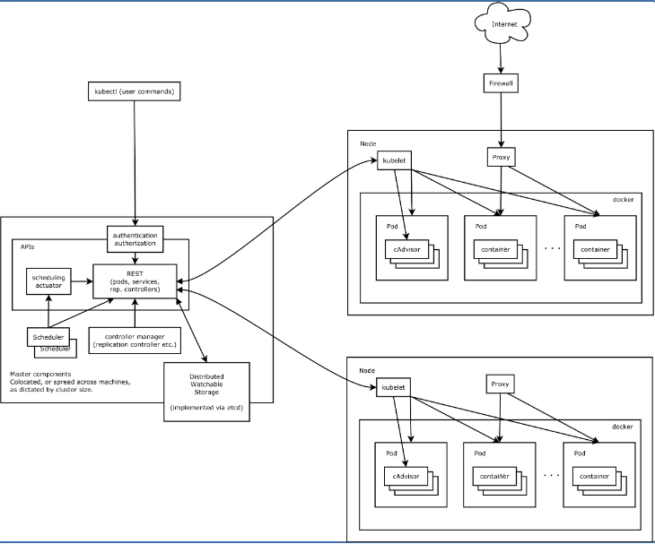

## 核心组件

Kubernetes 主要由以下几个核心组件组成：

- etcd 保存了整个集群的状态；
- apiserver 提供了资源操作的唯一入口，并提供认证、授权、访问控制、API 注册和发现等机制；
- controller manager 负责维护集群的状态，比如故障检测、自动扩展、滚动更新等；
- scheduler 负责资源的调度，按照预定的调度策略将 Pod 调度到相应的机器上；
- kubelet 负责维护容器的生命周期，同时也负责 Volume（CVI）和网络（CNI）的管理；
- Container runtime 负责镜像管理以及 Pod 和容器的真正运行（CRI）；
- kube-proxy 负责为 Service 提供 cluster 内部的服务发现和负载均衡



- `kubectl get` - 类似于 `docker ps`，查询资源列表
- 
- `kubectl describe` - 类似于 `docker inspect`，获取资源的详细信息
- 
- `kubectl logs` - 类似于 `docker logs`，获取容器的日志
- 
- `kubectl exec` - 类似于 `docker exec`，在容器内执行一个命令

## 使用 Volume

Pod 的生命周期通常比较短，只要出现了异常，就会创建一个新的 Pod 来代替它。那容器产生的数据呢？容器内的数据会随着 Pod 消亡而自动消失。Volume 就是为了持久化容器数据而生，比如可以为 redis 容器指定一个 hostPath 来存储 redis 数据：

```
apiVersion: v1
kind: Pod
metadata:
  name: redis
spec:
  containers:
  - name: redis
    image: redis
    volumeMounts:
    - name: redis-persistent-storage
      mountPath: /data/redis
  volumes:
  - name: redis-persistent-storage
    hostPath:
      path: /data/
```

## 扩展应用

通过修改 Deployment 中副本的数量（replicas），可以动态扩展或收缩应用：


这些自动扩展的容器会自动加入到 service 中，而收缩回收的容器也会自动从 service 中删除。

```
$ kubectl scale --replicas=3 deployment/nginx-app
$ kubectl get deploy
NAME        DESIRED   CURRENT   UP-TO-DATE   AVAILABLE   AGE
nginx-app   3         3         3            3           10m
```

## 滚动升级

滚动升级（Rolling Update）通过逐个容器替代升级的方式来实现无中断的服务升级：

```
kubectl rolling-update frontend-v1 frontend-v2 --image=image:v2
```

在滚动升级的过程中，如果发现了失败或者配置错误，还可以随时回滚

```
kubectl rolling-update frontend-v1 frontend-v2 --rollback
```

而更新应用的话，就可以直接用 `kubectl set` 命令：

```
kubectl set image deployment/nginx-app nginx-app=nginx:1.9.1
```

## 资源限制

Kubernetes 通过 cgroups 提供容器资源管理的功能，可以限制每个容器的 CPU 和内存使用，比如对于刚才创建的 deployment，可以通过下面的命令限制 nginx 容器最多只用 50% 的 CPU 和 128MB 的内存：

```
kubectl set resources deployment nginx-app -c=nginx --limits=cpu=500m,memory=128Mi
```

这等同于在每个 Pod 中设置 resources limits：

```
apiVersion: v1
kind: Pod
metadata:
  labels:
    app: nginx
  name: nginx
spec:
  containers:
    - image: nginx
      name: nginx
      resources:
        limits:
          cpu: "500m"
          memory: "128Mi"
```

## 健康检查

Kubernetes 作为一个面向应用的集群管理工具，需要确保容器在部署后确实处在正常的运行状态。Kubernetes 提供了两种探针（Probe，支持 exec、tcpSocket 和 http 方式）来探测容器的状态：

- LivenessProbe：探测应用是否处于健康状态，如果不健康则删除并重新创建容器
- ReadinessProbe：探测应用是否启动完成并且处于正常服务状态，如果不正常则不会接收来自 Kubernetes Service 的流量

对于已经部署的 deployment，可以通过 `kubectl edit deployment/nginx-app` 来更新 manifest，增加健康检查部分：

```yaml
apiVersion: extensions/v1beta1
kind: Deployment
metadata:
  labels:
    app: nginx
  name: nginx-default
spec:
  replicas: 3
  selector:
    matchLabels:
      app: nginx
  template:
    metadata:
      labels:
        app: nginx
    spec:
      containers:
      - image: nginx
        imagePullPolicy: Always
        name: http
        resources: {}
        terminationMessagePath: /dev/termination-log
        terminationMessagePolicy: File
        resources:
          limits:
            cpu: "500m"
            memory: "128Mi"
        livenessProbe:
          httpGet:
            path: /
            port: 80
          initialDelaySeconds: 15
          timeoutSeconds: 1
        readinessProbe:
          httpGet:
            path: /
            port: 80
          initialDelaySeconds: 5
          timeoutSeconds: 1
```

### 指定 Node 节点调度

### nodeSelector 示例

首先给 Node 打上标签

```
kubectl label nodes node-01 disktype=ssd
```

然后在 daemonset 中指定 nodeSelector 为 `disktype=ssd`：

```
spec:
  nodeSelector:
    disktype: ssd
```

# PersistentVolume

PersistentVolume (PV) 和 PersistentVolumeClaim (PVC) 提供了方便的持久化卷：PV 提供网络存储资源，而 PVC 请求存储资源。这样，设置持久化的工作流包括配置底层文件系统或者云数据卷、创建持久性数据卷、最后创建 PVC 来将 Pod 跟数据卷关联起来。PV 和 PVC 可以将 pod 和数据卷解耦，pod 不需要知道确切的文件系统或者支持它的持久化引擎。

### Volume 生命周期

Volume 的生命周期包括 5 个阶段

1. Provisioning，即 PV 的创建，可以直接创建 PV（静态方式），也可以使用 StorageClass 动态创建
2. Binding，将 PV 分配给 PVC
3. Using，Pod 通过 PVC 使用该 Volume，并可以通过准入控制 StorageObjectInUseProtection（1.9 及以前版本为 PVCProtection）阻止删除正在使用的 PVC
4. Releasing，Pod 释放 Volume 并删除 PVC
5. Reclaiming，回收 PV，可以保留 PV 以便下次使用，也可以直接从云存储中删除
6. Deleting，删除 PV 并从云存储中删除后段存储

根据这 5 个阶段，Volume 的状态有以下 4 种

- Available：可用
- Bound：已经分配给 PVC
- Released：PVC 解绑但还未执行回收策略
- Failed：发生错误

### PV

PersistentVolume（PV）是集群之中的一块网络存储。跟 Node 一样，也是集群的资源。PV 跟 Volume (卷) 类似，不过会有独立于 Pod 的生命周期。比如一个 NFS 的 PV 可以定义为

```
apiVersion: v1
kind: PersistentVolume
metadata:
  name: pv0003
spec:
  capacity:
    storage: 5Gi
  accessModes:
    - ReadWriteOnce
  persistentVolumeReclaimPolicy: Recycle
  nfs:
    path: /tmp
    server: 172.17.0.2
```

PV 的访问模式（accessModes）有三种：

- ReadWriteOnce（RWO）：是最基本的方式，可读可写，但只支持被单个节点挂载。
- ReadOnlyMany（ROX）：可以以只读的方式被多个节点挂载。
- ReadWriteMany（RWX）：这种存储可以以读写的方式被多个节点共享。不是每一种存储都支持这三种方式，像共享方式，目前支持的还比较少，比较常用的是 NFS。在 PVC 绑定 PV 时通常根据两个条件来绑定，一个是存储的大小，另一个就是访问模式。

PV 的回收策略（persistentVolumeReclaimPolicy，即 PVC 释放卷的时候 PV 该如何操作）也有三种

- Retain，不清理, 保留 Volume（需要手动清理）
- Recycle，删除数据，即 `rm -rf /thevolume/*`（只有 NFS 和 HostPath 支持）
- Delete，删除存储资源，比如删除 AWS EBS 卷（只有 AWS EBS, GCE PD, Azure Disk 和 Cinder 支持）

### PVC

PV 是存储资源，而 PersistentVolumeClaim (PVC) 是对 PV 的请求。PVC 跟 Pod 类似：Pod 消费 Node 资源，而 PVC 消费 PV 资源；Pod 能够请求 CPU 和内存资源，而 PVC 请求特定大小和访问模式的数据卷。

```yaml
kind: PersistentVolumeClaim
apiVersion: v1
metadata:
  name: myclaim
spec:
  accessModes:
    - ReadWriteOnce
  resources:
    requests:
      storage: 8Gi
  storageClassName: slow
  selector:
    matchLabels:
      release: "stable"
    matchExpressions:
      - {key: environment, operator: In, values: [dev]}
```

PVC 可以直接挂载到 Pod 中

```
kind: Pod
apiVersion: v1
metadata:
  name: mypod
spec:
  containers:
    - name: myfrontend
      image: dockerfile/nginx
      volumeMounts:
      - mountPath: "/var/www/html"
        name: mypd
  volumes:
    - name: mypd
      persistentVolumeClaim:
        claimName: myclaim
```

# Secret

## Secret 类型

Secret 有三种类型：

- Opaque：base64 编码格式的 Secret，用来存储密码、密钥等；但数据也通过 base64 --decode 解码得到原始数据，所有加密性很弱。
- `kubernetes.io/dockerconfigjson`：用来存储私有 docker registry 的认证信息。
- `kubernetes.io/service-account-token`： 用于被 serviceaccount 引用。serviceaccout 创建时 Kubernetes 会默认创建对应的 secret。Pod 如果使用了 serviceaccount，对应的 secret 会自动挂载到 Pod 的 `/run/secrets/kubernetes.io/serviceaccount` 目录中。

## Opaque Secret

Opaque 类型的数据是一个 map 类型，要求 value 是 base64 编码格式：

```
$ echo -n "admin" | base64
YWRtaW4=
$ echo -n "1f2d1e2e67df" | base64
MWYyZDFlMmU2N2Rm
```

secrets.yml

```yaml
apiVersion: v1
kind: Secret
metadata:
  name: mysecret
type: Opaque
data:
  password: MWYyZDFlMmU2N2Rm
  username: YWRtaW4=
```

## Opaque Secret 的使用

创建好 secret 之后，有两种方式来使用它：

- 以 Volume 方式
- 以环境变量方式

将 Secret 挂载到 Volume 中

```
apiVersion: v1
kind: Pod
metadata:
  labels:
    name: db
  name: db
spec:
  volumes:
  - name: secrets
    secret:
      secretName: mysecret
  containers:
  - image: gcr.io/my_project_id/pg:v1
    name: db
    volumeMounts:
    - name: secrets
      mountPath: "/etc/secrets"
      readOnly: true
    ports:
    - name: cp
      containerPort: 5432
      hostPort: 5432
```

将 Secret 导出到环境变量中

```yaml
apiVersion: extensions/v1beta1
kind: Deployment
metadata:
  name: wordpress-deployment
spec:
  replicas: 2
  strategy:
      type: RollingUpdate
  template:
    metadata:
      labels:
        app: wordpress
        visualize: "true"
    spec:
      containers:
      - name: "wordpress"
        image: "wordpress"
        ports:
        - containerPort: 80
        env:
        - name: WORDPRESS_DB_USER
          valueFrom:
            secretKeyRef:
              name: mysecret
              key: username
        - name: WORDPRESS_DB_PASSWORD
          valueFrom:
            secretKeyRef:
              name: mysecret
              key: password
```

# Helm

[Helm](https://github.com/kubernetes/helm) 是一个类似于 yum/apt/[homebrew](https://brew.sh/) 的 Kubernetes 应用管理工具。Helm 使用 [Chart](https://github.com/kubernetes/charts) 来管理 Kubernetes manifest 文件。

## Helm 基本使用

安装 `helm` 客户端

```
brew install kubernetes-helm
```

初始化 Helm 并安装 `Tiller` 服务（需要事先配置好 kubectl）

```
helm init
```

更新 charts 列表

```
helm repo update
```

部署服务，比如 mysql

```
➜  ~ helm install stable/mysql
NAME:   quieting-warthog
LAST DEPLOYED: Tue Feb 21 16:13:02 2017
NAMESPACE: default
STATUS: DEPLOYED

RESOURCES:
==> v1/Secret
NAME                    TYPE    DATA  AGE
quieting-warthog-mysql  Opaque  2     1s

==> v1/PersistentVolumeClaim
NAME                    STATUS   VOLUME  CAPACITY  ACCESSMODES  AGE
quieting-warthog-mysql  Pending  1s

==> v1/Service
NAME                    CLUSTER-IP    EXTERNAL-IP  PORT(S)   AGE
quieting-warthog-mysql  10.3.253.105  <none>       3306/TCP  1s

==> extensions/v1beta1/Deployment
NAME                    DESIRED  CURRENT  UP-TO-DATE  AVAILABLE  AGE
quieting-warthog-mysql  1        1        1           0          1s


NOTES:
MySQL can be accessed via port 3306 on the following DNS name from within your cluster:
quieting-warthog-mysql.default.svc.cluster.local

To get your root password run:

    kubectl get secret --namespace default quieting-warthog-mysql -o jsonpath="{.data.mysql-root-password}" | base64 --decode; echo

To connect to your database:

1. Run an Ubuntu pod that you can use as a client:

    kubectl run -i --tty ubuntu --image=ubuntu:16.04 --restart=Never -- bash -il

2. Install the mysql client:

    $ apt-get update && apt-get install mysql-client -y

3. Connect using the mysql cli, then provide your password:
    $ mysql -h quieting-warthog-mysql -p
```

## Helm 工作原理

### 基本概念

Helm 的三个基本概念

- Chart：Helm 应用（package），包括该应用的所有 Kubernetes manifest 模版，类似于 YUM RPM 或 Apt dpkg 文件
- Repository：Helm package 存储仓库
- Release：chart 的部署实例，每个 chart 可以部署一个或多个 release

### Helm 工作原理

Helm 包括两个部分，`helm` 客户端和 `tiller` 服务端。

## Helm 命令参考

### 查询 charts

```
helm search
helm search mysql
```

#### 查询 package 详细信息

```
helm install stable/mysql
```

部署之前可以自定义 package 的选项：

```
# 查询支持的选项
helm inspect values stable/mysql

# 自定义 password
echo "mysqlRootPassword: passwd" > config.yaml
helm install -f config.yaml stable/mysql
```

#### 查询服务 (Release) 状态

```
➜  ~ helm status quieting-warthog
LAST DEPLOYED: Tue Feb 21 16:13:02 2017
NAMESPACE: default
STATUS: DEPLOYED

RESOURCES:
==> v1/Secret
NAME                    TYPE    DATA  AGE
quieting-warthog-mysql  Opaque  2     9m

==> v1/PersistentVolumeClaim
NAME                    STATUS  VOLUME                                    CAPACITY  ACCESSMODES  AGE
quieting-warthog-mysql  Bound   pvc-90af9bf9-f80d-11e6-930a-42010af00102  8Gi       RWO          9m

==> v1/Service
NAME                    CLUSTER-IP    EXTERNAL-IP  PORT(S)   AGE
quieting-warthog-mysql  10.3.253.105  <none>       3306/TCP  9m

==> extensions/v1beta1/Deployment
NAME                    DESIRED  CURRENT  UP-TO-DATE  AVAILABLE  AGE
quieting-warthog-mysql  1        1        1           1          9m


NOTES:
MySQL can be accessed via port 3306 on the following DNS name from within your cluster:
quieting-warthog-mysql.default.svc.cluster.local

To get your root password run:

    kubectl get secret --namespace default quieting-warthog-mysql -o jsonpath="{.data.mysql-root-password}" | base64 --decode; echo

To connect to your database:

1. Run an Ubuntu pod that you can use as a client:

    kubectl run -i --tty ubuntu --image=ubuntu:16.04 --restart=Never -- bash -il

2. Install the mysql client:

    $ apt-get update && apt-get install mysql-client -y

3. Connect using the mysql cli, then provide your password:
    $ mysql -h quieting-warthog-mysql -p
```

#### 升级和回滚 Release

```
# 升级
cat "mariadbUser: user1" >panda.yaml
helm upgrade -f panda.yaml happy-panda stable/mariadb

# 回滚
helm rollback happy-panda 1
```

#### 删除 Release

```
helm delete quieting-warthog
```

#### repo 管理

```
# 添加 incubator repo
helm repo add incubator https://kubernetes-charts-incubator.storage.googleapis.com/

# 查询 repo 列表
helm repo list

# 生成 repo 索引（用于搭建 helm repository）
helm repo index
```

#### chart 管理

```
# 创建一个新的 chart
helm create deis-workflow

# validate chart
helm lint

# 打包 chart 到 tgz
helm package deis-workflow
```

## Istio

### 流量管理

#### 服务发现和负载均衡

#### 故障恢复

Istio 提供了一系列开箱即用的故障恢复功能，如

- 超时处理
- 重试处理，如限制最大重试时间以及可变重试间隔
- 健康检查，如自动移除不健康的容器
- 请求限制，如并发请求数和并发连接数
- 熔断

熔断示例：

```yaml
cat <<EOF | istioctl create -f -
apiVersion: networking.istio.io/v1alpha3
kind: DestinationRule
metadata:
  name: httpbin
spec:
  host: httpbin
  trafficPolicy:
    connectionPool:
      tcp:
        maxConnections: 1
      http:
        http1MaxPendingRequests: 1
        maxRequestsPerConnection: 1
    outlierDetection:
      http:
        consecutiveErrors: 1
        interval: 1s
        baseEjectionTime: 3m
        maxEjectionPercent: 100
EOF
```

#### 故障注入

Istio 支持为应用注入故障，以模拟实际生产中碰到的各种问题，包括

- 注入延迟（模拟网络延迟和服务过载）
- 注入失败（模拟应用失效）

这些故障均可以使用 VirtualService 动态配置。如以下配置 2 秒的延迟：

```yaml
apiVersion: networking.istio.io/v1alpha3
kind: VirtualService
metadata:
  name: ratings
spec:
  hosts:
  - ratings
  http:
  - fault:
      delay:
        percent: 100
        fixedDelay: 2s
    route:
    - destination:
        host: ratings
        subset: v1
```

#### 金丝雀部署

首先部署 bookinfo，并配置默认路由为 v1 版本

```yaml
# 以下命令假设 bookinfo 示例程序已部署，如未部署，可以执行下面的命令
$ kubectl apply -f <(istioctl kube-inject -f samples/bookinfo/platform/kube/bookinfo.yaml)
# 此时，三个版本的 reviews 服务以负载均衡的方式轮询。

# 创建默认路由，全部请求转发到 v1
$ istioctl create -f samples/bookinfo/routing/route-rule-all-v1.yaml

$ kubectl get virtualservice reviews -o yaml
apiVersion: networking.istio.io/v1alpha3
kind: VirtualService
metadata:
  name: reviews
spec:
  hosts:
  - reviews
  http:
  - route:
    - destination:
        host: reviews
        subset: v1
```

##### 示例一：将 10% 请求发送到 v2 版本而其余 90% 发送到 v1 版本

```yaml
cat <<EOF | istioctl create -f -
apiVersion: networking.istio.io/v1alpha3
kind: VirtualService
metadata:
  name: reviews
spec:
  hosts:
    - reviews
  http:
  - route:
    - destination:
        host: reviews
        subset: v1
      weight: 75
    - destination:
        host: reviews
        subset: v2
      weight: 25
EOF
```

##### 示例二：将 jason 用户的请求全部发到 v2 版本

```
cat <<EOF | istioctl replace -f -
apiVersion: networking.istio.io/v1alpha3
kind: VirtualService
metadata:
  name: ratings
spec:
  hosts:
  - ratings
  http:
  - match:
    - sourceLabels:
        app: reviews
        version: v2
      headers:
        end-user:
          exact: jason
EOF
```

##### 示例三：全部切换到 v2 版本

```
cat <<EOF | istioctl replace -f -
apiVersion: networking.istio.io/v1alpha3
kind: VirtualService
metadata:
  name: reviews
spec:
  hosts:
  - reviews
  http:
  - route:
    - destination:
        host: reviews
        subset: v2
EOF
```

##### 示例四：限制并发访问

```
cat <<EOF | istioctl create -f -
apiVersion: networking.istio.io/v1alpha3
kind: DestinationRule
metadata:
  name: reviews
spec:
  host: reviews
  subsets:
  - name: v1
    labels:
      version: v1
    trafficPolicy:
      connectionPool:
        tcp:
          maxConnections: 100
EOF
```

##### Gateway

Istio 在部署时会自动创建一个 [Istio Gateway](https://istio.io/docs/reference/config/istio.networking.v1alpha3/#Gateway)，用来控制 Ingress 访问

```
# prepare
kubectl apply -f <(istioctl kube-inject -f samples/httpbin/httpbin.yaml)
openssl req -x509 -nodes -days 365 -newkey rsa:2048 -keyout /tmp/tls.key -out /tmp/tls.crt -subj "/CN=httpbin.example.com"

# get ingress external IP (suppose load balancer service)
kubectl get svc istio-ingressgateway -n istio-system
export INGRESS_HOST=$(kubectl -n istio-system get service istio-ingressgateway -o jsonpath='{.status.loadBalancer.ingress[0].ip}')
export INGRESS_PORT=$(kubectl -n istio-system get service istio-ingressgateway -o jsonpath='{.spec.ports[?(@.name=="http")].port}')
export SECURE_INGRESS_PORT=$(kubectl -n istio-system get service istio-ingressgateway -o jsonpath='{.spec.ports[?(@.name=="https")].port}')

# create gateway
cat <<EOF | istioctl create -f -
apiVersion: networking.istio.io/v1alpha3
kind: Gateway
metadata:
  name: httpbin-gateway
spec:
  selector:
    istio: ingressgateway # use Istio default gateway implementation
  servers:
  - port:
      number: 80
      name: http
      protocol: HTTP
    hosts:
    - "httpbin.example.com"
EOF

# configure routes for the gateway
cat <<EOF | istioctl create -f -
apiVersion: networking.istio.io/v1alpha3
kind: VirtualService
metadata:
  name: httpbin
spec:
  hosts:
  - "httpbin.example.com"
  gateways:
  - httpbin-gateway
  http:
  - match:
    - uri:
        prefix: /status
    - uri:
        prefix: /delay
    route:
    - destination:
        port:
          number: 8000
        host: httpbin
EOF

# validate 200
curl --resolve httpbin.example.com:$INGRESS_PORT:$INGRESS_HOST -HHost:httpbin.example.com -I http://httpbin.example.com:$INGRESS_PORT/status/200

# invalidate 404
curl --resolve httpbin.example.com:$INGRESS_PORT:$INGRESS_HOST -HHost:httpbin.example.com -I http://httpbin.example.com:$INGRESS_PORT/headers
```

使用 TLS：

```
kubectl create -n istio-system secret tls istio-ingressgateway-certs --key /tmp/tls.key --cert /tmp/tls.crt

cat <<EOF | istioctl replace -f -
apiVersion: networking.istio.io/v1alpha3
kind: Gateway
metadata:
  name: httpbin-gateway
spec:
  selector:
    istio: ingressgateway # use istio default ingress gateway
  servers:
  - port:
      number: 80
      name: http
      protocol: HTTP
    hosts:
    - "httpbin.example.com"
  - port:
      number: 443
      name: https
      protocol: HTTPS
    tls:
      mode: SIMPLE
      serverCertificate: /etc/istio/ingressgateway-certs/tls.crt
      privateKey: /etc/istio/ingressgateway-certs/tls.key
    hosts:
    - "httpbin.example.com"
EOF


# validate 200
curl --resolve httpbin.example.com:$SECURE_INGRESS_PORT:$INGRESS_HOST -HHost:httpbin.example.com -I -k https://httpbin.example.com:$SECURE_INGRESS_PORT/status/200
```

#### Egress 流量

默认情况下，Istio 接管了容器的内外网流量，从容器内部无法访问 Kubernetes 集群外的服务。可以通过 ServiceEntry 为需要的容器开放 Egress 访问，如

```
$ cat <<EOF | istioctl create -f -
apiVersion: networking.istio.io/v1alpha3
kind: ServiceEntry
metadata:
  name: httpbin-ext
spec:
  hosts:
  - httpbin.org
  ports:
  - number: 80
    name: http
    protocol: HTTP
EOF

$ cat <<EOF | istioctl create -f -
apiVersion: networking.istio.io/v1alpha3
kind: VirtualService
metadata:
  name: httpbin-ext
spec:
  hosts:
    - httpbin.org
  http:
  - timeout: 3s
    route:
      - destination:
          host: httpbin.org
        weight: 100
EOF
```

#### 流量镜像

```
cat <<EOF | istioctl replace -f -
apiVersion: networking.istio.io/v1alpha3
kind: VirtualService
metadata:
  name: httpbin
spec:
  hosts:
    - httpbin
  http:
  - route:
    - destination:
        host: httpbin
        subset: v1
      weight: 100
    mirror:
      host: httpbin
      subset: v2
EOF
```

### 安全管理

#### RBAC

Istio Role-Based Access Control (RBAC) 提供了 namespace、service 以及 method 级别的访问控制。其特性包括

- 简单易用：提供基于角色的语意
- 支持认证：提供服务 - 服务和用户 - 服务的认证
- 灵活：提供角色和角色绑定的自定义属性

### 访问控制

Istio RBAC 提供了 ServiceRole 和 ServiceRoleBinding 两种资源对象，并以 CustomResourceDefinition (CRD) 的方式管理。

- ServiceRole 定义了一个可访问特定资源（namespace 之内）的服务角色，并支持以前缀通配符和后缀通配符的形式匹配一组服务
- ServiceRoleBinding 定义了赋予指定角色的绑定，即可以指定的角色和动作访问服务

```yaml
apiVersion: "rbac.istio.io/v1alpha1"
kind: ServiceRole
metadata:
  name: products-viewer
  namespace: default
spec:
  rules:
  - services: ["products.default.svc.cluster.local"]
    methods: ["GET", "HEAD"]

---
apiVersion: "rbac.istio.io/v1alpha1"
kind: ServiceRoleBinding
metadata:
  name: test-binding-products
  namespace: default
spec:
  subjects:
  - user: "service-account-a"
  - user: "istio-ingress-service-account"
    properties:
    - request.auth.claims[email]: "a@foo.com"
    roleRef:
    kind: ServiceRole
    name: "products-viewer"
```

## 排错指南

#### 查看 Pod 状态以及运行节点

```
kubectl get pods -o wide
kubectl -n kube-system get pods -o wide
```

#### 查看 Pod 事件

```
kubectl describe pod <pod-name>
```

#### 查看 Node 状态

```
kubectl get nodes
kubectl describe node <node-name>
```

#### kube-apiserver 日志

登录到 master 节点上，然后使用 journalctl -u kube-apiserver 查看其日志

#### kube-controller-manager 日志

登录到 master 节点上，然后使用 journalctl -u kube-controller-manager 查看其日志

#### kube-scheduler 日志

登录到 master 节点上，然后使用 journalctl -u kube-scheduler 查看其日志

#### kube-dns 日志

kube-dns 通常以 Addon 的方式部署，每个 Pod 包含三个容器，最关键的是 kubedns 容器的日志

#### Kubelet 日志

Kubelet 通常以 systemd 管理。查看 Kubelet 日志需要首先 SSH 登录到 Node 上，推荐使用 [kubectl-node-shell](https://github.com/kvaps/kubectl-node-shell) 插件而不是为每个节点分配公网 IP 地址。

```
curl -LO https://github.com/kvaps/kubectl-node-shell/raw/master/kubectl-node_shell
chmod +x ./kubectl-node_shell
sudo mv ./kubectl-node_shell /usr/local/bin/kubectl-node_shell

kubectl node-shell <node>
journalctl -l -u kubelet
```

#### Kube-proxy 日志

Kube-proxy 通常以 DaemonSet 的方式部署，可以直接用 kubectl 查询其日志

```
$ kubectl -n kube-system get pod -l component=kube-proxy
NAME               READY     STATUS    RESTARTS   AGE
kube-proxy-42zpn   1/1       Running   0          1d
kube-proxy-7gd4p   1/1       Running   0          3d
kube-proxy-87dbs   1/1       Running   0          4d
$ kubectl -n kube-system logs kube-proxy-42zpn
```

