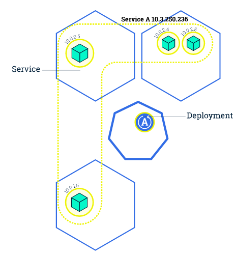

## 核心组件

Kubernetes 主要由以下几个核心组件组成：

- etcd 保存了整个集群的状态；
- apiserver 提供了资源操作的唯一入口，并提供认证、授权、访问控制、API 注册和发现等机制；
- controller manager 负责维护集群的状态，比如故障检测、自动扩展、滚动更新等；
- scheduler 负责资源的调度，按照预定的调度策略将 Pod 调度到相应的机器上；
- kubelet 负责维护容器的生命周期，同时也负责 Volume（CVI）和网络（CNI）的管理；
- Container runtime 负责镜像管理以及 Pod 和容器的真正运行（CRI）；
- kube-proxy 负责为 Service 提供 cluster 内部的服务发现和负载均衡


- `kubectl get` - 类似于 `docker ps`，查询资源列表
- 
- `kubectl describe` - 类似于 `docker inspect`，获取资源的详细信息
- 
- `kubectl logs` - 类似于 `docker logs`，获取容器的日志
- 
- `kubectl exec` - 类似于 `docker exec`，在容器内执行一个命令

## 使用 Volume

Pod 的生命周期通常比较短，只要出现了异常，就会创建一个新的 Pod 来代替它。那容器产生的数据呢？容器内的数据会随着 Pod 消亡而自动消失。Volume 就是为了持久化容器数据而生，比如可以为 redis 容器指定一个 hostPath 来存储 redis 数据：

```
apiVersion: v1
kind: Pod
metadata:
  name: redis
spec:
  containers:
  - name: redis
    image: redis
    volumeMounts:
    - name: redis-persistent-storage
      mountPath: /data/redis
  volumes:
  - name: redis-persistent-storage
    hostPath:
      path: /data/
```

## 扩展应用

通过修改 Deployment 中副本的数量（replicas），可以动态扩展或收缩应用：



这些自动扩展的容器会自动加入到 service 中，而收缩回收的容器也会自动从 service 中删除。

```
$ kubectl scale --replicas=3 deployment/nginx-app
$ kubectl get deploy
NAME        DESIRED   CURRENT   UP-TO-DATE   AVAILABLE   AGE
nginx-app   3         3         3            3           10m
```

## 滚动升级

滚动升级（Rolling Update）通过逐个容器替代升级的方式来实现无中断的服务升级：

```
kubectl rolling-update frontend-v1 frontend-v2 --image=image:v2
```

在滚动升级的过程中，如果发现了失败或者配置错误，还可以随时回滚

```
kubectl rolling-update frontend-v1 frontend-v2 --rollback
```

而更新应用的话，就可以直接用 `kubectl set` 命令：

```
kubectl set image deployment/nginx-app nginx-app=nginx:1.9.1
```

## 资源限制

Kubernetes 通过 cgroups 提供容器资源管理的功能，可以限制每个容器的 CPU 和内存使用，比如对于刚才创建的 deployment，可以通过下面的命令限制 nginx 容器最多只用 50% 的 CPU 和 128MB 的内存：

```
kubectl set resources deployment nginx-app -c=nginx --limits=cpu=500m,memory=128Mi
```

这等同于在每个 Pod 中设置 resources limits：

```
apiVersion: v1
kind: Pod
metadata:
  labels:
    app: nginx
  name: nginx
spec:
  containers:
    - image: nginx
      name: nginx
      resources:
        limits:
          cpu: "500m"
          memory: "128Mi"
```

## 健康检查

Kubernetes 作为一个面向应用的集群管理工具，需要确保容器在部署后确实处在正常的运行状态。Kubernetes 提供了两种探针（Probe，支持 exec、tcpSocket 和 http 方式）来探测容器的状态：

- LivenessProbe：探测应用是否处于健康状态，如果不健康则删除并重新创建容器
- ReadinessProbe：探测应用是否启动完成并且处于正常服务状态，如果不正常则不会接收来自 Kubernetes Service 的流量

对于已经部署的 deployment，可以通过 `kubectl edit deployment/nginx-app` 来更新 manifest，增加健康检查部分：

```yaml
apiVersion: extensions/v1beta1
kind: Deployment
metadata:
  labels:
    app: nginx
  name: nginx-default
spec:
  replicas: 3
  selector:
    matchLabels:
      app: nginx
  template:
    metadata:
      labels:
        app: nginx
    spec:
      containers:
      - image: nginx
        imagePullPolicy: Always
        name: http
        resources: {}
        terminationMessagePath: /dev/termination-log
        terminationMessagePolicy: File
        resources:
          limits:
            cpu: "500m"
            memory: "128Mi"
        livenessProbe:
          httpGet:
            path: /
            port: 80
          initialDelaySeconds: 15
          timeoutSeconds: 1
        readinessProbe:
          httpGet:
            path: /
            port: 80
          initialDelaySeconds: 5
          timeoutSeconds: 1
```

### 指定 Node 节点调度

### nodeSelector 示例

首先给 Node 打上标签

```
kubectl label nodes node-01 disktype=ssd
```

然后在 daemonset 中指定 nodeSelector 为 `disktype=ssd`：

```
spec:
  nodeSelector:
    disktype: ssd
```

# Secret

## Secret 类型

Secret 有三种类型：

- Opaque：base64 编码格式的 Secret，用来存储密码、密钥等；但数据也通过 base64 --decode 解码得到原始数据，所有加密性很弱。
- `kubernetes.io/dockerconfigjson`：用来存储私有 docker registry 的认证信息。
- `kubernetes.io/service-account-token`： 用于被 serviceaccount 引用。serviceaccout 创建时 Kubernetes 会默认创建对应的 secret。Pod 如果使用了 serviceaccount，对应的 secret 会自动挂载到 Pod 的 `/run/secrets/kubernetes.io/serviceaccount` 目录中。

## Opaque Secret

Opaque 类型的数据是一个 map 类型，要求 value 是 base64 编码格式：

```
$ echo -n "admin" | base64
YWRtaW4=
$ echo -n "1f2d1e2e67df" | base64
MWYyZDFlMmU2N2Rm
```

secrets.yml

```yaml
apiVersion: v1
kind: Secret
metadata:
  name: mysecret
type: Opaque
data:
  password: MWYyZDFlMmU2N2Rm
  username: YWRtaW4=
```

## Opaque Secret 的使用

创建好 secret 之后，有两种方式来使用它：

- 以 Volume 方式
- 以环境变量方式

将 Secret 挂载到 Volume 中

```
apiVersion: v1
kind: Pod
metadata:
  labels:
    name: db
  name: db
spec:
  volumes:
  - name: secrets
    secret:
      secretName: mysecret
  containers:
  - image: gcr.io/my_project_id/pg:v1
    name: db
    volumeMounts:
    - name: secrets
      mountPath: "/etc/secrets"
      readOnly: true
    ports:
    - name: cp
      containerPort: 5432
      hostPort: 5432
```

将 Secret 导出到环境变量中

```yaml
apiVersion: extensions/v1beta1
kind: Deployment
metadata:
  name: wordpress-deployment
spec:
  replicas: 2
  strategy:
      type: RollingUpdate
  template:
    metadata:
      labels:
        app: wordpress
        visualize: "true"
    spec:
      containers:
      - name: "wordpress"
        image: "wordpress"
        ports:
        - containerPort: 80
        env:
        - name: WORDPRESS_DB_USER
          valueFrom:
            secretKeyRef:
              name: mysecret
              key: username
        - name: WORDPRESS_DB_PASSWORD
          valueFrom:
            secretKeyRef:
              name: mysecret
              key: password
```

# Helm

[Helm](https://github.com/kubernetes/helm) 是一个类似于 yum/apt/[homebrew](https://brew.sh/) 的 Kubernetes 应用管理工具。Helm 使用 [Chart](https://github.com/kubernetes/charts) 来管理 Kubernetes manifest 文件。

## Helm 基本使用

安装 `helm` 客户端

```
brew install kubernetes-helm
```

初始化 Helm 并安装 `Tiller` 服务（需要事先配置好 kubectl）

```
helm init
```

更新 charts 列表

```
helm repo update
```

部署服务，比如 mysql

```
➜  ~ helm install stable/mysql
NAME:   quieting-warthog
LAST DEPLOYED: Tue Feb 21 16:13:02 2017
NAMESPACE: default
STATUS: DEPLOYED

RESOURCES:
==> v1/Secret
NAME                    TYPE    DATA  AGE
quieting-warthog-mysql  Opaque  2     1s

==> v1/PersistentVolumeClaim
NAME                    STATUS   VOLUME  CAPACITY  ACCESSMODES  AGE
quieting-warthog-mysql  Pending  1s

==> v1/Service
NAME                    CLUSTER-IP    EXTERNAL-IP  PORT(S)   AGE
quieting-warthog-mysql  10.3.253.105  <none>       3306/TCP  1s

==> extensions/v1beta1/Deployment
NAME                    DESIRED  CURRENT  UP-TO-DATE  AVAILABLE  AGE
quieting-warthog-mysql  1        1        1           0          1s


NOTES:
MySQL can be accessed via port 3306 on the following DNS name from within your cluster:
quieting-warthog-mysql.default.svc.cluster.local

To get your root password run:

    kubectl get secret --namespace default quieting-warthog-mysql -o jsonpath="{.data.mysql-root-password}" | base64 --decode; echo

To connect to your database:

1. Run an Ubuntu pod that you can use as a client:

    kubectl run -i --tty ubuntu --image=ubuntu:16.04 --restart=Never -- bash -il

2. Install the mysql client:

    $ apt-get update && apt-get install mysql-client -y

3. Connect using the mysql cli, then provide your password:
    $ mysql -h quieting-warthog-mysql -p
```

## Helm 工作原理

### 基本概念

Helm 的三个基本概念

- Chart：Helm 应用（package），包括该应用的所有 Kubernetes manifest 模版，类似于 YUM RPM 或 Apt dpkg 文件
- Repository：Helm package 存储仓库
- Release：chart 的部署实例，每个 chart 可以部署一个或多个 release

### Helm 工作原理

Helm 包括两个部分，`helm` 客户端和 `tiller` 服务端。

## Helm 命令参考

### 查询 charts

```
helm search
helm search mysql
```

#### 查询 package 详细信息

```
helm install stable/mysql
```

部署之前可以自定义 package 的选项：

```
# 查询支持的选项
helm inspect values stable/mysql

# 自定义 password
echo "mysqlRootPassword: passwd" > config.yaml
helm install -f config.yaml stable/mysql
```

#### 查询服务 (Release) 状态

```
➜  ~ helm status quieting-warthog
LAST DEPLOYED: Tue Feb 21 16:13:02 2017
NAMESPACE: default
STATUS: DEPLOYED

RESOURCES:
==> v1/Secret
NAME                    TYPE    DATA  AGE
quieting-warthog-mysql  Opaque  2     9m

==> v1/PersistentVolumeClaim
NAME                    STATUS  VOLUME                                    CAPACITY  ACCESSMODES  AGE
quieting-warthog-mysql  Bound   pvc-90af9bf9-f80d-11e6-930a-42010af00102  8Gi       RWO          9m

==> v1/Service
NAME                    CLUSTER-IP    EXTERNAL-IP  PORT(S)   AGE
quieting-warthog-mysql  10.3.253.105  <none>       3306/TCP  9m

==> extensions/v1beta1/Deployment
NAME                    DESIRED  CURRENT  UP-TO-DATE  AVAILABLE  AGE
quieting-warthog-mysql  1        1        1           1          9m


NOTES:
MySQL can be accessed via port 3306 on the following DNS name from within your cluster:
quieting-warthog-mysql.default.svc.cluster.local

To get your root password run:

    kubectl get secret --namespace default quieting-warthog-mysql -o jsonpath="{.data.mysql-root-password}" | base64 --decode; echo

To connect to your database:

1. Run an Ubuntu pod that you can use as a client:

    kubectl run -i --tty ubuntu --image=ubuntu:16.04 --restart=Never -- bash -il

2. Install the mysql client:

    $ apt-get update && apt-get install mysql-client -y

3. Connect using the mysql cli, then provide your password:
    $ mysql -h quieting-warthog-mysql -p
```

#### 升级和回滚 Release

```
# 升级
cat "mariadbUser: user1" >panda.yaml
helm upgrade -f panda.yaml happy-panda stable/mariadb

# 回滚
helm rollback happy-panda 1
```

#### 删除 Release

```
helm delete quieting-warthog
```

#### repo 管理

```
# 添加 incubator repo
helm repo add incubator https://kubernetes-charts-incubator.storage.googleapis.com/

# 查询 repo 列表
helm repo list

# 生成 repo 索引（用于搭建 helm repository）
helm repo index
```

#### chart 管理

```
# 创建一个新的 chart
helm create deis-workflow

# validate chart
helm lint

# 打包 chart 到 tgz
helm package deis-workflow
```

## Istio

#### 服务发现和负载均衡

#### 故障恢复

Istio 提供了一系列开箱即用的故障恢复功能，如

- 超时处理
- 重试处理，如限制最大重试时间以及可变重试间隔
- 健康检查，如自动移除不健康的容器
- 请求限制，如并发请求数和并发连接数
- 熔断

熔断示例：

```yaml
cat <<EOF | istioctl create -f -
apiVersion: networking.istio.io/v1alpha3
kind: DestinationRule
metadata:
  name: httpbin
spec:
  host: httpbin
  trafficPolicy:
    connectionPool:
      tcp:
        maxConnections: 1
      http:
        http1MaxPendingRequests: 1
        maxRequestsPerConnection: 1
    outlierDetection:
      http:
        consecutiveErrors: 1
        interval: 1s
        baseEjectionTime: 3m
        maxEjectionPercent: 100
EOF
```

#### 故障注入

Istio 支持为应用注入故障，以模拟实际生产中碰到的各种问题，包括

- 注入延迟（模拟网络延迟和服务过载）
- 注入失败（模拟应用失效）

这些故障均可以使用 VirtualService 动态配置。如以下配置 2 秒的延迟：

```yaml
apiVersion: networking.istio.io/v1alpha3
kind: VirtualService
metadata:
  name: ratings
spec:
  hosts:
  - ratings
  http:
  - fault:
      delay:
        percent: 100
        fixedDelay: 2s
    route:
    - destination:
        host: ratings
        subset: v1
```

#### 金丝雀部署

首先部署 bookinfo，并配置默认路由为 v1 版本

```yaml
# 以下命令假设 bookinfo 示例程序已部署，如未部署，可以执行下面的命令
$ kubectl apply -f <(istioctl kube-inject -f samples/bookinfo/platform/kube/bookinfo.yaml)
# 此时，三个版本的 reviews 服务以负载均衡的方式轮询。

# 创建默认路由，全部请求转发到 v1
$ istioctl create -f samples/bookinfo/routing/route-rule-all-v1.yaml

$ kubectl get virtualservice reviews -o yaml
apiVersion: networking.istio.io/v1alpha3
kind: VirtualService
metadata:
  name: reviews
spec:
  hosts:
  - reviews
  http:
  - route:
    - destination:
        host: reviews
        subset: v1
```

##### 示例一：将 10% 请求发送到 v2 版本而其余 90% 发送到 v1 版本

```yaml
cat <<EOF | istioctl create -f -
apiVersion: networking.istio.io/v1alpha3
kind: VirtualService
metadata:
  name: reviews
spec:
  hosts:
    - reviews
  http:
  - route:
    - destination:
        host: reviews
        subset: v1
      weight: 75
    - destination:
        host: reviews
        subset: v2
      weight: 25
EOF
```

