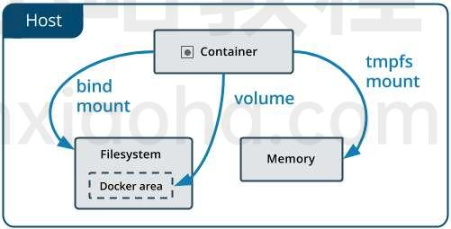
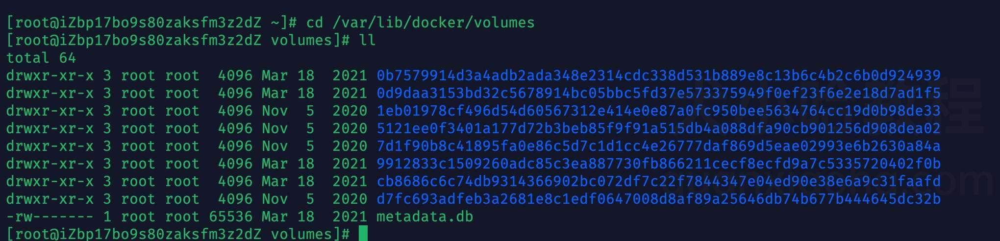
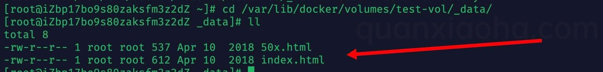
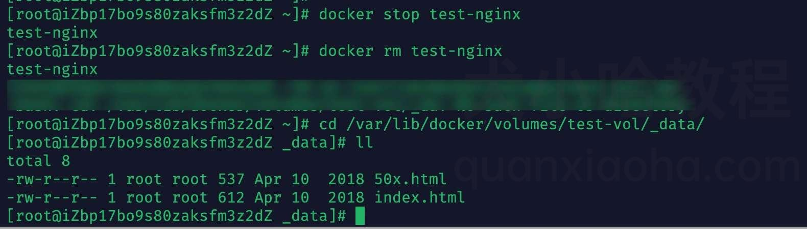
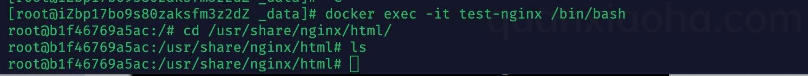
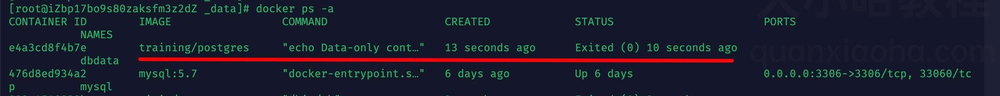

```bash
$ docker --help

管理命令:
  container   管理容器
  image       管理镜像
  network     管理网络
命令：
  attach      介入到一个正在运行的容器
  build       根据 Dockerfile 构建一个镜像
  commit      根据容器的更改创建一个新的镜像
  cp          在本地文件系统与容器中复制 文件/文件夹
  create      创建一个新容器
  exec        在容器中执行一条命令
  images      列出镜像
  kill        杀死一个或多个正在运行的容器    
  logs        取得容器的日志
  pause       暂停一个或多个容器的所有进程
  ps          列出所有容器
  pull        拉取一个镜像或仓库到 registry
  push        推送一个镜像或仓库到 registry
  rename      重命名一个容器
  restart     重新启动一个或多个容器
  rm          删除一个或多个容器
  rmi         删除一个或多个镜像
  run         在一个新的容器中执行一条命令
  search      在 Docker Hub 中搜索镜像
  start       启动一个或多个已经停止运行的容器
  stats       显示一个容器的实时资源占用
  stop        停止一个或多个正在运行的容器
  tag         为镜像创建一个新的标签
  top         显示一个容器内的所有进程
  unpause     恢复一个或多个容器内所有被暂停的进程
```

```
service docker start       # 启动 docker 服务，守护进程
service docker stop        # 停止 docker 服务
service docker status      # 查看 docker 服务状态
chkconfig docker on        # 设置为开机启动
```

```
docker pull centos:latest  # 从docker.io中下载centos镜像到本地
docker images              # 查看已下载的镜像
docker rmi [image_id]      # 删除镜像，指定镜像id

# 删除所有镜像
# none 默认为 docker.io
docker rmi $(docker images | grep none | awk '{print $3}' | sort -r)

# 连接进行进入命令行模式，exit命令退出。
docker run -t -i nginx:latest /bin/bash
```

### 通过容器创建镜像

我们可以通过以下两种方式对镜像进行更改。

1. 从已经创建的容器中更新镜像，并且提交这个镜像
2. 使用 Dockerfile 指令来创建一个新的镜像

下面通过已存在的容器创建一个新的镜像。

```
docker commit -m="First Docker" -a="wcjiang" a6b0a6cfdacf wcjiang/nginx:v1.2.1
```

上面命令参数说明：

- `-m` 提交的描述信息
- `-a` 指定镜像作者
- `a6b0a6cfdacf` 记住这个是容器id，不是镜像id
- `wcjiang/nginx:v1.2.1` 创建的目标镜像名

### 通过Dockerfile创建镜像

假设创建一个 node.js 镜像，首先在 node.js 项目根目录创建文件。

```
touch Dockerfile .dockerignore
```

`.dockerignore` 文件内容，下面代码表示，这三个路径要排除，不要打包进入 image 文件。如果你没有路径要排除，这个文件可以不新建。

```
.git
node_modules
npm-debug.log
```

Dockerfile 文件内容

```
FROM node:8.4
COPY . /app
WORKDIR /app
RUN npm install --registry=https://registry.npm.taobao.org
EXPOSE 3000
```

- `FROM node:8.4`：该 `image` 文件继承官方的 `node image`，冒号表示标签，这里标签是`8.4`，即`8.4`版本的 `node`。
- `COPY . /app`：将当前目录下的所有文件（除了 `.dockerignore` 排除的路径），都拷贝进入 `image` 文件的 `/app` 目录。
- `WORKDIR /app`：指定接下来的工作路径为`/app`。
- `RUN npm install`：在/app目录下，运行 `npm install` 命令安装依赖。注意，安装后所有的依赖，都将打包进入 `image` 文件。
- `EXPOSE 3000`：将容器 `3000` 端口暴露出来， 允许外部连接这个端口。

有了 `Dockerfile` 文件以后，就可以使用 `docker image build` 命令创建 `image` 文件了。

```
$ docker image build -t koa-demo .
# 或者
$ docker image build -t koa-demo:0.0.1 .
```

上面命令，`-t` 参数用来指定 `image` 文件的名字，后面还可以用冒号指定标签。如果不指定，默认的标签就是 `latest`。注意后面有个 `.`，表示 Dockerfile 文件所在的路径为当前路径

```
docker run --name koa-demo-name --rm -d -p 9066:3000 koa-demo:latest
# 或者
docker run --name koa-demo-name --rm -d -p 9066:3000 koa-demo:0.0.1
```

上面命令，将刚创建的 koa-demo 景象跑起来。

### 发布自己的镜像

1. 在[Docker](https://www.docker.com/) 注册账户，发布的镜像都在[这个页面里](https://cloud.docker.com/repository/list)展示
2. 将上面做的镜像`nginx`，起个新的名字`nginx-test`

```
docker tag wcjiang/nginx:v1.2.1 wcjiang/nginx-test:lastest
```

1. 登录docker

```
docker login
```

1. 上传`nginx-test`镜像

```
docker push wcjiang/nginx-test:lastest
# The push refers to a repository [docker.io/wcjiang/nginx-test]
# 2f5c6a3c22e3: Mounted from wcjiang/nginx
# cf516324493c: Mounted from wcjiang/nginx
# lastest: digest: sha256:73ae804b2c60327d1269aa387cf782f664bc91da3180d10dbd49027d7adaa789 size: 736
```

### 镜像中安装软件

通常情况下，使用docker官方镜像，如 mysql镜像，默认情况下镜像中啥软件也没有，通过下面命令安装你所需要的软件：

```
# 第一次需要运行这个命令，确保源的索引是最新的
# 同步 /etc/apt/sources.list 和 /etc/apt/sources.list.d 中列出的源的索引
apt-get update
# 做过上面更新同步之后，可以运行下面的命令了
apt-get install vim
```

如果你安装了CentOS或者Ubuntu系统可以进入系统安装相关软件

```
# 进入到centos7镜像系统
docker run -i -t centos:7 /bin/bash
yum update
yum install vim
```

## 容器管理

容器就像一个类的实例

```
# 列出本机正在运行的容器
docker container ls
# 列出本机所有容器，包括终止运行的容器
docker container ls --all
docker start [containerID/Names] # 启动容器
docker stop [containerID/Names]  # 停止容器
docker rm [containerID/Names]    # 删除容器
docker logs [containerID/Names]  # 查看日志
docker exec -it [containerID/Names] /bin/bash  # 进入容器

# 从正在运行的 Docker 容器里面，将文件拷贝到本机，注意后面有个【点】拷贝到当前目录
docker container cp [containID]:[/path/to/file] .

docker run centos echo "hello world"  # 在docker容器中运行hello world!
docker run centos yum install -y wget # 在docker容器中，安装wget软件
docker ps                             # 列出包括未运行的容器
docker ps -a                          # 查看所有容器(包括正在运行和已停止的)
docker logs my-nginx                  # 查看 my-nginx 容器日志

docker run -i -t centos /bin/bash     # 启动一个容器
docker inspect centos                 # 检查运行中的镜像
docker commit 8bd centos              # 保存对容器的修改
docker commit -m "n changed" my-nginx my-nginx-image # 使用已经存在的容器创建一个镜像
docker inspect -f {{.State.Pid}} 44fc0f0582d9        # 获取id为 44fc0f0582d9 的PID进程编号
# 下载指定版本容器镜像
docker pull gitlab/gitlab-ce:11.2.3-ce.0
```

### 容器服务管理

```
docker run -itd --name my-nginx2 nginx  # 通过nginx镜像，【创建】容器名为 my-nginx2 的容器
docker start my-nginx --restart=always  # 【启动策略】一个已经存在的容器启动添加策略
    # no - 容器不重启
    # on-failure - 容器推出状态非0时重启
    # always - 始终重启
docker start my-nginx             # 【启动】一个已经存在的容器
docker restart my-nginx           # 【重启】容器
docker stop my-nginx              # 【停止运行】一个容器
docker kill my-nginx              # 【杀死】一个运行中的容器
docker rename my-nginx new-nginx  # 【重命名】容器
docker rm new-nginx               # 【删除】容器
```

### 进入容器

1. 创建一个守护状态的 Docker 容器

```
docker run -itd my-nginx /bin/bash
```

1. 使用`docker ps`查看到该容器信息

```
docker ps
# CONTAINER ID  IMAGE  COMMAND      CREATED          STATUS          PORTS    NAMES
# 6bd0496da64f  nginx  "/bin/bash"  20 seconds ago   Up 18 seconds   80/tcp   high_shirley
```

1. 使用`docker exec`命令进入一个已经在运行的容器

```
docker exec -it 6bd0496da64f /bin/bash
```

通常有下面几种方式进入Docker的容器，推荐使用 `exec`，使用 `attach` 一直进入失败。

- 使用`docker attach`
- 使用`SSH` [为什么不需要在 Docker 容器中运行 sshd](http://www.oschina.net/translate/why-you-dont-need-to-run-sshd-in-docker?cmp)
- 使用`nsenter`进入Docker容器，[nsenter官方仓库](https://github.com/jpetazzo/nsenter)
- 使用`docker exec`，在`1.3.*`之后提供了一个新的命令`exec`用于进入容器

## 文件拷贝

从主机复制到容器 `sudo docker cp host_path containerID:container_path`
从容器复制到主机 `sudo docker cp containerID:container_path host_path`

## Docker私有仓库搭建

通过官方提供的私有仓库镜像`registry`来搭建私有仓库。通过 [humpback](https://humpback.github.io/) 快速搭建轻量级的Docker容器云管理平台。关于仓库配置说明请参见[configuration.md](https://github.com/docker/distribution/blob/master/docs/configuration.md)

> ⚠️ 注意：也可以通过部署管理工具 `Harbor` 来部署 `registry`

除了 [Harbor](https://github.com/goharbor/harbor) 还有 [humpback](https://github.com/humpback/humpback) 和 [rancher](https://github.com/rancher/rancher)

### `registry`

```
docker pull registry:2.6.2
```

创建容器并运行，创建成功之后，可访问 `http://192.168.99.100:7000/v2/`，来检查仓库是否正常运行，当返回 `{}` 时，表示部署成功。

```
docker run -d \
  -p 5000:5000 \
  --restart=always \
  --name registry \
  registry:2

# 自定义存储位置
docker run -d \
  -p 5000:5000 \
  --restart=always \
  --name registry \
  -v $HOME/_docker/registry:/var/lib/registry \
  registry:2

docker run -d -p 5000:5000 --restart=always --name registry \
    -v `pwd`/config.yml:/etc/docker/registry/config.yml \
    registry:2
```

推送镜像到私有仓库

```
# 从官方仓库拉取一个镜像
docker pull nginx:1.13
# 为镜像 `nginx:1.13` 创建一个新标签 `192.168.31.69:7000/test-nginx:1.13`
docker tag nginx:latest 192.168.31.69:7000/test-nginx:1.13
# 推送到私有仓库中
docker push 192.168.31.69:5000/test-nginx:1.13
# The push refers to a repository [192.168.99.100:7000/test-nginx]
# Get https://192.168.99.100:7000/v1/_ping: http: server gave HTTP response to HTTPS client
```

在推送到的时候报错误，默认是使用 `https` 提交，这个搭建的默认使用的是 `http`，解决方法两个：

1. 创建一个 `https` 映射
2. 将仓库地址加入到不安全的仓库列表中

我们使用第二种方法，加入到不安全的仓库列表中，修改docker配置文件 `vi /etc/docker/daemon.json` 添加 `insecure-registries` 配置信息，如果 [daemon.json](https://docs.docker.com/engine/reference/commandline/dockerd/#daemon-configuration-file) 文件不存在可以创建，关键配置项，将仓库将入到不安全的仓库列表中。

```
{
  "insecure-registries":[
    "192.168.31.69:5000"
  ]
}
```

重启服务 `service docker restart`，默认情况下 push 是会报如下错误的：

```
docker push 192.168.99.100:7000/test-nginx:1.13
# The push refers to a repository [192.168.99.100:7000/test-nginx]
# a1a53f8d99b5: Retrying in 1 second
# ...
# received unexpected HTTP status: 500 Internal Server Error
```

上面错误是 `SELinux` 强制访问控制安全系统，阻止导致的错误，通过下面方法禁用 SELinux 之后就可以 push 了。

```
setenforce 0  
getenforce   
# Permissive  
```

```
# 停止本地 registry
docker container stop registry
# 要删除容器，请使用 docker container rm
docker container stop registry && docker container rm -v registry
# 自定义存储位置
```

### `Harbor`

[部署 registry 管理工具 Harbor](https://github.com/jaywcjlove/docker-tutorial/blob/master/docs/harbor.md)

## Docker REST API

`Docker` 不仅可以通过本地命令行 `docker` 命令进行调用，还可以通过开启远程控制 `API`，使用 `HTTP` 调用接口来进行访问，远程控制 `Docker Daemon` 来做很多操作。`Docker` 的远程 `API` 服务默认监听的是 TCP `2375` 端口，为了保证安全，Docker 安装后默认不会启用远程 `API` 服务，因为这个服务默认不做权限认证。

### CentOS

CentOS 的开启方法比较简单，先修改配置：

```
vim /usr/lib/systemd/system/docker.service

# 修改 `ExecStart` 配置项，默认如下：
ExecStart=/usr/bin/dockerd -H fd:// --containerd=/run/containerd/containerd.sock

# 增加一个 `-H tcp://0.0.0.0:2375` 选项
ExecStart=/usr/bin/dockerd -H fd:// -H tcp://0.0.0.0:2375 --containerd=/run/containerd/containerd.sock
```

如果是内网生产环境，也可以将 `0.0.0.0` 改为内网 IP。同样的，`2375` 端口也可以修改。但是这样可能还有一个问题，无法在命令行使用 `docker` 命令了，还需要添加 `sock` 选项：`-H unix:///var/run/docker.sock`，最后为：

```bash
ExecStart=/usr/bin/dockerd -H fd:// -H unix:///var/run/docker.sock -H tcp://10.105.3.115:2375 --containerd=/run/containerd/containerd.sock
```

修改完配置之后需要重启 Docker 服务：

```
systemctl daemon-reload
systemctl restart docker
sudo service docker restart
```

重启完成后，可以使用 netstat 查看端口是否监听来确认是否成功：

```
[root@VM-3-115-centos ~]# netstat -nutlp | grep 2375
tcp   0   0 10.105.3.115:2375   0.0.0.0:*     LISTEN    32316/dockerd
```

### MacOS

在 Mac 下无法直接修改配置文件来开启远程 API 服务，后来在 [`docker/for-mac`](https://github.com/docker/for-mac) 的 [`issue`](https://github.com/docker/for-mac/issues/770) 中得到了解决方案。

可以运行一个 [`bobrik/socat`](https://hub.docker.com/r/bobrik/socat) 容器，将 `unix socket` 上的 Docker API 转发到 MacOS 上指定的端口中：

```
docker run -d -v /var/run/docker.sock:/var/run/docker.sock -p 127.0.0.1:2375:2375 bobrik/socat TCP-LISTEN:2375,fork UNIX-CONNECT:/var/run/docker.sock
```

### 测试

启用成功后，可以进行一些测试，例如直接使用浏览器访问 info 和 version 等页面获取信息。

```
http://127.0.0.1:2375/info
http://127.0.0.1:2375/version
```

下面可测试 docker 是否启动了

```
curl -s --unix-socket /var/run/docker.sock http://dummy/containers/json
## 或者使用下面命令
docker info
```

## 使用Docker实战

> ⚠文件挂载注意：docker 禁止用主机上不存在的文件挂载到 container 中已经存在的文件

```
-d, --detach=false      # 指定容器运行于前台还是后台，默认为false   
-i, --interactive=false # 打开STDIN，用于控制台交互  
-t, --tty=false         # 分配tty设备，该可以支持终端登录，默认为false  
-u, --user=""           # 指定容器的用户  
-a, --attach=[]         # 登录容器（必须是以docker run -d启动的容器）
-w, --workdir=""        # 指定容器的工作目录 
-c, --cpu-shares=0      # 设置容器CPU权重，在CPU共享场景使用  
-e, --env=[]            # 指定环境变量，容器中可以使用该环境变量  
-m, --memory=""         # 指定容器的内存上限  
-P, --publish-all=false # 指定容器暴露的端口  
-p, --publish=[]        # 指定容器暴露的端口 
-h, --hostname=""       # 指定容器的主机名  
-v, --volume=[]         # 给容器挂载存储卷，挂载到容器的某个目录  
--volumes-from=[]       # 给容器挂载其他容器上的卷，挂载到容器的某个目录
--cap-add=[]            # 添加权限，权限清单详见：http://linux.die.net/man/7/capabilities  
--cap-drop=[]           # 删除权限，权限清单详见：http://linux.die.net/man/7/capabilities  
--cidfile=""            # 运行容器后，在指定文件中写入容器PID值，一种典型的监控系统用法  
--cpuset=""             # 设置容器可以使用哪些CPU，此参数可以用来容器独占CPU  
--device=[]             # 添加主机设备给容器，相当于设备直通  
--dns=[]                # 指定容器的dns服务器  
--dns-search=[]         # 指定容器的dns搜索域名，写入到容器的/etc/resolv.conf文件  
--entrypoint=""         # 覆盖image的入口点  
--env-file=[]           # 指定环境变量文件，文件格式为每行一个环境变量  
--expose=[]             # 指定容器暴露的端口，即修改镜像的暴露端口  
--link=[]               # 指定容器间的关联，使用其他容器的IP、env等信息  
--lxc-conf=[]           # 指定容器的配置文件，只有在指定--exec-driver=lxc时使用  
--name=""               # 指定容器名字，后续可以通过名字进行容器管理，links特性需要使用名字  
--net="bridge"          # 容器网络设置:
                            # bridge 使用docker daemon指定的网桥     
                            # host 	//容器使用主机的网络  
                            # container:NAME_or_ID  >//使用其他容器的网路，共享IP和PORT等网络资源  
                            # none 容器使用自己的网络（类似--net=bridge），但是不进行配置 
--privileged=false      # 指定容器是否为特权容器，特权容器拥有所有的capabilities  
--restart="no"          # 指定容器停止后的重启策略:
                            # no：容器退出时不重启  
                            # on-failure：容器故障退出（返回值非零）时重启 
                            # always：容器退出时总是重启  
--rm=false              # 指定容器停止后自动删除容器(不支持以docker run -d启动的容器)  
--sig-proxy=true        # 设置由代理接受并处理信号，但是SIGCHLD、SIGSTOP和SIGKILL不能被代理
```

## 卸载旧的版本

移除旧的版本

```
$ sudo yum remove docker \
  docker-client \
  docker-client-latest \
  docker-common \
  docker-latest \
  docker-latest-logrotate \
  docker-logrotate \
  docker-selinux \
  docker-engine-selinux \
  docker-engine
```

**镜像拉不下来**

修改 Docker `daemon.json` 配置 macOS: `/etc/docker/daemon.json`，Linux: `~/.docker/daemon.json`

```
{
  "registry-mirrors":[
     "https://docker.mirrors.ustc.edu.cn",
     "https://hub-mirror.c.163.com",
     "https://mirror.baidubce.com",
     "https://registry.docker-cn.com"
  ],
  "insecure-registries": [
     "192.168.188.111:2021"
  ]
}
```

## Docker数据卷

挂载数据卷

Docker 提供了 3 种不同的方式将数据从宿主机挂载到容器中。

### volume (最常用的方式)

volume : Docker 管理宿主机文件系统的一部分，默认位于 `/var/lib/docker/volumes` 目录下, 也是最常用的方式。

看上图，所有的 Docker 容器数据都保存在 `/var/lib/docker/volumes` 目录下。若容器运行时未指定数据卷， Docker 创建容器时会使用默认的匿名卷（名称为一堆很长的 ID）。

#### 创建一个数据卷

执行如下命令创建数据卷：

```
docker volume create test-vol
```

#### 查看所有的数据卷

```
docker volume ls
```

#### 查看数据卷信息

执行如下命令，可以查看指定的数据卷信息

```
# 查看数据卷名为 test-vol 的信息
docker volume inspect test-vol
```

#### 运行容器时挂载数据卷

数据卷 `test-vol`创建成功后，我们运行一个 Nginx 容器，并尝试挂载该数据卷，挂载命令支持两种：

1. `-v`

```BASH
docker run -d -it --name=test-nginx -p 8011:80 -v test-vol:/usr/share/nginx/html nginx:1.1
```

参数说明：

- `-d` : 后台运行容器；
- `--name=test-nginx` : 指定容器名为 test-nginx;
- `-p 8011:80` : 将容器的 80 端口挂载到宿主机的 8011 端口；
- `-v test-vol:/usr/share/nginx/html` : 将 `test-vol` 数据卷挂载到容器中的 /usr/share/nginx/html 目录上；

1. `--mount`

```
docker run -d -it --name=test-nginx -p 8011:80 --mount source=test-vol,target=/usr/share/nginx/html nginx:1.13.12
```

参数说明：

- `--mount source=test-vol,target=/usr/share/nginx/html` : 将 `test-vol` 数据卷挂载到容器中的 /usr/share/nginx/html 目录上；

#### `-v` 和 `--mount` 有什么区别？

都是挂载命令，使用 `-v` 挂载时，如果宿主机上没有指定文件不会报错，会自动创建指定文件；当使用 `--mount`时，如果宿主机中没有这个文件会报错找不到指定文件，不会自动创建指定文件。

容器运行成功后，进入到 `/var/lib/docker/volumes` 目录下，验证数据是否挂载成功：



可以看到已经有了 `50x.html` 、 `index.html` 两个 Nginx 页面相关数据，说明数据卷挂载成功了。挂载成功后，我们不论是修改 `/var/lib/docker/volumes` 下的数据，还是进入到容器中修改 `/usr/share/nginx/html` 下的数据，都会同步修改对应的挂载目录，类似前端开发中双向绑定的作用。

下面，我们停止并删除刚刚运行的 Nginx 容器, 看看数据卷中的数据是否会跟着被删除：

下面，我们停止并删除刚刚运行的 Nginx 容器, 看看数据卷中的数据是否会跟着被删除：

删除容器，验证数据卷是否还存在

可以发现数据卷相关数据都还在，表明数据卷的生命周期独立于容器。另外，若下次再创建 Nginx 容器，还可以复用这个数据卷，复用性以及扩张性都非常不错。

### 删除数据卷

由于数据卷的生命期独立于容器，想要删除数据卷，就需要我们手动来操作, 执行命令如下：

```
docker volume rm test-vol
```

1. 如果你需要在删除容器的同时移除数据卷，请使用 `docker rm -v` 命令。
2. 对于那些没有被使用的数据卷，可能会占用较多的磁盘空间，你可以通过如下命令统一删除：

```
docker volume prune
```

### bind mount（**比较常用的方式**）

bind mount: 意为可以存储在宿主机中的任意位置。需要注意的是，bind mount 在不同的宿主机系统时不可移植的，比如 Windows 和 Linux 的目录结构是不一样的，bind mount 所指向的 host 目录也不一样。这也是为什么 bind mount 不能出现在 Dockerfile 中的原因所在，因为这样 Dockerfile 就不可移植了。

#### bind mount 使用

```
docker run -d -it --name=test-nginx -p 8011:80 -v /docker/nginx1:/usr/share/nginx/html nginx:1.13.12
```

参数说明：

- `-v /docker/nginx1:/usr/share/nginx/html` : 将宿主机中的 `/docker/nginx1` 目录挂载到容器中的 `/usr/share/nginx/html` 目录；

容器运行成功后，进入容器中：

```
docker exec -it test-nginx /bin/bash
```



从上图可以看到，与 volume 不同，bind mount 这种方式会隐藏目录中的内容（非空情况下），这里的 `/usr/share/nginx/html` 目录下的 html 文件被隐藏了，所以我们看不到。

但是，我们可以将宿主机中该目录中的文件立刻挂载到容器中，下面验证一下：

1. 新建一个 `index.html`:

   

2. 再次进入容器，查看挂载目录内容：

   

### tmpfs mount (一般不用这种方式)

tmpfs mount : 挂载存储在宿主机的内存中，而不会写入宿主机的文件系统，一般不用此种方式。

## Docker 数据卷容器

如果你有一些需要持续更新的数据需要在容器之间共享，最佳实践是创建数据卷容器。**数据卷容器，其实就是一个正常的 Docker 容器，专门用于提供数据卷供其他容器挂载的**。

### 创建数据卷容器

运行一个容器，并创建一个名为 `dbdata` 的数据卷：

```
docker run -d -v /dbdata --name dbdata training/postgres echo Data-only container for postgres
```

容器运行成功后，会发现该数据卷容器处于停止运行状态，这是因为数据卷容器并不需要处于运行状态，只需用于提供数据卷挂载即可。



## 挂载数据卷

`--volumes-from` 命令支持从另一个容器挂载容器中已创建好的数据卷。

```
docker run -d --volumes-from dbdata --name db1 training/postgres
docker run -d --volumes-from dbdata --name db2 training/postgres
docker ps
CONTAINER ID       IMAGE                COMMAND                CREATED             STATUS              PORTS               NAMES
7348cb189292       training/postgres    "/docker-entrypoint.   11 seconds ago      Up 10 seconds       5432/tcp            db2
a262c79688e8       training/postgres    "/docker-entrypoint.   33 seconds ago      Up 32 seconds       5432/tcp            db1
```

还可以使用多个 `--volumes-from` 参数来从多个容器挂载多个数据卷。 也可以从其他已经挂载了数据卷的容器来挂载数据卷。

如果删除了挂载的容器（包括 dbdata、db1 和 db2），数据卷并不会被自动删除。如果想要删除一个数据卷，必须在删除最后一个还挂载着它的容器时使用 `docker rm -v` 命令来指定同时删除关联的容器。

## Docker 使用数据卷容器备份、恢复、迁移数据卷

### 备份

首先使用 `--volumes-from` 命令创建一个加载 dbdata 的容器卷容器，并将宿主机当前目录挂载到容器的 /backup 目录，命令如下：

```
sudo docker run --volumes-from dbdata -v $(pwd):/backup ubuntu tar cvf /backup/backup.tar /dbdata
```

容器启动后，使用了 `tar` 命令来将 dbdata 数据卷备份为容器中 /backup/backup.tar 文件，因为挂载了的关系，宿主机的当前目录下也会生成 `backup.tar` 备份文件。

### 恢复/迁移

如果要恢复数据到一个容器，首先创建一个带有空数据卷的容器 dbdata2

```
$ sudo docker run -v /dbdata --name dbdata2 ubuntu /bin/bash
```

然后创建另一个容器，挂载 dbdata2 容器卷中的数据卷，并使用 `untar` 解压备份文件到挂载的容器卷中。

```
$ sudo docker run --volumes-from dbdata2 -v $(pwd):/backup busybox tar xvf
/backup/backup.tar
```

