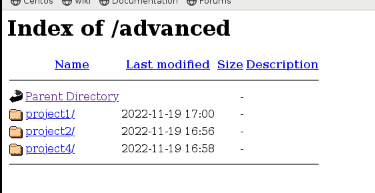
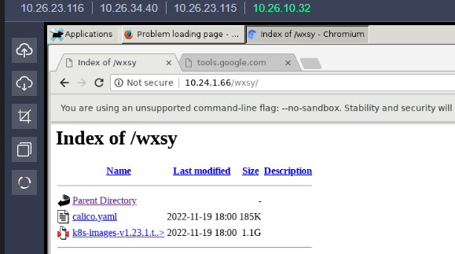

```
[centos]
name=centos
baseurl=http://10.24.1.66/centos/
gpgcheck=0
enabled=1
[iaas]
name=iaas
baseurl=http://10.24.1.66/iaas-repo/
gpgcheck=0
enabled=1
```

一、私有云任务（当前任务共25道题目）

1、【实操题】基础环境配置（2分）

使用提供的用户名密码，登录提供的OpenStack私有云平台，在当前租户下，使用CentOS7.9镜像，创建两台云主机，云主机类型使用4vCPU/12G/100G_50G类型。当前租户下默认存在一张网卡，自行创建第二张网卡并连接至controller和compute节点（第二张网卡的网段为10.10.X.0/24，X为工位号，不需要创建路由）。自行检查安全组策略，以确保网络正常通信与ssh连接，然后按以下要求配置服务器：

（1）设置控制节点主机名为controller，设置计算节点主机名为compute；

（2）修改hosts文件将IP地址映射为主机名；

完成后提交控制节点的用户名、密码和IP地址到答题框。


2、【实操题】Yum源配置（2分）

使用提供的http服务地址，在http服务下，存在centos7.9和iaas的网络yum源，使用该http源作为安装iaas平台的网络源。分别设置controller节点和compute节点的yum源文件http.repo。完成后提交控制节点的用户名、密码和IP地址到答题框。


3、安装openstack-iaas


4、编写脚本


5、数据库安装与调优

修改/etc/my.cnf

1、设置数据库支持大小写

2、设置数据库缓存innodb表索引、数据、插入数据的缓冲为4G

```
lower_case_table_names = 1
innodb_buffer_pool_size = 4G
```


6、keystone

创建用户chinaskill，密码为000000

```
openstack user create chinaskill --password 000000
```


7、glance

 上传镜像，设置最小启动硬盘10G


8、nova

修改nova配置文件，解决因等待时间过长导致虚拟机启动超时获取不到IP地址而报错的问题

```
vif_plugging_is_fatal=false
systemctl restart *nova*
```


9、安装neutron服务


10、安装Dashboard


11、安装swift


12、【实操题】Cinder创建硬盘（2分）

在控制节点和计算节点分别使用iaas-install-cinder-controller.sh、iaas-install-cinder-compute.sh脚本安装Cinder服务，请在计算节点，对块存储进行扩容操作，即在计算节点再分出一个5G的分区，加入到cinder块存储的后端存储中去。完成后提交计算节点的用户名、密码和IP地址到答题框。

```
pvcreate /dev/sdc
vgextend cinder-volumes /dev/sdc

vgdisplay
```

13、【实操题】Barbican服务安装与使用（2分）

使用iaas-install-barbican.sh脚本安装barbican服务，安装服务完毕后，使用openstack命令创建一个名为secret01的密钥，创建完成后提交控制节点的用户名、密码和IP地址到答题框。

```
openstack secret store --name secret01 --payload secretkey
```


14 、manila

创建default_share_type共享类型，接着创建一个大小2G的共享存储名为share01

```
manila type-create default_share_type 0
manila create NFS 2 --name share01
```


15、【实操题】Cloudkitty服务安装与使用（2分）

使用iaas-install-cloudkitty.sh脚本安装cloudkitty服务，安装完毕后，启用hashmap评级模块。设置完成后提交控制节点的用户名、密码和IP地址到答题框。

```
openstack rating module enable hashmap
```


16、平台内存优化

关闭内存共享，打开透明大页

```
echo 'never' > /sys/kernel/mm/transparent_hugepage/defrag

ipcs
```


17、【实操题】OpenStack Glance镜像压缩（2分）

使用自行搭建的OpenStack平台。在HTTP服务中存在一个镜像为CentOS7.5-compress.qcow2的镜像，请使用qemu相关命令，对该镜像进行压缩，压缩后的镜像命名为chinaskill-js-compress.qcow2并存放在/root目录下。完成后提交controller点的用户名、密码和IP地址到答题框。

```
qemu-img convert -c -O qcow2 CentOS7.5-compress.qcow2 chinaskill-js-compress.qcow2
```


18、修改文件句柄数

修改相关配置，将控制节点的最大文件句柄数永久修改为65535

```
vim /etc/security/limits.conf
* hard nofile 65535
* soft nofile 65535

ulimit -n 65535
```


19、openstack参数调优

通过用户级别、系统级别、配置文件设置RabbitMQ服务的最大连接数为10240

```
vim /etc/security/limits.conf
openstack hard nofile 10240
openstack soft nofile 10240

vim /usr/lib/systemd/system/rabbitmq-server.service
LimitNOFILE=10240

systemctl daemon-reload
systemctl restart rabbitmq-server

vi /etc/sysctl.conf
fs.file-max = 10240

sysctl -p
```


20、防止SYN攻击

```
vi /etc/sysctl.conf
net.ipv4.tcp_syncookies = 1
sysctl -p
```


21、【实操题】OpenStack开放镜像权限（2分）

使用OpenStack私有云平台，在OpenStack平台的admin项目中使用cirros-0.3.4-x86_64-disk.img镜像文件创建名为glance-cirros的镜像，通过OpenStack命令将glance-cirros镜像指定demo项目进行共享使用。配置完成后提交controller点的用户名、密码和IP地址到答题框。

```
先将镜像共享给A租户
glance member-create 镜像id A租户id【projectA】
共享之后，镜像的状态是pending状态，还需要激活镜像
glance member-update  镜像id A租户id【projectA】 accepted
```


22、【实操题】glance对接cinder后端存储（2分）

在自行搭建的OpenStack平台中修改相关参数，使glance可以使用cinder作为后端存储，将镜像存储于cinder卷中。使用cirros-0.3.4-x86_64-disk.img文件创建cirros-image镜像存储于cirros-cinder卷中，通过cirros-image镜像使用cinder卷启动盘的方式进行创建虚拟机。完成后提交修改节点的用户名、密码和IP地址到答题框。

```bash
在自行搭建的OpenStack平台中修改相关参数，使glance可以使用cinder作为后端存储，将镜像存储于cinder卷中。使用cirros-0.3.4-x86_64-disk.img文件创建cirros-image镜像存储于cirros-cinder卷中，通过cirros-image镜像使用cinder卷启动盘的方式进行创建虚拟机。

vi /etc/glance/glance-api.conf

stores = file, http, cinder
show_multiple_locations = True

/etc/cinder/cinder.conf
glance_api_version = 2     ##这个配置字段默认没有，在第300行那一片添加就行
allowed_direct_url_schemes = cinder
#以下字段在cinder配置文件里没有，直接在最后面添加就行
[lvm]
image_upload_use_internal_tenant = True

systemctl restart *glance* *cinder* 

创建镜像
openstack image create --container-format bare --disk-format raw --file /opt/openstack/images/cirros-0.3.4-x86_64-disk.img  cirros 
根据此镜像创建一个cinder卷        
cinder create --image cirros --name cirros-cinder 1
根据刚才含有镜像的卷创建出cirros-image镜像
openstack image create --container-format bare --disk-format raw --volume cirros-cinder  cirros-image 
```


23、【实操题】OpenStack Nova清除缓存（2分）

在OpenStack平台的一台计算节点创建虚拟机，若是第一次在该节点创建次虚拟机，会先将镜像文件复制到该计算节点目录/var/lib/nova/instances/_base。长期下来，该目录会占用比较大的磁盘空间而要清理。可以通过修改nova的配置文件来自动清理该缓存目录，即在该节点没有使用某镜像启动的云主机，那么这个镜像在过一定的时间后会被自动删除。配置完成后提交改动节点的用户名、密码和IP地址到答题框。

```
remove_unused_base_images=true
```


24、【实操题】Python运维开发：基于OpenStack Restful API实现镜像上传（2分）

使用OpenStack all-in-one镜像，创建OpenStack Python运维开发环境。云主机的用户/密码为：“root/Abc@1234”，OpenStack的域名/账号/密码为：“demo/admin/000000”。

提示说明：python脚本文件头建议加入“#encoding:utf-8”避免编码错误；测试脚本代码用python3命令执行与测试。

在controller节点的/root目录下创建api_image_manager.py脚本，编写python代码对接OpenStack API，完成镜像的创建与上传。创建之前查询是否存在“同名镜像”，如果存在先删除该镜像。

（1）创建镜像：要求在OpenStack私有云平台中上传镜像cirros-0.3.4-x86_64-disk.img，名字为cirros001，disk_format为qcow2，container_format为bare。

（2）查询镜像：查询cirros001的详细信息，并以json格式文本输出到控制台。

完成后提交OpenStack Python运维开发环境Controller节点的IP地址，用户名和密码提交。

```python
#查询cirros001的详细信息，并以json格式文本输出到控制台。
import requests,json

controller="10.26.22.242"
url=f"http://{controller}:5000/v3/auth/tokens"
body={
    "auth":{
        "identity":{
            "methods":["password"],
            "password":{
                "user":{
                    "domain":{"name":"demo"},
                    "name":"admin",
                    "password":"000000"
                }
            }
        },
        "scope":{
            "project":{
                "domain":{"name":"demo"},
                "name":"admin"
            }
        }
    }
}
headers={
    "Content-Type":"application/json"
}
Token=requests.post(url,headers=headers,data=json.dumps(body)).headers["X-Subject-Token"]
heaters={
    "X-Auth-Token":Token
}
print(f"Token:{Token}")

id="0e572906-f6af-4faf-acb1-8c3407314d36"
image_url=f"http://{controller}:9292/v2/images"+id
re = json.loads(requests.get(image_url,headers=headers).text)
print(re)
```


25、【实操题】Python运维开发：基于Openstack Python SDK实现云主机创建（2分）

使用已建好的OpenStack Python运维开发环境，在/root目录下创建sdk_server_manager.py脚本，使用python-openstacksdk Python模块，完成云主机的创建和查询。创建之前查询是否存在“同名云主机”，如果存在先删除该镜像。

（1）创建1台云主机：云主机信息如下：

云主机名称如下：server001

镜像文件：cirros-0.3.4-x86_64-disk.img

云主机类型：m1.tiny

网络等必要信息自己补充。

（2）查询云主机：查询云主机server001的详细信息，并以json格式文本输出到控制台。

完成后提交OpenStack Python运维开发环境 Controller节点的IP地址，用户名和密码提交。

```python
import json
import openstack
def create_connection(auth_url,user_domain_name,username,password):
  return openstack.connect(
    auth_url="http://10.26.22.242",
    user_domain_name="admin",
    username="admin",
    password="000000"
)
class server_namager:
  def __init__(self,connect):
    self.connect=connect
  def create_server(self):
    image = self.connect.compute.find.image("cirros-0.3.4-x86_64-disk.img")
    flavor = self.connect.compute.find_flavor("m1.tiny")
    network = self.connect.compute.find_network("int-net")
    server =self.connect.compute.create_server(name=server001,image_id=image.id,flavor_id=flavor.id,network=[{"uuid":met
work.id}])
    result = self.connectncompute.wait_for_server(server)
    return result
```


【实操题】平台部署--部署容器云平台（2分）

登录OpenStack私有云平台，使用CentOS7.9镜像创建两台云主机，使用kubeeasy工具完成Kubernetes 1.22.1集群的搭建。

完成后提交master节点的用户名、密码和IP到答题框。

```
curl -O 10.24.1.66/chinaskills_cloud_paas_v2.0.2.iso
curl -O 10.24.1.66/gameone/chinaskills_cloud_paas.iso
```

5、【实操题】容器化Memcached服务（2分）

在master节点/root/DjangoBlog目录下编写Dockerfile-memcached文件构建blog-memcached:v1.0镜像，具体要求如下：（需要用到的软件包：Django.tar.gz）

（1）基础镜像：centos:7.9.2009；

（2）完成memcached服务的安装；

（3）声明端口：11211；

（4）设置服务开机自启。

完成后构建镜像，并提交master节点的用户名、密码和IP地址到答题框。

```

```


8、【实操题】容器化Blog服务（2分）

在master节点/root/DjangoBlog目录下编写Dockerfile-blog文件构建blog-service:v1.0镜像，具体要求如下：（需要用到的软件包：Django.tar.gz）

（1）基础镜像：centos:7.9.2009；

（2）安装Python3.6环境；

（3）使用pip3工具离线安装requirements.txt中的软件包；

（4）安装DjangoBlog服务；

（5）声明端口：8000；

（6）设置DjangoBlog服务开机自启。

完成后构建镜像，并提交master节点的用户名、密码和IP地址到答题框。

```

```

