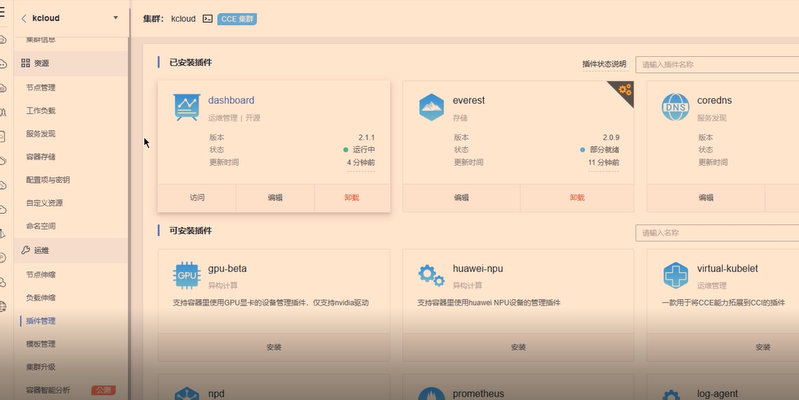
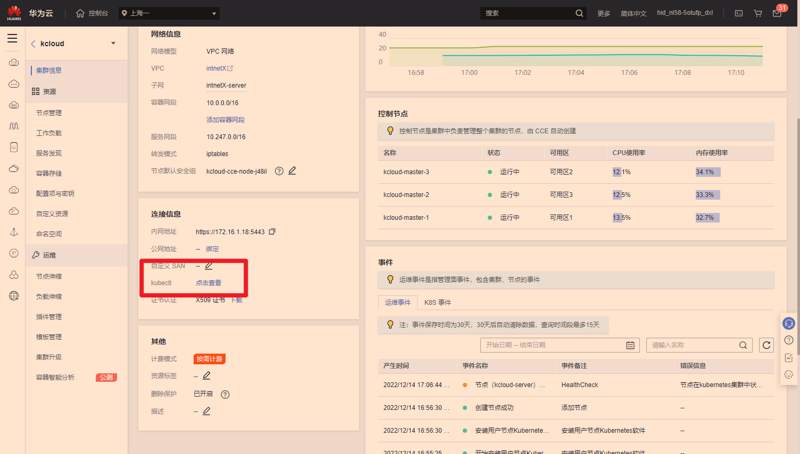
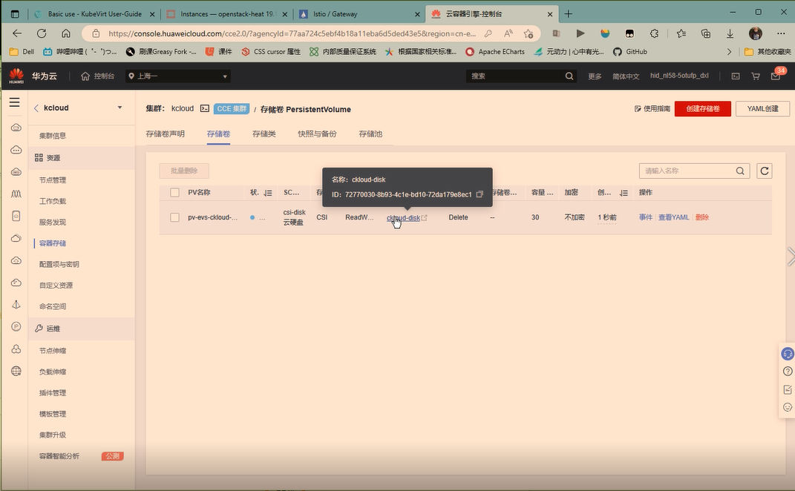
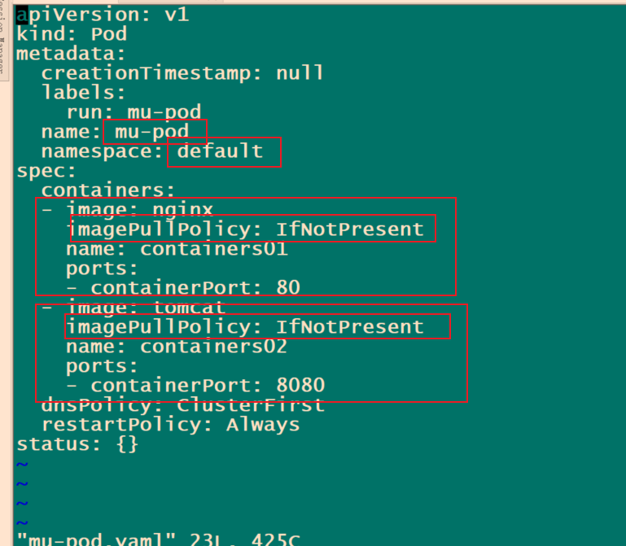
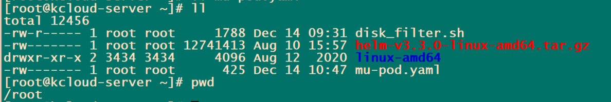
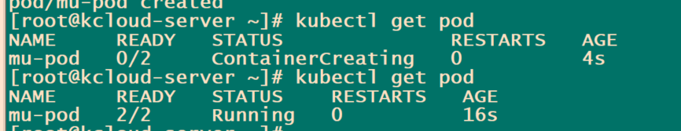

1、【实操题】私有网络管理


2、【实操题】云实例管理（2分）

登录华为云平台，创建两台云实例，具体要求如下：

（1）计费模式：按需计费；

（2）地域：上海一；

（3）CPU架构：x86计算；

（4）规格：c7.xlarge.2；

（5）镜像：CentOS 7.5 64位；

（6）系统盘：高IO 50G硬盘；

（7）公网带宽：按带宽计费，5Mbps；

（8）实例名称：ChinaSkill-node-1、ChinaSkill-node-2；

（9）登录方式：使用密码登录，密码自定义。

创建完成后，提交当前的AK（SecretId）、SK（SecretKey）和ChinaSkill-node-1的实例ID到答题框。

```

```

3、【实操题】数据库管理（2分）

使用intnetX-mysql网络创建两台chinaskill-sql-1和chinaskill-sql-2云服务器，使用提供的压缩文件rocketchat-cloud.tar.gz中的软件包源，在chinaskill-sql-1和chinaskill-sql-2中部署MongoDB数据库服务。配置完成后提交连接chinaskill-sql-1节点的用户名、密码和公网IP地址到答题框。

```
yum -y install mongodb-org
systemctl enable --now mongod
```

4、【实操题】主从数据库（2分）

在chinaskill-sql-1和chinaskill-sql-2云服务器中配置MongoDB主从数据库，配置MongoDB集群名称为rs并完成集群设置。完成后提交连接chinaskill-sql-1节点的用户名、密码和公网IP地址到答题框。

```
#主库
[root@mysql-1 ~]# vi /etc/mongod.conf
net:
  port: 27017
  bindIp: 0.0.0.0  # 修改

replication:
  replSetName: rs   #添加
  
删除从库数据库
> use config
switched to db config
> db.dropDatabase()
{ "dropped" : "config", "ok" : 1 }
[root@mysql-1 ~]# vi /etc/mongod.conf
net:
  port: 27017
  bindIp: 0.0.0.0  # 修改

replication:
  replSetName: rs   #添加
重启systemctl restart mongod
```

```bash
数据库配置
#主库
> use admin 
switched to db admin
> config={_id:'rs',members:[{_id:0,host:'172.16.2.68:27017'},{_id:1,host:'172.16.2.204:27017'}]};
{
        "_id" : "rs",
        "members" : [
                {
                        "_id" : 0,
                        "host" : "172.16.2.68:27017"
                },
                {
                        "_id" : 1,
                        "host" : "172.16.2.204:27017"
                }
        ]
}
> rs.initiate(config)
{ "ok" : 1 }    #要显示ok 1

#报错把从配置文件主从配置去掉重启服务在从上进入库后执行db.dropDatabase(),清空所有的数据库，一个也不要留，直到show dbs为空
rs:SECONDARY> rs.status()
{
        "set" : "rs",
        "date" : ISODate("2022-12-13T14:51:21.843Z"),
        "myState" : 1,
        "term" : NumberLong(1),
```

5、【实操题】node环境管理（2分）

使用提供的压缩文件rocketchat-cloud.tar.gz中软件包源，在ChinaSkill-node-1部署nodejs，根据所提供的rocket.chat所需要求安装nodejs对应版本。配置完成后提交连接ChinaSkill-node-1节点的用户名、密码和公网IP地址到答题框。

```bash
[root@chinaskill-sql-1 rocketchat-cloud]# chmod +x setup_12.x 
[root@chinaskill-sql-1 rocketchat-cloud]# ./setup_12.x 
[root@chinaskill-sql-1 rocketchat-cloud]# sudo yum install -y nodejs

npm install -g inherits n && sudo n 12.16.1

# -g 全局安装
```

6、【实操题】安全组管理（2分）

创建一个安全组，具体要求如下：

（1）名称：intnetX-security；

（2）允许策略：只放行源地址为172.16.1.0/24访问27017端口；

（3）允许策略：只放行源地址为172.16.1.0/24使用ping命令访问；

（4）关联实例：将intnetX-security安全组关联至所创建的数据库中；

创建完成后，提交当前的AK（SecretId）、SK（SecretKey）和安全组ID到答题框。

```

```

7、【实操题】RocketChat上云（2分）

参考【https://lala.im/2705.html】

参考【https://blog.51cto.com/liangww/5053015】

使用http服务器提供的压缩文件rocketchat-cloud.tar.gz中的RocketChat软件包，在ChinaSkill-node-1中部署RocketChat的Web服务。使用chinaskill-sql-1的MongoDB为后端数据库，设置RocketChat服务访问端口为3000。完成Rocketchat系统上云后，将ChinaSkill-node-1节点的用户名、密码和公网IP地址到答题框。(0？？？)

```bash
yum -y install gcc gcc-c++  make
yum install -y epel-release && sudo yum install -y GraphicsMagick

看README

[root@chinaskill-sql-1 rocketchat-cloud]# cd bundle/programs/server/
[root@chinaskill-sql-1 server]# npm install

将安装完成的bundle目录移动至/opt/目录中，添加Rocket.chat用户，设置Rocket.Chat文件夹的权限
mv bundle /opt/Rocket.Chat
useradd -M rocketchat && sudo usermod -L rocketchat
chown -R rocketchat:rocketchat /opt/Rocket.Chat

配置mongodb环境变量：
[root@chinaskill-node-0001 bundle]# export PORT=3000

[root@chinaskill-node-0001 bundle]# export ROOT_URL=http://116.63.33.97:3000

[root@chinaskill-node-0001 bundle]# export MONGO_URL=mongodb://localhost:27017/rocketchat?replicaSet=rs

[root@chinaskill-node-0001 bundle]# export MONGO_OPLOG_URL=mongodb://localhost:27017/local?replicaSet=rs

设置mongodb开机启动以及现在就运行mongodb：
sed -i "s/^# engine:/engine: mmapv1/" /etc/mongod.conf

systemctl restart mongod

npm install -g pm2

pm2 start main.js   #后台运行
#开机自启 可不做
pm2 save
pm2 startup
```

8、【实操题】NAT网关（2分）

创建一个公网NAT网关，具体配置如下：

（1）名称为：kcloud-nat；

（2）虚拟私有云：intnetX；

（3）子网：intnetX-server；

（4）规则：内部子网地址访问外网；

（5）设置Chinaskill-node-1云服务器3000端口转换为外部3000服务端口。

创建完成后提交当前的AK（SecretId）、SK（SecretKey）和NAT网关的ID到答题框。

```

```

9、【实操题】云备份（2分）

创建一个云服务器备份存储库名为server_backup，容量为100G。将ChinaSkill-node-1云服务器制作镜像文件chinaskill-image。完成后，将当前的AK（SecretId）、SK（SecretKey）和存储库ID到答题框。

```

```

10、【实操题】负载均衡器（2分）

创建一个负载均衡器chinaskill-elb，将ChinaSkill-node-1和ChinaSkill-node-2加入负载均衡的后端。设置一个可用的公网服务IP，服务端口为3000。配置监听器，监听3000端口。对浮动公共IP进行Web访问测试。完成后，提交当前的AK（SecretId）、SK（SecretKey）和负载均衡器的ID到答题框。

```

```

11、【实操题】弹性伸缩管理（2分）


新建一个启动配置，具体要求如下：

（1）启动配置名称：template-exam；

（2）计费模式：按量计费；

（3）地域：上海一；

（4）镜像：chinaskill-image；

（5）登录方式：使用密码登录，密码自定义。

创建一个伸缩组，具体要求如下：

（1）名称：as-exam；

（2）最小伸缩数：1；起始实例数：1；最大伸缩数：5；

（3）启动配置：template-exam；

（4）使用负载均衡：chinaskill-elb；

（5）移出策略：移出最旧的实例。

为伸缩组as-exam新建告警触发策略，具体要求如下：

（1）如果实例的内存利用率在5分钟内的最大值小于40%，且连续发生3次。则实例数减少1台。冷却60秒；

（2）如果实例的内存利用率在5分钟内的最大值大于80%，且连续发生3次。则实例数增加1台。冷却60秒；

（3）如果实例的CPU利用率在5分钟内的最大值小于40%，且连续发生3次。则实例数减少1台。冷却60秒；

（4）如果实例的CPU利用率在5分钟内的平均值大于等于80%，且连续发生3次。则实例数增加1台。冷却60秒。

创建完成后提交当前的AK（SecretId）、SK（SecretKey）和伸缩组的实例ID到答题框。

```

```

12、【实操题】云容器引擎（2分）

创建一个x86架构集群，具体要求如下：

（1）集群名称：kcloud；

（2）集群版本：v1.21；

（3）地域：上海一；

（4）集群管理规模：50节点；

（5）控制节点数：3；

（6）节点使用子网：intnetX-server；

（7）Pod实例上限：64；

（8）容器网段：10.10.0.0/16。

节点配置信息要求如下：

（1）节点名称：kcloud-server；

（2）节点规格：c6s.xlarge.2

（3）节点：EulerOS 2.9

创建完成后提交当前的AK（SecretId）、SK（SecretKey）和集群的ID到答题框。 （0 ？？？）

```

```


13、【实操题】云容器管理

安装dashboard



14、【实操题】使用kubectl操作集群（2分）

在kcloud集群中安装kubectl命令，使用kubectl命令管理kcloud集群。完成后提交连接kcloud集群节点的用户名、密码和公网IP地址到答题框。



15、【实操题】安装helm（2分）

使用提供的helm软件包（软件包为helm-v3.3.0-linux-amd64.tar.gz在http服务下），在kcloud集群中安装helm服务。完成后提交连接kcloud集群节点的用户名、密码和公网IP地址到答题框。

```
[root@kcloud-server ~]# tar -zxf helm-v3.3.0-linux-amd64.tar.gz
[root@kcloud-server ~]# cp -f linux-amd64/helm /usr/local/bin/
[root@kcloud-server ~]# helm version
version.BuildInfo{Version:"v3.3.0", GitCommit:"8a4aeec08d67a7b84472007529e8097ec3742105", GitTreeState:"dirty", GoVersion:"go1.14.7"}
```


16、【实操题】云硬盘存储卷（2分）

购买云硬盘存储卷，具体配置如下：

（1）名称为：ckloud-disk；

（2）集群：kcloud；

（3）容量：30G；

（4）类型：高I/O；

完成后提交连接kcloud集群节点的用户名、密码和公网IP地址到答题框。 （1.33 把名字改了 ）



17、【实操题】多容器Pod管理（2分）（这种题好像只检测创建没创建）

在kcloud集群节点/root目录下编写YAML文件mu-pod.yaml，具体要求如下：

（1）Pod名称：mu-pod；

（2）命名空间：default；

（3）Pod包含两个容器：

• 容器1名称：containers01；镜像：nginx；容器端口：80；

• 容器2名称：containers02；镜像：tomcat；容器端口：8080；

（4）拉取策略：IfNotPresent。

完成后使用该YAML文件创建Pod，并提交master节点的用户名、密码和IP到答题框。（0？？）

```bash
kubectl run mu-pod --image=nginx --port='80' --dry-run='client' -oyaml > mu-pod.yaml

apiVersion: v1
kind: Pod
metadata:
  creationTimestamp: null
  labels:
    run: mu-pod
  name: mu-pod
  namespace: default
spec:
  containers:
  - image: nginx
    imagePullPolicy: IfNotPresent
    name: containers01
    ports:
    - containerPort: 80
  - image: tomcat
    imagePullPolicy: IfNotPresent
    name: containers02
    ports:
    - containerPort: 8080
  dnsPolicy: ClusterFirst
  restartPolicy: Always
status: {}
```





**因为没创建**



18、【实操题】Namespace管理（2分）

在kcloud集群节点/root目录下编写YAML文件my-namespace.yaml，具体要求如下：

（1）Namespace名称：test。

完成后使用该YAML文件创建Namespace，并提交master节点的用户名、密码和IP到答题框。

```bash
kubectl create ns test --dry-run='client' --output='yaml' > my-namespace.yaml
```

 

19、【实操题】Secrets管理--Opaque（2分）

在master节点/root目录下编写YAML文件secret.yaml，具体要求如下：

（1）Secret名称：mysecret；

（2）命名空间：default；

（3）类型：Opaque；

（4）username: YWRtaW4=；password: MWYyZDFlMmU2N2Rm。

完成后使用该YAML文件创建Secret，并提交master节点的用户名、密码和IP到答题框。

```bash
[root@kcloud-server ~]# kubectl create secret generic mysecret --type='Opaque' --from-literal=username=YWRtaW4=  --from-literal=password=MWYyZDFlMmU2N2Rm --dry-run='client' -oyaml >  secret.yaml

命令创建后数据内容会被改成base64，记得求改内容


apiVersion: v1
kind: Secret
metadata:
  creationTimestamp: null
  name: mysecret
type: Opaque
data:
  username: YWRtaW4=
  password: MWYyZDFlMmU2N2Rm
```


20、【实操题】使用helm模板（2分）

使用赛项提供的mychart-0.1.0.tgz模板包（在http服务下），修改模板代码使外部可通过节点地址进行访问。在模板市场中上传我的模板mychart，在kcloud集群中安装名为nginx的模板实例。完成后提交连接kcloud集群节点的用户名、密码和公网IP地址到答题框。

```bash
tar xzvf mychart-0.1.0.tgz 

[root@kcloud-server ~]# vim mychart/values.yaml 
service:
  type: NodePort
  port: 80

打包
[root@kcloud-server ~]# helm package ./mychart

点击模板市场，上传
```

21、【实操题】Python运维开发：华为云Python 运行环境准备（4分）

通过华为云控制台，选择北京四区域，创建一台 x86 架构，“按需计费”的2核，4G，系统盘50G的云实例，实例名为chinaskill2022，选择镜像为CentOS 7.9 64bit(40GB)，分配独立的公网IP，带宽选择按使用流量计费5M。登录此云服务器，安装Python3.68运行环境，并安装华为云旧版SDK、新版(v3.0) Python SDK中弹性云服务、虚拟私有云、镜像服务、容器云引擎的python库。

完成后提交“chinaskill2022开发运行环境云主机”的用户名、密码和 IP 地址到答题框。

```bash
HUAWEICloud-Python.zip

1. upgrade pip
python3 -m pip install --upgrade pip

2. install huaweicloud-sdk-python
python3 -m pip install huaweicloud-sdk-python

pip3 install huaweicloudsdkecs
pip3 install huaweicloudsdkims
pip3 install huaweicloudsdkvpc
pip3 install huaweicloudsdkcce
```

22、【实操题】Python运维开发：实现容器集群创建（6分）

基于在Huawei Cloud API的云容器引擎CCE Python模块，使用以下信息，在/root目录下手动编写cce_cluser.yaml文件。

云服务器的/root/ 目录下编写cce_cluster_manager.py 文件，编码实现读取cce_cluser.yaml，创建“按需计费”的CCE容器引擎集群（Cluster），创建后根据名称查询该集群（Cluster）的详细信息，通过控制台以json格式输出该集群的信息。

创建CCE集群的信息如下：

CCE名称chinaskillscce2022；

按需计费；集群版本：v1.21；

集群规模：节点数50；

网络模式：VPC网络；

其他必要信息不限。

完成后提交“chinaskill2022开发运行环境云主机”的用户名、密码和 IP 地址到答题框。

```python
vi cce_cluser.yaml

kind: Cluster
apiVersion: v3
metadata:
  name: chinaskillscce2022
spec: 
  flavor: cce.s1.small
  version: v1.21
  hostNetwork:
    vpc: 65e52a8a-32fd-43f6-bbf2-c1af8f631eff
    subnet: cebfaacd-67ad-40c9-8599-a5fa637f4713
  containerNetwork
    mode: vpc-router
    
    
    
vi cce_cluster_manager.py
# coding: utf-8

from huaweicloudsdkcore.auth.credentials import BasicCredentials
from huaweicloudsdkcce.v3.region.cce_region import CceRegion
from huaweicloudsdkcore.exceptions import exceptions
from huaweicloudsdkcce.v3 import *

if __name__ == "__main__":
    ak = "<YOUR AK>"
    sk = "<YOUR SK>"

    credentials = BasicCredentials(ak, sk) \

    client = CceClient.new_builder() \
        .with_credentials(credentials) \
        .with_region(CceRegion.value_of("cn-north-4")) \
        .build()

    try:
        request = ShowClusterRequest()
        request.cluster_id = "24490471-7c2c-11ed-ab7d-0255ac100262"
        response = client.show_cluster(request)
        print(response)
    except exceptions.ClientRequestException as e:
        print(e.status_code)
        print(e.request_id)
        print(e.error_code)
        print(e.error_msg)
```

```
时间得分任务名称题目

- 2022-12-15 12:06:466三、公有云服务搭建22、Python运维开发：实现容器集群创建
- 2022-12-15 11:04:154三、公有云服务搭建21、Python运维开发：华为云Python 运行环境准备
- 2022-12-15 10:29:042三、公有云服务搭建20、使用helm模板
- 2022-12-15 10:26:472三、公有云服务搭建19、Secrets管理--Opaque
- 2022-12-15 10:18:081三、公有云服务搭建18、Namespace管理
- 2022-12-15 10:17:122三、公有云服务搭建17、多容器Pod管理
- 2022-12-14 10:37:491.33三、公有云服务搭建16、云硬盘存储卷
- 2022-12-14 10:22:522三、公有云服务搭建15、安装helm
- 2022-12-14 10:15:562三、公有云服务搭建14、使用kubectl操作集群
- 2022-12-14 09:42:402三、公有云服务搭建13、云容器管理
- 2022-12-14 09:36:080三、公有云服务搭建12、云容器引擎
- 2022-12-14 01:03:492三、公有云服务搭建11、弹性伸缩管理
- 2022-12-14 00:51:421三、公有云服务搭建10、负载均衡器
- 2022-12-14 00:20:592三、公有云服务搭建9、云备份
- 2022-12-14 00:15:240三、公有云服务搭建8、NAT网关
- 2022-12-14 00:10:300三、公有云服务搭建7、RocketChat上云
- 2022-12-13 23:18:592三、公有云服务搭建6、安全组管理
- 2022-12-13 23:09:120三、公有云服务搭建5、node环境管理
- 2022-12-13 22:52:172三、公有云服务搭建4、主从数据库
- 2022-12-13 22:28:572三、公有云服务搭建3、数据库管理
- 2022-12-13 21:14:192三、公有云服务搭建2、云实例管理
- 2022-12-13 21:08:422三、公有云服务搭建1、私有网络管理
- 2022-12-13 20:59:020二、容器云任务20、Python运维开发：基于Kubernetes Python SDK实现Job创建
- 2022-12-13 20:58:420二、容器云任务19、Python运维开发：基于Kubernetes Restful API实现Deployment创建
- 2022-12-13 20:43:510.5二、容器云任务18、存储与卷--创建emptyDisk卷
- 2022-12-13 20:38:080二、容器云任务17、VM管理--创建VM
- 2022-12-13 20:24:590二、容器云任务16、服务网格--创建基于用户身份的路由
- 2022-12-13 20:24:420二、容器云任务15、流量管理--创建Ingress Gateway
- 2022-12-13 20:20:572二、容器云任务14、HPA管理--创建HPA规则
- 2022-12-13 20:08:272二、容器云任务13、解析管理--添加主机别名到Pod
- 2022-12-13 20:04:442二、容器云任务12、CRD管理--创建自定义资源类型
- 2022-12-13 19:57:492二、容器云任务11、安全管理--配置Pod安全上下文
- 2022-12-13 19:52:042二、容器云任务10、Pod管理--创建Pod
- 2022-12-13 19:13:490.5二、容器云任务9、编排部署博客系统
- 2022-12-13 18:54:102二、容器云任务8、容器化Blog服务
- 2022-12-13 18:29:121二、容器云任务7、容器化前端服务
- 2022-12-13 18:23:212二、容器云任务6、容器化Mariadb服务
- 2022-12-13 18:04:202二、容器云任务5、容器化Memcached服务
- 2022-12-13 17:47:452二、容器云任务4、平台部署--部署Harbor仓库及Helm包管理工具
- 2022-12-13 17:47:252二、容器云任务3、平台部署--部署KubeVirt虚拟化
- 2022-12-13 17:47:092二、容器云任务2、平台部署--部署Istio服务网格
- 2022-12-13 17:46:462二、容器云任务1、平台部署--部署容器云平台
- 2022-12-13 17:05:570一、私有云任务25、Python运维开发：基于Openstack Python SDK实现云主机创建
- 2022-12-13 17:03:152一、私有云任务24、Python运维开发：基于OpenStack Restful API实现镜像上传
- 2022-12-13 16:27:482一、私有云任务23、OpenStack Nova清除缓存
- 2022-12-13 16:26:131.5一、私有云任务22、glance对接cinder后端存储
- 2022-12-13 16:06:082一、私有云任务21、OpenStack开放镜像权限
- 2022-12-13 16:02:172一、私有云任务20、Linux系统调优-防止SYN攻击
- 2022-12-13 16:01:012一、私有云任务19、OpenStack参数调优
- 2022-12-13 15:55:412一、私有云任务18、修改文件句柄数
- 2022-12-13 15:53:442一、私有云任务17、OpenStack Glance镜像压缩
- 2022-12-13 15:50:512一、私有云任务16、OpenStack平台内存优化
- 2022-12-13 15:49:332一、私有云任务15、Cloudkitty服务安装与使用
- 2022-12-13 15:48:422一、私有云任务14、manila安装
- 2022-12-13 15:46:222一、私有云任务13、Barbican服务安装与使用
- 2022-12-13 15:41:510一、私有云任务12、Cinder创建硬盘
- 2022-12-13 15:34:442一、私有云任务11、Swift安装
- 2022-12-13 15:32:572一、私有云任务10、Doshboard安装
- 2022-12-13 15:31:041一、私有云任务9、Neutron安装
- 2022-12-13 15:29:152一、私有云任务8、Nova安装与优化
- 2022-12-13 15:24:451一、私有云任务7、Glance安装与使用
- 2022-12-13 15:18:442一、私有云任务6、Keystone服务安装与使用
- 2022-12-13 15:16:172一、私有云任务5、数据库安装与调优
- 2022-12-13 15:07:420一、私有云任务4、基础安装
- 2022-12-13 15:02:232一、私有云任务3、配置无秘钥ssh
- 2022-12-13 14:55:400一、私有云任务2、Yum源配置
- 2022-12-13 14:53:252一、私有云任务1、基础环境配置
```