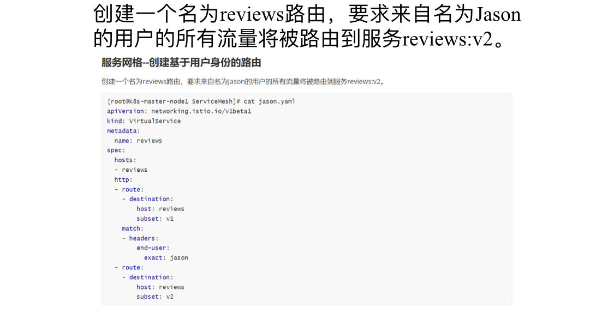

1、【实操题】平台部署--部署容器云平台（2分）

登录OpenStack私有云平台，使用CentOS7.9镜像创建两台云主机，使用kubeeasy工具完成Kubernetes 1.22.1集群的搭建。

完成后提交master节点的用户名、密码和IP到答题框。


2、【实操题】平台部署--部署Istio服务网格（2分）

在Kubernetes集群上完成Istio服务网格环境的安装。

完成后提交master节点的用户名、密码和IP到答题框。


3、【实操题】平台部署--部署KubeVirt虚拟化


4、【实操题】平台部署--部署Harbor仓库及Helm包管理工具（2分）

在master节点上完成Harbor镜像仓库及Helm包管理工具的部署。

完成后提交master节点的用户名、密码和IP到答题框。


5、【实操题】容器化Memcached服务（2分）

在master节点/root/DjangoBlog目录下编写Dockerfile-memcached文件构建blog-memcached:v1.0镜像，具体要求如下：（需要用到的软件包：Django.tar.gz）

（1）基础镜像：centos:7.9.2009；

（2）完成memcached服务的安装；

（3）声明端口：11211；

（4）设置服务开机自启。

完成后构建镜像，并提交master节点的用户名、密码和IP地址到答题框。

```dockerfile
[root@master ~]# cd DjangoBlog/
[root@master DjangoBlog]# vi local.repo 
[yum]
name=yum
baseurl=file:///root/yum
gpgcheck=0
enabled=1

[root@master DjangoBlog]# vi Dockerfile-memcached
FROM centos:centos7.9.2009
MAINTAINER Chinaskills
RUN rm -rf /etc/yum.repos.d/*
COPY local.repo /etc/yum.repos.d/
COPY yum /root/yum
RUN yum install libevent libevent-devel -y
RUN yum install memcached -y
EXPOSE 11211
ENTRYPOINT /usr/bin/memcached -u root

docker build -t blog-memcached:v1.0 -f Dockerfile-memcached .
```

6、【实操题】容器化Mariadb服务（2分）

在master节点/root/DjangoBlog目录下编写Dockerfile-mariadb文件构建blog-mysql:v1.0镜像，具体要求如下：（需要用到的软件包：Django.tar.gz）

（1）基础镜像：centos:7.9.2009；

（2）安装MariaDB服务并设置root用户的密码为root；

（3）创建数据库djangoblog并将sqlfile.sql导入该数据库；

（4）声明端口：3306；

（5）设置服务开机自启。

完成后构建镜像，并提交master节点的用户名、密码和IP地址到答题框。

```bash
[root@master DjangoBlog]# vi mysql_init.sh 
#!/bin/bash
mysql_install_db --user=root
mysqld_safe --user=root &
sleep 8
mysqladmin -u root password 'root'
mysql -uroot -proot -e "grant all on *.* to 'root'@'%' identified by 'root';flush privileges;"
mysql -uroot -proot -e "create database djangoblog;use djangoblog;source /opt/sqlfile.sql;"

[root@master DjangoBlog]# vi Dockerfile-mariadb 
FROM centos:centos7.9.2009
MAINTAINER Chinaskills
RUN rm -rf /etc/yum.repos.d/*
COPY local.repo /etc/yum.repos.d/
COPY yum /root/yum
ENV LC_ALL en_US.UTF-8
RUN yum -y install mariadb-server
COPY mysql_init.sh /opt/
COPY sqlfile.sql /opt
RUN bash /opt/mysql_init.sh
EXPOSE 3306
CMD ["mysqld_safe","--user=root"]


docker build -t blog-mysql:v1.0 -f Dockerfile-mariadb .
```

7、【实操题】容器化前端服务

```dockerfile
[root@master DjangoBlog]# vi Dockerfile-nginx 
FROM centos:centos7.9.2009
MAINTAINER Chinaskills
RUN rm -rf /etc/yum.repos.d/*
COPY local.repo /etc/yum.repos.d/
COPY yum /root/yum
RUN yum -y install nginx
ADD nginx.conf /etc/nginx/nginx.conf
RUN /bin/bash -c 'echo init ok'
EXPOSE 80
CMD ["nginx","-g","daemon off;"]

[root@master DjangoBlog]# docker build -t blog-nginx:v1.0 -f Dockerfile-nginx .
```

8、【实操题】容器化Blog服务（2分）

在master节点/root/DjangoBlog目录下编写Dockerfile-blog文件构建blog-service:v1.0镜像，具体要求如下：（需要用到的软件包：Django.tar.gz）

（1）基础镜像：centos:7.9.2009；

（2）安装Python3.6环境；

（3）使用pip3工具离线安装requirements.txt中的软件包；

（4）安装DjangoBlog服务；

（5）声明端口：8000；

（6）设置DjangoBlog服务开机自启。

完成后构建镜像，并提交master节点的用户名、密码和IP地址到答题框。

```dockerfile
[root@master DjangoBlog]# vi Dockerfile-blog
FROM centos:centos7.9.2009
MAINTAINER Chinaskills
RUN rm -rfv /etc/yum.repos.d/*
COPY local.repo /etc/yum.repos.d/
COPY yum /root/yum
RUN yum install -y make openssl-devel bzip2-devel expat-devel gdbm-devel readline-devel sqlite-devel gcc gcc-devel python-devel mysql-devel
COPY Python-3.6.5.tgz /opt
RUN tar -zxvf /opt/Python-3.6.5.tgz
RUN mv Python-3.6.5 /usr/local
RUN cd /usr/local/Python-3.6.5/ && ./configure && make && make install
RUN ln -s /usr/local/python3/bin/python3 /usr/bin/python3
RUN ln -s /usr/local/python3/bin/pip3 /usr/bin/pip3
ADD requirements.txt requirements.txt
COPY Python-pip /opt
RUN pip3 install --upgrade pip --no-index --find-links=/opt
RUN pip3 install -r requirements.txt --no-index --find-links=/opt
RUN pip3 install gunicorn[gevent] --no-index --find-links=/opt   #这是什么意思
RUN pip3 cache purge
RUN mkdir -p /code/djangoBlog
ADD . /code/djangoBlog/
RUN chmod +x /code/djangoBlog/bin/docker_start.sh
ENTRYPOINT ["/code/djangoBlog/bin/docker_start.sh"]

[root@master DjangoBlog]# docker build -t blog-service:v1.0 -f Dockerfile-blog .
```


9、【实操题】编排部署博客系统（3分）

在master节点/root/DjangoBlog目录下编写docker-compose.yaml文件，具体要求如下：

（1）容器1名称：blog-memcached；镜像：blog-memcached:v1.0；端口映射：11211:11211；

（2）容器2名称：blog-mysql；镜像：blog-mysql:v1.0；端口映射：3306:3306；

（3）容器3名称：blog-nginx；镜像：blog-nginx:v1.0；端口映射：80:8888；

（4）容器4名称：blog-service；镜像：blog-service:v1.0；端口映射：8000:8000。

完成后编排部署该博客系统，并提交master节点的用户名、密码和IP地址到答题框。

```yaml
[root@k8s-master-node1 DjangoBlog]# vi docker-compose.yaml 
version: '3'
services:
  memcached:
    restart: always
    image: blog-memcached:v1.0
    container_name: blog-memcached
    ports:
      - "11211:11211"
  db:
    image: blog-mysql:v1.0
    restart: always
    environment:
      - MYSQL_DATABASE=djangoblog
      - MYSQL_ROOT_PASSWORD=root
    ports:
      - 3306:3306
    depends_on:
      - memcached
    container_name: blog-mysql
  djangoblog:
    image: blog-service:v1.0
    restart: always
    ports:
      - "8000:8000"
    environment:
      - DJANGO_MYSQL_DATABASE=djangoblog
      - DJANGO_MYSQL_USER=root
      - DJANGO_MYSQL_PASSWORD=root
      - DJANGO_MYSQL_HOST=db
      - DJANGO_MYSQL_PORT=3306
      - DJANGO_MEMCACHED_LOCATION=memcached:11211
    volumes:
      - ./collectedstatic:/code/djangoBlog/collectedstatic
    links:
      - db
      - memcached
    depends_on:
      - db
    container_name: blog-service
  nginx:
    restart: always
    image: blog-nginx:v1.0
    volumes:
      - ./collectedstatic:/code/djangoblog/collectedstatic
    ports:
      - "8888:80"
      - "443:443"
    links:
      - djangoblog:djangoblog
    container_name: blog-nginx
    
[root@k8s-master-node1 DjangoBlog]# docker-compose up -d

docker-compose ps
```


10、【实操题】Pod管理--创建Pod（2分）

在default命名空间下使用nginx:latest镜像创建一个QoS类为Guaranteed的Pod，名称为qos-demo。

完成后提交master节点的IP地址、用户名和密码到答题框。

```yaml
kubectl run qos-demo --image=nginx:latest --dry-run='client' -oyaml > pod.yaml

apiVersion: v1
kind: Pod
metadata:
  name: qos-demo
spec:
  containers:
  - image: nginx
    imagePullPolicy: IfNotPresent
    resources:
      limits:
        memory: "200Mi"
        cpu: "700m"
      requests:
        memory: "200Mi"
        cpu: "700m"
```


11、【实操题】安全管理--配置Pod安全上下文（2分）

使用busybox镜像启动一个名为context-demo的Pod，为该Pod配置安全上下文，要求容器内以用户1000和用户组3000来运行所有进程，并在启动时执行“sleep 1h”命令。

完成后提交master节点的IP地址、用户名和密码到答题框。

```yaml
 kubectl run context-demo  --image=busybox:latest  --dry-run='client' -oyaml > security.yaml
 
apiVersion: v1
kind: Pod
metadata:
  creationTimestamp: null
  labels:
    run: context-demo
  name: context-demo
spec:
  securityContext:
    runAsUser: 1000
    runAsGroup: 3000
  containers:
  - image: busybox:latest
    imagePullPolicy: IfNotPresent
    name: context-demo
    command:
    - sleep
    - 1h
    resources: {}
  dnsPolicy: ClusterFirst
  restartPolicy: Always
status: {}
```

12、【实操题】CRD管理--创建自定义资源类型（2分）

在Kubernetes集群中自定义一种资源类型Student，API为stable.example.com/v1，单数形式为student，复数形式为students，简写为stu，作用域为命名空间级，然后在default命名空间下创建一个名为exam的Student对象。

完成后提交master节点的IP地址、用户名和密码到答题框。（000）

```yaml
apiVersion: apiextensions.k8s.io/v1
kind: CustomResourceDefinition
metadata:
# metadata.name的内容是由"复数名.分组名"构成，如下，students是复数名，bolingcavalry.k8s.io是分组名
  name: students.stable.example.com
spec:
# 分组名，在REST API中也会用到的，格式是: /apis/分组名/CRD版本
  group: stable.example.com
  versions:
  - name: v1
    storage: true  # 只有一个版本能被标注为storage
    served: true   # 是否有效的开关.
    schema:  
      openAPIV3Schema:
        type: object
  scope: Namespaced    #范围是属于namespace的
  names:
    kind: Student         # 类型名
    plural: students      # 复数名
    singular: student     # 单数名
    shortNames:           # 简称，就像service的简称是svc
    - stu
    
    
apiVersion: stable.example.com/v1
kind: Student
metadata:
  name: exam
```

13、【实操题】解析管理--添加主机别名到Pod（2分）

使用nginx镜像在default命名空间下创建一个名为nginx的Pod，并在Pod的/etc/hosts中添加IP地址127.0.0.1与chinaskills的解析。

完成后提交master节点的IP地址、用户名和密码到答题框。

```yaml
kubectl run nginx --image=nginx:latest --dry-run='client' --image-pull-policy='IfNotPresent' -oyaml > hostAliases.yaml

apiVersion: v1
kind: Pod
metadata:
  creationTimestamp: null
  labels:
    run: nginx
  name: nginx
spec:
  hostAliases:
  - ip: "127.0.0.1"
    hostnames:
    - "chinaskill"
  containers:
  - image: nginx:latest
    name: nginx
    ports:
    - containerPort: 80
    resources: {}
  dnsPolicy: ClusterFirst
  restartPolicy: Always
status: {}


[root@k8s-master-node1 ~]# kubectl exec nginx  -- cat /etc/hosts
# Kubernetes-managed hosts file.
127.0.0.1       localhost
::1     localhost ip6-localhost ip6-loopback
fe00::0 ip6-localnet
fe00::0 ip6-mcastprefix
fe00::1 ip6-allnodes
fe00::2 ip6-allrouters
10.244.0.24     nginx

# Entries added by HostAliases.
127.0.0.1       chinaskill
```

14、【实操题】HPA管理--创建HPA规则（2分）

默认情况下HPA是无法调整伸缩灵敏度的，但不同的业务场景对伸缩灵敏度的要求不一样。要求在default命名空间下使用nginx镜像创建一个名为web的deployment，自定义HPA的伸缩灵敏度，为该deployment创建一个名为web的HPA，扩容时立即新增当前9倍数量的副本数，时间窗口为5s，伸缩范围为1--1000。例如一开始只有1个Pod，当CPU使用率超过80%时，Pod数量变化趋势为：1 → 10 → 100 → 1000。

完成后提交master节点的IP地址、用户名和密码到答题框。

```yaml
kubectl create deploy web --image=nginx:latest --port=80

autoscaling/v2beta2


apiVersion: autoscaling/v2beta2
kind: HorizontalPodAutoscaler
metadata:
  name: web
spec:
  maxReplicas: 1000
  minReplicas: 1
  metrics:
  - type: Resource
    resource:
      name: cpu
      target: 
        averageUtilization: 80
        type: Utilization
  scaleTargetRef:
    apiVersion: apps/v1
    kind: Deployment
    name: web
  behavior:
    scaleUp:
      stabilizationWindowSeconds: 0
      policies:
      - periodSeconds: 5
        type: Percent
        value: 900
```

```bash
[root@k8s-master-node1 ~]# kubectl get hpa.v2beta2.autoscaling web -oyaml
```

15、【实操题】流量管理--创建Ingress Gateway（2分）

使用提供的软件包ServiceMesh.tar.gz将Bookinfo应用部署到default命名空间下，使用Istio Gateway可以实现应用程序从外部访问，请为Bookinfo应用创建一个名为bookinfo-gateway的网关，指定所有HTTP流量通过80端口流入网格，然后将网关绑定到虚拟服务bookinfo上。

完成后提交master节点的IP地址、用户名和密码到答题框。

```yaml
kubectl apply -f bookinfo/bookinfo.yaml

apiVersion: networking.istio.io/v1alpha3
kind: Gateway
metadata:
  name: bookinfo-gateway
spec:
  selector:
    istio: ingressgateway      # use istio default controller
  servers:
  - port:
      number: 80
      name: http
      protocol: HTTP
    hosts:
    - "*"
---
apiVersion: networking.istio.io/v1alpha3
kind: VirtualService
metadata:
  name: bookinfo
spec:
  hosts:
  - "*"
  gateways:
  - bookinfo-gateway
  http:
  - match:
    - uri:
        exact: /productpage
    - uri:
        prefix: /static
    - uri:
        exact: /login
    - uri:
        exact: /logout
    - uri:
        prefix: /api/v1/products
    route:
    - destination:
        host: productpage
        port:
          number: 9080
          
#查看  kubectl get svc -n istio-system

```

16、【实操题】服务网格--创建基于用户身份的路由（2分）

创建一个名为reviews路由，要求来自名为Jason的用户的所有流量将被路由到服务reviews:v2。

完成后提交master节点的用户名、密码和IP到答题框。

```yaml
apiVersion: networking.istio.io/v1beta1
kind: VirtualService
metadata:
  name: reviews
spec:
  hosts:
  - reviews
  http:
  - route:
    - destination:
        host: reviews
        subset: v1
    match:
    - headers:
        end-user:
          exact: jason
  - route:
    - destination:
        host: reviews
        subset: v2
```



17、【实操题】VM管理--创建VM（2分）

使用镜像fedora-virt:v1.0在default命名空间下创建一台vm，名称为vm-fedora，内存为1G。

完成后提交master节点的IP地址、用户名和密码到答题框。

```yaml
apiVersion: kubevirt.io/v1
kind: VirtualMachine
metadata:
  name: vm-fedora
spec: 
  running: false
  template:
    spec:
      domain:
        resources:
          requests:
            memory: 1Gi
        devices:
          disks:
          - name: containerdisk
            disk: {}
      volumes:
      - name: containerdisk
        containerDisk:
          image: fedora-virt:v1.0
```

18、【实操题】存储与卷--创建emptyDisk卷（2分）

使用镜像fedora-virt:v1.0在default命名空间下创建一台vmi，名称为vmi-fedora，并使用emptyDisk卷为vmi挂载一块2G的磁盘。

完成后提交master节点的IP地址、用户名和密码到答题框。（0.5）

```yaml
apiVersion: kubevirt.io/v1alpha3
kind: VirtualMachineInstance
metadata:
  name: vmi-fedora
spec:
  domain:
    resources:
      requests:
        memory: 1Gi
    devices:
      disks:
      - name: containerdisk
        disk: {}
      - name: emptydisk
        disk: {}
  volumes:
  - name: containerdisk
    containerDisk:
      image: fedora-virt:v1.0 
      imagePullPolicy: IfNotPresent
  - name: emptydisk
    emptyDisk:
      capacity: 2Gi
```

二、容器云任务（当前任务共20道题目）


19、【实操题】Python运维开发：基于Kubernetes Restful API实现Deployment创建（2分）


在提供的OpenStack私有云平台上，使用k8s-python-dev镜像创建1台云主机，云主机类型使用4vCPU/12G内存/100G硬盘。该主机中已经默认安装了所需的开发环境，登录默认账号密码为“root/1DaoYun@2022”。

使用Kubernetes Restful API库，在/root目录下，创建api_deployment_manager.py文件，要求编写python代码，代码实现以下任务：

（1）编写Python程序实现Deployment资源的创建。Deployment配置信息如下。如果同名Deployment存在，先删除再创建。

（2）创建完成后，查询该Deployment的详细信息，执行结果控制台输出，以yaml格式展示。

创建Deployment 的yaml的配置如下：

```yaml
apiVersion: apps/v1
kind: Deployment
metadata:
  name: nginx-deployment
  labels:
    app: nginx
spec:
  replicas: 3
  selector:
    matchLabels:
      app: nginx
  template:
    metadata:
      labels:
        app: nginx
    spec:
      containers:
      - name: nginx
        image: nginx:1.15.4
        ports:
        - containerPort: 80
```

```bash
获取token
kubectl create serviceaccount admin1 -n kube-system

kubectl create clusterrolebinding admin1 --clusterrole=cluster-admin --serviceaccount=kube-system:admin1

kubectl get secrets  -n kube-system

kubectl describe secrets admin1-token-zf7vk -n kube-system 
```

```bash


#自行创建deployment就可以

vim api_deployment_manager.py

import requests,json

def get_token(api_token):
    bearer_token = "bearer " + api_token
    return bearer_token

class dep_manager:
    def __init__(self,node_url,bearer_token):
        self.node_url = node_url
        self.bearer_token = bearer_token

    def get_dep(self,dep_name,namespace):
        headers = {
            "Authorization": self.bearer_token
        }
        url = self.node_url + "/apis/apps/v1/namespaces/" + namespace + "/deployments/" + dep_name
        req = json.loads(requests.get(url, headers=headers, verify=False).text)
        return req
if __name__ == "__main__":
    api_token = "XXX"
    node_url = "https://10.10.16.10:6443"
    bearer_token = get_token(api_token)
    dep_m = dep_manager(node_url, bearer_token)
    get_dep = dep_m.get_dep("nginx-deployment", "default")
    print(f"获取到Deployment的信息为{get_dep}")
```

20、【实操题】Python运维开发：基于Kubernetes Python SDK实现Job创建（2分）


在前面已建好的Kubernetes开发环境云平台上。使用Kubernetes python SDK的“kubernetes”Python库，在/root目录下，创建sdk_job_manager.py文件，要求编写python代码，代码实现以下任务：

（1）编写Python程序实现Job资源的创建。Job配置信息如下。如果同名Job存在，先删除再创建。

（2）创建完成后，查询该Job的详细信息，执行结果控制台输出，以json格式展示。

Job创建yaml的信息如下：

```yaml
apiVersion: batch/v1
kind: Job
metadata:
  name: pi
spec:
  template:
    spec:
      containers:
      - name: pi
        image: perl
        command: ["perl",  "-Mbignum=bpi", "-wle", "print bpi(2000)"]
      restartPolicy: Never
  backoffLimit: 4
```

```python
from kubernetes import client, config

class job_manager():
    def __init__(self, config_file):
        # 传入配置文件
        config.load_kube_config(config_file)
        # 获取API,管理Job
        self.api = client.BatchV1Api()

    #查看Job
    def get_job(self):
        v1 = self.api
        resp = v1.read_namespaced_job(name="pi", namespace="default")
        print(resp)

if __name__ == '__main__':
    job_manager(config_file="config").get_job()
```

```
时间得分任务名称题目

2022-12-12 16:07:270二、容器云任务20、Python运维开发：基于Kubernetes Python SDK实现Job创建

2022-12-12 16:06:550二、容器云任务19、Python运维开发：基于Kubernetes Restful API实现Deployment创建

2022-12-12 16:04:430二、容器云任务18、存储与卷--创建emptyDisk卷

2022-12-12 15:57:150二、容器云任务17、VM管理--创建VM

2022-12-12 15:49:350二、容器云任务16、服务网格--创建基于用户身份的路由

2022-12-12 15:45:122二、容器云任务15、流量管理--创建Ingress Gateway

2022-12-12 15:24:080二、容器云任务14、HPA管理--创建HPA规则

2022-12-12 15:22:450二、容器云任务13、解析管理--添加主机别名到Pod

2022-12-12 15:14:160二、容器云任务12、CRD管理--创建自定义资源类型

2022-12-12 15:05:360二、容器云任务11、安全管理--配置Pod安全上下文

2022-12-12 14:46:110二、容器云任务10、Pod管理--创建Pod

2022-12-12 14:08:583二、容器云任务9、编排部署博客系统

2022-12-12 13:49:092二、容器云任务8、容器化Blog服务

2022-12-12 13:25:081二、容器云任务7、容器化前端服务

2022-12-12 13:16:342二、容器云任务6、容器化Mariadb服务

2022-12-12 13:06:202二、容器云任务5、容器化Memcached服务

2022-12-12 12:47:042二、容器云任务4、平台部署--部署Harbor仓库及Helm包管理工具

2022-12-12 12:24:462二、容器云任务3、平台部署--部署KubeVirt虚拟化

2022-12-12 12:22:120二、容器云任务2、平台部署--部署Istio服务网格

2022-12-12 12:19:042二、容器云任务1、平台部署--部署容器云平台
```

CICD

