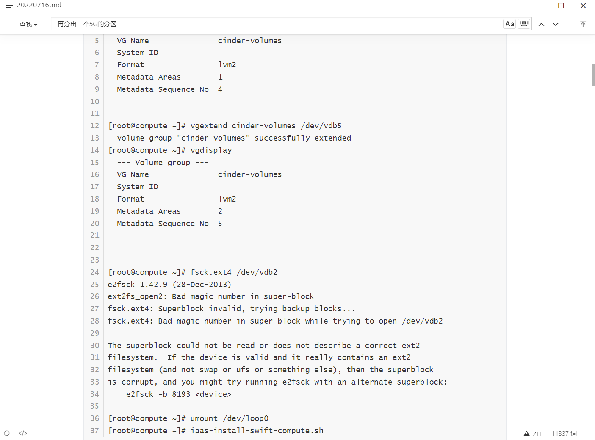
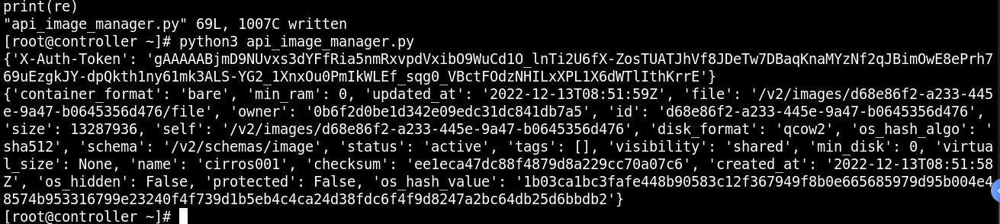
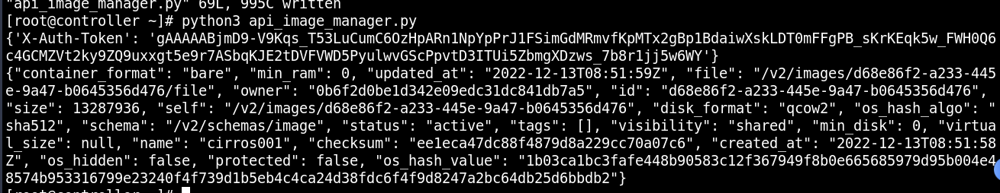

1、【实操题】基础环境配置（2分）

使用提供的用户名密码，登录提供的OpenStack私有云平台，在当前租户下，使用CentOS7.9镜像，创建两台云主机，云主机类型使用4vCPU/12G/100G_50G类型。当前租户下默认存在一张网卡，自行创建第二张网卡并连接至controller和compute节点（第二张网卡的网段为10.10.X.0/24，X为工位号，不需要创建路由）。自行检查安全组策略，以确保网络正常通信与ssh连接，然后按以下要求配置服务器：

（1）设置控制节点主机名为controller，设置计算节点主机名为compute；

（2）修改hosts文件将IP地址映射为主机名；

完成后提交控制节点的用户名、密码和IP地址到答题框。

```

```


2、【实操题】Yum源配置（2分）

使用提供的http服务地址，在http服务下，存在centos7.9和iaas的网络yum源，使用该http源作为安装iaas平台的网络源。分别设置controller节点和compute节点的yum源文件http.repo。完成后提交控制节点的用户名、密码和IP地址到答题框。（0？？？）

```

```


3、【实操题】配置无秘钥ssh（2分）

配置controller节点可以无秘钥访问compute节点，配置完成后，尝试ssh连接compute节点的hostname进行测试。完成后提交controller节点的用户名、密码和IP地址到答题框。

```

```

4、【实操题】基础安装（2分）

在控制节点和计算节点上分别安装openstack-iaas软件包，根据表2配置两个节点脚本文件中的基本变量（配置脚本文件为/etc/openstack/openrc.sh）。

> （记得修改密码为节点的密码，不要写000000）

表2 云平台配置信息

| 服务名称         | 变量               | 参数/密码 |
| ---------------- | ------------------ | --------- |
| Mysql            | root               | 000000    |
| Keystone         | 000000             |           |
| Glance           | 000000             |           |
| Nova             | 000000             |           |
| Neutron          | 000000             |           |
| Heat             | 000000             |           |
| Zun              | 000000             |           |
| Keystone         | DOMAIN_NAME        | demo      |
| Admin            | 000000             |           |
| Rabbit           | 000000             |           |
| Glance           | 000000             |           |
| Nova             | 000000             |           |
| Neutron          | 000000             |           |
| Heat             | 000000             |           |
| Zun              | 000000             |           |
| Neutron          | Metadata           | 000000    |
| External Network | eth1（以实际为准） |           |

完成后提交控制节点的用户名、密码和IP地址到答题框。

```

```


5、【实操题】数据库安装与调优（2分）

在controller节点上使用iaas-install-mysql.sh 脚本安装Mariadb、Memcached、RabbitMQ等服务。安装服务完毕后，修改/etc/my.cnf文件，完成下列要求：

1.设置数据库支持大小写；

2.设置数据库缓存innodb表的索引，数据，插入数据时的缓冲为4G；

完成后提交控制节点的用户名、密码和IP地址到答题框。

```
lower_case_table_names = 1
innodb_buffer_pool_size = 4G
```

6、【实操题】Keystone服务安装与使用（2分）

在controller节点上使用iaas-install-keystone.sh脚本安装Keystone服务。安装完成后，使用相关命令，创建用户chinaskill，密码为000000。完成后提交控制节点的用户名、密码和IP地址到答题框。

```
openstack user create chinaskill --password 000000
```


7、【实操题】Glance安装与使用（2分）

在controller节点上使用iaas-install-glance.sh脚本安装glance 服务。使用命令将提供的cirros-0.3.4-x86_64-disk.img镜像（该镜像在HTTP服务中，可自行下载）上传至平台，命名为cirros，并设置最小启动需要的硬盘为10G。完成后提交控制节点的用户名、密码和IP地址到答题框。(1 ?  ?  ?)

```

```


8、【实操题】Nova安装与优化（2分）

在controller节点和compute节点上分别使用iaas-install-placement.sh脚本、iaas-install-nova -controller.sh脚本、iaas-install-nova-compute.sh脚本安装Nova服务。安装完成后，请修改nova相关配置文件，解决因等待时间过长而导致虚拟机启动超时从而获取不到IP地址而报错失败的问题。配置完成后提交controller点的用户名、密码和IP地址到答题框。

```
vif_plugging_is_fatal=false
systemctl restart *nova*
```


9、【实操题】Neutron安装（2分）

使用提供的脚本iaas-install-neutron-controller.sh和iaas-install-neutron-compute.sh，在controller和compute节点上安装neutron服务。完成后提交控制节点的用户名、密码和IP地址到答题框。

```

```


10、【实操题】Doshboard安装（2分）

在controller节点上使用iaas-install-dashboad.sh脚本安装dashboad服务。完成后提交控制节点的用户名、密码和IP地址到答题框。

```

```


11、【实操题】Swift安装（2分）

在控制节点和计算节点上分别使用iaas-install-swift-controller.sh和iaas-install-swift-compute.sh脚本安装Swift服务。完成后提交控制节点的用户名、密码和IP地址到答题框。

```

```


12、【实操题】Cinder创建硬盘（2分）

在控制节点和计算节点分别使用iaas-install-cinder-controller.sh、iaas-install-cinder-compute.sh脚本安装Cinder服务，请在计算节点，对块存储进行扩容操作，即在计算节点再分出一个5G的分区，加入到cinder块存储的后端存储中去。完成后提交计算节点的用户名、密码和IP地址到答题框。

```
pvcreate /dev/sdc
vgextend cinder-volumes /dev/sdc

vgdisplay
```



13、【实操题】Barbican服务安装与使用（2分）

使用iaas-install-barbican.sh脚本安装barbican服务，安装服务完毕后，使用openstack命令创建一个名为secret01的密钥，创建完成后提交控制节点的用户名、密码和IP地址到答题框。

```
openstack secret store --name secret01
```

14、【实操题】manila安装（2分）

在控制和计算节点上分别使用iaas-install-manila-controller.sh和iaas-install-manila-compute.sh脚本安装manila服务。安装服务后创建default_share_type共享类型（不使用驱动程序支持），接着创建一个大小为2G的共享存储名为share01。最后提交控制节点的用户名、密码和IP地址到答题框。

```
manila type-create default_share_type 0
manila create NFS 2 --name share01
```

15、【实操题】Cloudkitty服务安装与使用（2分）

使用iaas-install-cloudkitty.sh脚本安装cloudkitty服务，安装完毕后，启用hashmap评级模块。设置完成后提交控制节点的用户名、密码和IP地址到答题框。

```
openstack rating module enable hashmap
```

16、【实操题】OpenStack平台内存优化（2分）

搭建完OpenStack平台后，关闭系统的内存共享，打开透明大页。完成后提交控制节点的用户名、密码和IP地址到答题框。

```
echo 'never' > /sys/kernel/mm/transparent_hugepage/defrag
```


17、【实操题】OpenStack Glance镜像压缩（2分）

使用自行搭建的OpenStack平台。在HTTP服务中存在一个镜像为CentOS7.5-compress.qcow2的镜像，请使用qemu相关命令，对该镜像进行压缩，压缩后的镜像命名为chinaskill-js-compress.qcow2并存放在/root目录下。完成后提交controller点的用户名、密码和IP地址到答题框。

```
qemu-img convert -c -O qcow2 CentOS7.5-compress.qcow2 chinaskill-js-compress.qcow2
```

18、【实操题】修改文件句柄数（2分）

Linux服务器大并发时，往往需要预先调优Linux参数。默认情况下，Linux最大文件句柄数为1024个。当你的服务器在大并发达到极限时，就会报出“too many open files”。创建一台云主机，修改相关配置，将控制节点的最大文件句柄数永久修改为65535。配置完成后提交controller点的用户名、密码和IP地址到答题框。

```bash
ulimit -n 65535

vim /etc/security/limits.conf
* hard nofile 65535
* soft nofile 65535
```

19、【实操题】OpenStack参数调优（2分）

OpenStack各服务内部通信都是通过RPC来交互，各agent都需要去连接RabbitMQ；随着各服务agent增多，MQ的连接数会随之增多，最终可能会到达上限，成为瓶颈。使用自行搭建的OpenStack私有云平台，分别通过用户级别、系统级别、配置文件来设置RabbitMQ服务的最大连接数为10240，配置完成后提交修改节点的用户名、密码和IP地址到答题框。

```python
vim /etc/security/limits.conf
openstack hard nofile 10240
openstack soft nofile 10240

vim /usr/lib/systemd/system/rabbitmq-server.service
LimitNOFILE=10240

systemctl daemon-reload
systemctl restart rabbitmq-server

vi /etc/sysctl.conf
fs.file-max = 10240

sysctl -p
```

20、【实操题】Linux系统调优-防止SYN攻击（2分）

修改controller节点的相关配置文件，开启SYN cookie，防止SYN洪水攻击。完成后提交controller节点的用户名、密码和IP地址到答题框

```bash
vi /etc/sysctl.conf
net.ipv4.tcp_syncookies = 1
sysctl -p
```

21、【实操题】OpenStack开放镜像权限（2分）

使用OpenStack私有云平台，在OpenStack平台的admin项目中使用cirros-0.3.4-x86_64-disk.img镜像文件创建名为glance-cirros的镜像，通过OpenStack命令将glance-cirros镜像指定demo项目进行共享使用。配置完成后提交controller点的用户名、密码和IP地址到答题框。

```bash
先将镜像共享给A租户
glance member-create 镜像id A租户id【projectA】
共享之后，镜像的状态是pending状态，还需要激活镜像
glance member-update  镜像id A租户id【projectA】 accepted
```


22、【实操题】glance对接cinder后端存储（2分）

在自行搭建的OpenStack平台中修改相关参数，使glance可以使用cinder作为后端存储，将镜像存储于cinder卷中。使用cirros-0.3.4-x86_64-disk.img文件创建cirros-image镜像存储于cirros-cinder卷中，通过cirros-image镜像使用cinder卷启动盘的方式进行创建虚拟机。完成后提交修改节点的用户名、密码和IP地址到答题框。

```bash
vi /etc/glance/glance-api.conf
	stores = file, http, cinder
	show_multiple_locations = true
	
vi /etc/cinder/cinder.conf
	glance_api_version = 2  #300行左右直接添加
	allowed_direct_url_schemes = cinder
	image_upload_use_internal_tenant = true

systemctl restart *glance* *cinder*

# 创建镜像
openstack image create --container-format bare --disk-format raw --file /opt/images/cirros-0.3.4-x86_64-disk.img  cirros  

# 根据镜像创建卷
cinder create --image cirros --name cirros-cinder 1

# 根据刚才含有镜像的卷创建出cirros-image镜像
openstack image create --container-format bare --disk-format raw --volume cirros-cinder  cirros-image  
```

23、【实操题】OpenStack Nova清除缓存（2分）

在OpenStack平台的一台计算节点创建虚拟机，若是第一次在该节点创建次虚拟机，会先将镜像文件复制到该计算节点目录/var/lib/nova/instances/_base。长期下来，该目录会占用比较大的磁盘空间而要清理。可以通过修改nova的配置文件来自动清理该缓存目录，即在该节点没有使用某镜像启动的云主机，那么这个镜像在过一定的时间后会被自动删除。配置完成后提交改动节点的用户名、密码和IP地址到答题框。

```bash
remove_unused_base_images=true
```


ansible     zabbix   mariadb


24、【实操题】Python运维开发：基于OpenStack Restful API实现镜像上传（2分）

使用OpenStack all-in-one镜像，创建OpenStack Python运维开发环境。云主机的用户/密码为：“root/Abc@1234”，OpenStack的域名/账号/密码为：“demo/admin/000000”。

提示说明：python脚本文件头建议加入“#encoding:utf-8”避免编码错误；测试脚本代码用python3命令执行与测试。

在controller节点的/root目录下创建api_image_manager.py脚本，编写python代码对接OpenStack API，完成镜像的创建与上传。创建之前查询是否存在“同名镜像”，如果存在先删除该镜像。

（1）创建镜像：要求在OpenStack私有云平台中上传镜像cirros-0.3.4-x86_64-disk.img，名字为cirros001，disk_format为qcow2，container_format为bare。

（2）查询镜像：查询cirros001的详细信息，并以json格式文本输出到控制台。

完成后提交OpenStack Python运维开发环境Controller节点的IP地址，用户名和密码提交。

```python
去创建所需镜像就可以

#“root/Abc@1234”，OpenStack的域名/账号/密码为：“demo/admin/000000”。
import  requests,json
controller="10.26.24.73"
url=f"http://{controller}:5000/v3/auth/tokens"
body={
    "auth":{
        "identity":{
            "methods":["password"],
            "password":{
                "user":{
                    "domain":{"name":"demo"},
                    "name":"admin",
                    "password":"000000"
                }
            }
        },
        "scope":{
            "project":{
                "domain":{"name":"demo"},
                "name":"admin"
            }
        }
    }
}
headers={
    "Content-Type":"application/json"
}
Token=requests.post(url=url,headers=headers,data=json.dumps(body)).headers["X-Subject-Token"]
headers={
    "X-Auth-Token":Token
}
print(headers)
image_url=f"http://{controller}:9292/v2/images/d68e86f2-a233-445e-9a47-b0645356d476"
re=json.loads(requests.get(image_url,headers=headers).text)
print(re)
```





25、【实操题】Python运维开发：基于Openstack Python SDK实现云主机创建（2分）

使用已建好的OpenStack Python运维开发环境，在/root目录下创建sdk_server_manager.py脚本，使用python-openstacksdk Python模块，完成云主机的创建和查询。创建之前查询是否存在“同名云主机”，如果存在先删除该镜像。

（1）创建1台云主机：云主机信息如下：

云主机名称如下：server001

镜像文件：cirros-0.3.4-x86_64-disk.img

云主机类型：m1.tiny

网络等必要信息自己补充。

（2）查询云主机：查询云主机server001的详细信息，并以json格式文本输出到控制台。

完成后提交OpenStack Python运维开发环境 Controller节点的IP地址，用户名和密码提交。

```python
自行创建所需云主机


import json
import openstack
def create_connection():
    return openstack.connect(
        auth_url="http://10.10.16.30:5000/v3/",
        user_domain_name='demo',
        username="admin",
        password="000000",
    )
print(create_connection())

class server_manager:  
    def __init__(self, connect):  
        self.connect = connect  
    def get_server(self, server_name):  
        """  
        获取云主机  
        :param server_name:  
        :return:  
        """  
        server = self.connect.compute.find_server(server_name)  
        return json.dumps(server, indent=2, skipkeys=True)
if __name__ == '__main__':  
    conn = create_connection() 
    sdk_m = server_manager(conn) 
    result = sdk_m.get_server("server001")  
    print("servers:", result)
```


