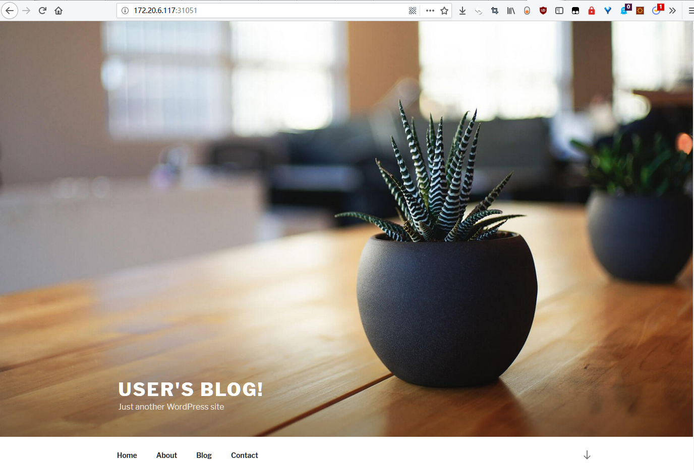

参考【https://sunmite.com/post/kubernetes-install-helm-and-wordpress】

## 1. 搜索 chart

搜索 wordpress 的 charts

```
# helm search wordpress

NAME            	CHART VERSION	APP VERSION	DESCRIPTION                                             
stable/wordpress	5.0.3        	5.0.2      	Web publishing platform for building blogs and websites.

```

## 2. 查看 chart 的存储信息

创建 wordpress 的时候需要申请  PersistentVolumeClaim，由于我们的环境不支持动态申请所以需要手动创建

```
# helm inspect value stable/wordpress

……
  ## MariaDB admin password
  ## ref: https://github.com/bitnami/bitnami-docker-mariadb/blob/master/README.md#setting-the-root-password-on-first-run
  ##
  # rootUser:
  #   password:

  ## Enable persistence using Persistent Volume Claims
  ## ref: http://slug:.io/docs/user-guide/persistent-volumes/
  ##
  master:
    persistence:
      enabled: true
      ## mariadb data Persistent Volume Storage Class
      ## If defined, storageClassName: <storageClass>
      ## If set to "-", storageClassName: "", which disables dynamic provisioning
      ## If undefined (the default) or set to null, no storageClassName spec is
      ##   set, choosing the default provisioner.  (gp2 on AWS, standard on
      ##   GKE, AWS & OpenStack)
      ##
      # storageClass: "-"
      accessMode: ReadWriteOnce
      size: 8Gi
      
……

persistence:
  enabled: true
  ## wordpress data Persistent Volume Storage Class
  ## If defined, storageClassName: <storageClass>
  ## If set to "-", storageClassName: "", which disables dynamic provisioning
  ## If undefined (the default) or set to null, no storageClassName spec is
  ##   set, choosing the default provisioner.  (gp2 on AWS, standard on
  ##   GKE, AWS & OpenStack)
  ##
  # storageClass: "-"
  ##
  ## If you want to reuse an existing claim, you can pass the name of the PVC using
  ## the existingClaim variable
  # existingClaim: your-claim
  accessMode: ReadWriteOnce
  size: 10Gi

```

可以看到 wordpress 的 chart 需要两个 pv，分别用于 mariadb(8G) 和 wordpress(10G) 的数据存储。

## 3. 手动创建 chart 所需的 pv

创建 create-pv.yml 文件，输入以下内容

```
# vim create-pv.yml

apiVersion: v1
kind: PersistentVolume
metadata:
  name: mariadb-pv
spec:
  capacity:
    storage: 8Gi
  accessModes:
    - ReadWriteOnce
  persistentVolumeReclaimPolicy: Retain
  #storageClassName: nfs
  nfs:
    path: /nfsdata/mariadb-pv
    server: 172.20.6.116
---
apiVersion: v1
kind: PersistentVolume
metadata:
  name: wordpress-pv
spec:
  capacity:
    storage: 10Gi
  accessModes:
    - ReadWriteOnce
  persistentVolumeReclaimPolicy: Retain
  #storageClassName: nfs
  nfs:
    path: /nfsdata/wordpress-pv
    server: 172.20.6.116
```

创建 pv

```
# kubectl apply -f create-pv.yml 

persistentvolume/mariadb-pv created
persistentvolume/wordpress-pv created
```

## 4. 安装 chart

```
# helm install --name wordpress stable/wordpress

NAME:   wordpress                                  ---------①---------
LAST DEPLOYED: Fri Jan  4 10:32:57 2019
NAMESPACE: default
STATUS: DEPLOYED

RESOURCES:                                         ---------②---------
==> v1beta1/Deployment
NAME                 DESIRED  CURRENT  UP-TO-DATE  AVAILABLE  AGE
wordpress-wordpress  1        1        1           0          0s

==> v1beta1/StatefulSet
NAME               DESIRED  CURRENT  AGE
wordpress-mariadb  1        1        0s

==> v1/Pod(related)
NAME                                  READY  STATUS   RESTARTS  AGE
wordpress-wordpress-56794ff7b9-rf98x  0/1    Pending  0         0s
wordpress-mariadb-0                   0/1    Pending  0         0s

==> v1/Secret
NAME                 TYPE    DATA  AGE
wordpress-mariadb    Opaque  2     0s
wordpress-wordpress  Opaque  1     0s

==> v1/ConfigMap
NAME                     DATA  AGE
wordpress-mariadb        1     0s
wordpress-mariadb-tests  1     0s

==> v1/PersistentVolumeClaim
NAME                 STATUS   VOLUME  CAPACITY  ACCESS MODES  STORAGECLASS  AGE
wordpress-wordpress  Pending  0s

RESOURCES:
==> v1/Service
NAME                 TYPE          CLUSTER-IP      EXTERNAL-IP  PORT(S)                     AGE
wordpress-mariadb    ClusterIP     10.100.218.132  <none>       3306/TCP                    0s
wordpress-wordpress  LoadBalancer  10.100.36.64    <pending>    80:31051/TCP,443:30169/TCP  0s


NOTES:                                             ---------③---------
1. Get the WordPress URL:

  NOTE: It may take a few minutes for the LoadBalancer IP to be available.
        Watch the status with: 'kubectl get svc --namespace default -w wordpress-wordpress'
  export SERVICE_IP=$(kubectl get svc --namespace default wordpress-wordpress --template "{{ range (index .status.loadBalancer.ingress 0) }}{{.}}{{ end }}")
  echo "WordPress URL: http://$SERVICE_IP/"
  echo "WordPress Admin URL: http://$SERVICE_IP/admin"

2. Login with the following credentials to see your blog

  echo Username: user
  echo Password: $(kubectl get secret --namespace default wordpress-wordpress -o jsonpath="{.data.wordpress-password}" | base64 --decode)
```

输出分为 3 部分（上文输出结果中的①②③）：

- ① 本次部署 chart 的描述信息。包括 release 的名字（没有指定，则默认生成）。release 部署的 namespace，默认是 default。release的状态 DEPLOYED 表示已经将 chart 部署到集群。
- ② release 包含的资源： Service、 Deployment、 Secret 等
- ③ release 的使用方法

## 5. 访问 wordpress

使用 http://nodeip+service_port 访问wordpress，访问地址为：http://172.20.6.116:31051/