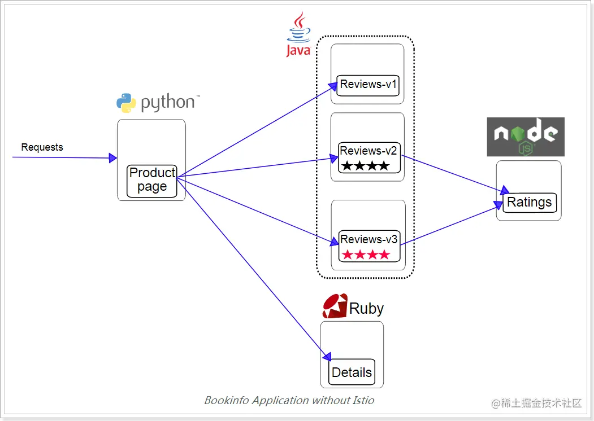

灰度发布

```yaml
部署Kubernetes集群

1. 
部署Bookinfo应用
注：如果运行不起来把镜像改为本地镜像名称

2.
启用对应用程序的外部访问Istio Gateway,网关指定所有HTTP流量通过80端口流入网格,然后把网关绑定到虚拟服务上
apiVersion: networking.istio.io/v1beta1
kind: Gateway
metadata: 
  name: bookinfo-gateway
spec:
  selector: 
    istio: ingressgateway             #istio 默认的控制器
  servers:
    - hosts:
        - "*"
      port:
        name: http
        protocol: HTTP
        number: 80
---
apiVersion: networking.istio.io/v1beta1
kind: VirtualService
metadata: 
  name: bookinfo
spec: 
  gateways:
    - bookinfo-gateway
  hosts:
    - "*"
  http:
    - match:
        - uri: 
            exact: /productpage
        - uri: 
            prefix: /static
        - uri: 
            exact: /login
        - uri: 
            exact: /logout
        - uri: 
            prefix: /api/v1/products
      route:
        - destination:
            host: productpage
            port:
              number: 9080
确认网关创建完成
查看Ingress Gateway    kubectl get svc -n istio-system
可以看到Gateway 80端口对应的NodePort端口

生产测试
[root@master ServiceMesh]# vi curl.sh
#!/bin/bash
while true
do
  curl http://10.24.2.5:22092/productpage >/dev/null 2>&1
  sleep 1
done
[root@master ServiceMesh]# chmod +x curl.sh
[root@master ServiceMesh]# bash curl.sh &
[1] 2924
```

```
启用Istio 
apiVersion: networking.istio.io/v1alpha3
kind: DestinationRule
metadata:
  name: productpage
spec:
  host: productpage
  subsets:
  - name: v1
    labels:
      version: v1
---
apiVersion: networking.istio.io/v1alpha3
kind: DestinationRule
metadata:
  name: reviews
spec:
  host: reviews
  subsets:
  - name: v1
    labels:
      version: v1
  - name: v2
    labels:
      version: v2
  - name: v3
    labels:
      version: v3
---
apiVersion: networking.istio.io/v1alpha3
kind: DestinationRule
metadata:
  name: ratings
spec:
  host: ratings
  subsets:
  - name: v1
    labels:
      version: v1
  - name: v2
    labels:
      version: v2
  - name: v2-mysql
    labels:
      version: v2-mysql
  - name: v2-mysql-vm
    labels:
      version: v2-mysql-vm
---
apiVersion: networking.istio.io/v1alpha3
kind: DestinationRule
metadata:
  name: details
spec:
  host: details
  subsets:
  - name: v1
    labels:
      version: v1
  - name: v2
    labels:
      version: v2
```

重新部署productpage微服务，istio注入

```
[root@master ServiceMesh]# cat bookinfo/bookinfo.yaml | istioctl kube-inject -f - | kubectl apply -l app=productpage -f -
service/productpage unchanged
deployment.apps/productpage-v1 configured


kubectl get pods
检查productpage的Pod并且查看每个副本的两个容器。第一个容器是微服务本身的，第二个是连接到它的Sidecar代理
```


istio

```
#创建exam命名空间
kubectl create ns exam
#通过为命名空间打标签来实现自动注入
kubect label ns exam istio-injection=enabled
```

istio边车代理

```
自动注入sidecar在exam命名空间下
kubectl create namespace exam
kubectl label namespace exam istio-injection=enabled
```

部署示例（金丝雀发布也称灰度发布）

```
将master加上污点，将镜像包上传node并导入

[root@master istio-1.8.0]# kubectl apply -f <(istioctl  kube-inject -f /root/istio-1.8.0/samples/bookinfo/platform/kube/bookinfo.yaml)
service/details created
serviceaccount/bookinfo-details created
deployment.apps/details-v1 created
service/ratings created
serviceaccount/bookinfo-ratings created
deployment.apps/ratings-v1 created
service/reviews created
serviceaccount/bookinfo-reviews created
deployment.apps/reviews-v1 created
deployment.apps/reviews-v2 created
deployment.apps/reviews-v3 created
service/productpage created
serviceaccount/bookinfo-productpage created
deployment.apps/productpage-v1 created


都启动后

[root@master istio-1.8.0]# kubectl get svc
NAME          TYPE        CLUSTER-IP       EXTERNAL-IP   PORT(S)    AGE
details       ClusterIP   10.101.161.207   <none>        9080/TCP   10m
kubernetes    ClusterIP   10.96.0.1        <none>        443/TCP    7d23h
productpage   ClusterIP   10.108.218.29    <none>        9080/TCP   10m
ratings       ClusterIP   10.104.173.211   <none>        9080/TCP   10m
reviews       ClusterIP   10.96.217.43     <none>        9080/TCP   10m
[root@master istio-1.8.0]# curl 10.108.218.29:9080/productpage
<!DOCTYPE html>
<html>
  <head>
    <title>Simple Bookstore App</title>
<meta charset="utf-8">
<meta http-equiv="X-UA-Compatible" content="IE=edge">
<meta name="viewport" content="width=device-width, initial-scale=1.0">


对外部开放，指定网关
[root@master istio-1.8.0]# kubectl apply -f samples/bookinfo/networking/bookinfo-gateway.yaml 
gateway.networking.istio.io/bookinfo-gateway created
virtualservice.networking.istio.io/bookinfo created
```


配置路由管理策略

```
[root@master ServiceMesh]# cat destination-rule-all.yaml
apiVersion: networking.istio.io/v1alpha3
kind: DestinationRule
metadata:
  name: productpage
spec:
  host: productpage
  subsets:
  - name: v1
    labels:
      version: v1
---
apiVersion: networking.istio.io/v1alpha3
kind: DestinationRule
metadata:
  name: reviews
spec:
  host: reviews
  subsets:
  - name: v1
    labels:
      version: v1
  - name: v2
    labels:
      version: v2
  - name: v3
    labels:
      version: v3
---
apiVersion: networking.istio.io/v1alpha3
kind: DestinationRule
metadata:
  name: ratings
spec:
  host: ratings
  subsets:
  - name: v1
    labels:
      version: v1
  - name: v2
    labels:
      version: v2
  - name: v2-mysql
    labels:
      version: v2-mysql
  - name: v2-mysql-vm
    labels:
      version: v2-mysql-vm
---
apiVersion: networking.istio.io/v1alpha3
kind: DestinationRule
metadata:
  name: details
spec:
  host: details
  subsets:
  - name: v1
    labels:
      version: v1
  - name: v2
    labels:
      version: v2
```

使用下面的命令把50%的流量从reviews:v1转移到reviews:v3（金丝雀版本）

```
[root@master ServiceMesh]# vi virtual-service-reviews-50-50.yaml 
apiVersion: networking.istio.io/v1alpha3
kind: VirtualService
metadata:
  name: reviews
spec:
  hosts:
    - reviews
  http:
  - route:
    - destination:
        host: reviews
        subset: v1
      weight: 50
    - destination:
        host: reviews
        subset: v3
      weight: 50
[root@master ServiceMesh]# kubectl apply -f virtual-service-reviews-50-50.yaml
virtualservice.networking.istio.io/reviews configured
```

> 详见kubernetes+Istio实现灰度发布


## Bookinfo示例

### 应用说明

这个示例部署了一个用于演示多种 Istio 特性的应用，该应用由四个单独的微服务构成。 这个应用模仿在线书店的一个分类，显示一本书的信息。 页面上会显示一本书的描述，书籍的细节（ISBN、页数等），以及关于这本书的一些评论。

Bookinfo 应用分为四个单独的微服务：

- `productpage`. 这个微服务会调用 `details` 和 `reviews` 两个微服务，用来生成页面。
- `details`. 这个微服务中包含了书籍的信息。
- `reviews`. 这个微服务中包含了书籍相关的评论。它还会调用 `ratings` 微服务。
- `ratings`. 这个微服务中包含了由书籍评价组成的评级信息。

`reviews` 微服务有 3 个版本：

- v1 版本不会调用 `ratings` 服务。
- v2 版本会调用 `ratings` 服务，并使用 1 到 5 个黑色星形图标来显示评分信息。
- v3 版本会调用 `ratings` 服务，并使用 1 到 5 个红色星形图标来显示评分信息。



Bookinfo 应用中的几个微服务是由不同的语言编写的。 这些服务对 Istio 并无依赖，但是构成了一个有代表性的服务网格的例子：它由多个服务、多个语言构成，并且 `reviews` 服务具有多个版本。

