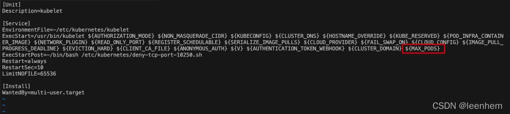

### 基于Docker Compose编排部署Pig快速开发框架

#### 1、【实操题】容器化部署MariaDB（1分）

在master节点上编写/root/Pig/Dockerfile-mariadb文件构建pig-mariadb:v1.0镜像，具体要求如下：（需要用到的软件包：Pig.tar.gz）

（1）基础镜像：centos:centos7.9.2009；

（2）安装并初始化MariaDB，密码：root；

（3）将pig_codegen.sql、pig_config.sql、pig_job.sql、pig.sql导入数据库；

（4）声明端口：3306；

（5）设置MariaDB开机自启。

完成后构建镜像，并提交master节点的IP地址、用户名和密码到答题框。

```bash
#编写脚本以root用户初始化数据库，
[root@master ~]# cd Pig/
[root@master Pig]# vi mysql_init.sh 
#!/bin/bash
mysql_install_db --user=root
mysqld_safe --user=root &
sleep 8
mysqladmin -u root password 'root'
mysql -uroot -proot -e "grant all on *.* to 'root'@'%' identified by 'root';flush privileges;"
mysql -uroot -proot -e "source /opt/pig.sql;source /opt/pig_codegen.sql;source /opt/pig_config.sql;source /opt/pig_job.sql;"
```

#### 2、【实操题】容器化部署Redis（1分）

在master节点上编写/root/Pig/Dockerfile-redis文件构建pig-redis:v1.0镜像，具体要求如下：（需要用到的软件包：Pig.tar.gz）

（1）基础镜像：centos:centos7.9.2009；

（2）安装redis服务；

（3）修改配置文件中的bind 127.0.0.1为bind 0.0.0.0；

（4）设置redis免密，并关闭保护模式；

（5）声明端口：6379；

（6）设置服务开机自启。

完成后构建镜像，并提交master节点的IP地址、用户名和密码到答题框。

```

```


#### 3、【实操题】容器化部署Pig（1.5分）

在master节点上编写/root/Pig/Dockerfile-nacos文件构建pig-nacos:v1.0镜像，具体要求如下：（需要用到的软件包：Pig.tar.gz）

（1）基础镜像：centos:centos7.9.2009；

（2）安装openjdk服务；

（3）声明端口：3000、4000、8848、9999；

（4）使用提供的jar包启动pig服务并设置开机自启。

完成后构建镜像，并提交master节点的IP地址、用户名和密码到答题框。

```

```


#### 4、【实操题】容器化部署前端服务（1分）

在master节点上编写/root/Pig/Dockerfile-nginx文件构建pig-ui:v1.0镜像，具体要求如下：（需要用到的软件包：Pig.tar.gz）

（1）基础镜像：centos:centos7.9.2009；

（2）安装nginx服务；

（3）将dist拷贝到/data目录下，并将pig-ui.conf拷贝到/etc/nginx/conf.d/目录下；

（4）设置nginx服务开机自启。

完成后构建镜像，并提交master节点的IP地址、用户名和密码到答题框。

```

```


#### 5、【实操题】编排部署Pig快发开发平台（2.5分）

在master节点上编写/root/Pig/docker-compose.yaml文件，具体要求如下：

（1）容器1名称：pig-mysql；镜像：pig-mariadb:v1.0；端口映射：3306:3306；

（2）容器2名称： pig-redis；镜像：pig-redis:v1.0；端口映射：6379:6379；

（3）容器3名称：pig-service；镜像：pig-server:v1.0；端口映射：8848:8848、9999:9999；

（4）容器4名称：pig-ui；镜像：pig-server:v1.0；端口映射：80:8888。

完成后编排部署Pig快速开发平台。然后提交master节点的IP地址、用户名和密码到答题框。

```

```


### 基于Kubernetes + Jenkins + GitLab + Harbor构建持续集成

#### 【实操题】安装Jenkins环境（1.5分）

在Kubernetes集群default命名空间下完成Jenkins的部署，使用镜像jenkins/jenkins:latest，Deployment和Service名称均为jenkins，要求以NodePort方式将Jenkins的8080端口对外暴露为30880，并完成离线插件的安装。部署完成后设置Jenkins用户名为jenkins；密码为000000，并在授权策略中配置“任何用户可以做任何事(没有任何限制)”。

完成后提交master节点的用户名、密码和IP地址到答题框。（需要用到的软件包路http://<IP>/Jenkins.tar.gz）

```yaml
[root@k8s-master-node1 Jenkins]# cat jenkins.yaml 
apiVersion: apps/v1
kind: Deployment
metadata:
  creationTimestamp: null
  labels:
    app: jenkins
  name: jenkins
spec:
  replicas: 1
  selector:
    matchLabels:
      app: jenkins
  strategy: {}
  template:
    metadata:
      creationTimestamp: null
      labels:
        app: jenkins
    spec:
      containers:
      - image: jenkins/jenkins:latest
        imagePullPolicy: IfNotPresent
        securityContext:
          runAsUser: 0
        name: jenkins
        ports:
        - containerPort: 8080
        volumeMounts:
        - name: jenkins
          mountPath: /var/jenkins_home
        - name: jenkins2
          mountPath: /usr/bin/docker
        - name: jenkins3
          mountPath: /var/run/docker.sock
        - name: jenkins4
          mountPath: /root/.kube
        - name: jenkins5
          mountPath: /usr/local/bin/kubectl
      volumes:
      - name: jenkins
        hostPath:
          path: /etc/jenkins_home
      - name: jenkins2
        hostPath:
          path: /usr/bin/docker
      - name: jenkins3
        hostPath:
          path: /var/run/docker.sock
      - name: jenkins4
        hostPath:
          path: /root/.kube
      - name: jenkins5
        hostPath:
          path: /usr/bin/kubectl
---
apiVersion: v1
kind: Service
metadata:
 name: jenkins
spec:
 type: NodePort
 ports:
 - port: 8080
   targetPort: 8080
   nodePort: 30880
 selector:
  app: jenkins
```

#### 【实操题】安装GitLab环境（1.5分)

在Kubenetes集群default命名空间下完成GiLab的部署，使用镜像gitabl/gitab-ce:latest,Deployment和Service名称均为gitlab，要求在eployment资源清单文件中设置GitL ab的root用户密码为admin123，并以NodePort方式将GitLab的80端口对外暴露为30888。部署完成后新建开项目springcloud，并将springcloud文件夹中的代码上传到该项目。
完成后提交master节点的用户名、密码和IP地址到答题框。(需要用到的软件包路径http:l<lP>/Jenkins.tar.gz)

```yaml
[root@k8s-master-node1 Jenkins]# cat gitlab.yaml 
apiVersion: apps/v1
kind: Deployment
metadata:
  creationTimestamp: null
  labels:
    app: gitlab
  name: gitlab
spec:
  replicas: 1
  selector:
    matchLabels:
      app: gitlab
  strategy: {}
  template:
    metadata:
      creationTimestamp: null
      labels:
        app: gitlab
    spec:
      containers:
      - image: gitlab/gitlab-ce:latest
        name: gitlab-ce
        imagePullPolicy: IfNotPresent
        ports:
        - containerPort: 80
        env: 
        - name: DB_USER
          value: root
        - name: DB_PASS
          value: admin123
        resources: {}
status: {}
---
apiVersion: v1
kind: Service
metadata:
  creationTimestamp: null
  labels:
    app: gitlab
  name: gitlab
spec:
  ports:
  - name: gitlab-svc
    port: 80
    protocol: TCP
    targetPort: 80
    nodePort: 30888
  selector:
    app: gitlab
  type: NodePort
status:
  loadBalancer: {}
```

#### 【实操题】配置Jenkins连接GitLab (1分)

配置Jenkins连接GitLab，在GlLab中生成名为jenkins的"Access Tokens"，在Jenkins中配置GitLab并测试其连通性。完成后提交master节点的用户名、密码和IP地址到答题框。(需要用到的软件包路径http:/<IP>/Jenkins.tar.gz)

#### 【实操题】配置Jenkins连接maven (1分)

在Jenkins容器中完成Maven的安装，并在Jenkins全局工具配置中新增Maven。
完成后提交master节点的用户名、密码和IP地址到答题框。(需要用到的软件包路径http:/<lP>/Jenkins.tar.gz)

#### 【实操题】构建CI/CD (3分)??1

在Jenkins中新建一个流水线任务springcloud，基于GltLab中的springcloud项目，编写流水线脚本，触发构建，完成项目代码构建
并构建
docker镜像推送到Harbor仓库的springcloud项目，基于新构建的镜像完成config和gateway服务自动发布到Kubermetes集群springcloud命名空间下。
完成后提交master节点的用户名、密码和IP地址到答题框。(需要用到的软件包路径http:;l<lP>/Jenkins.tar.gz)


### 容器云运维** //10

#### 参数调优--修改Pod数量限制(1分)

```
Kubernetes默认每个节点只能启动110个Pod，由于业务需要，需要在所有节点上运行大量资源消耗非常小的Pod，请将每个节点默认限制的Pod数量改为200。完成后提交master节点的用户名、密码和IP到答题框。

一般来说，我们只需要在 kubelet 启动命令中增加 --max-pods 参数，然后，重启 kubelet 服务，就生效。
重启 kubelet，不影响现有运行中的容器，不会造成容器重启。

1.登录 Node 节点，查看kubelet启动文件路径
 systemctl status kubelet
2.查看 systemd 启动文件
可以看到，Environment 文件是引用 /etc/kubernetes/kubelet，至此，我们只需要在/etc/kubernetes/kubelet 中增加 max-pods 的变量，然后在/usr/lib/systemd/system/kubelet.service 中，将变量添加到启动参数后即可。
3.修改 /etc/kubernetes/kubelet
强烈建议，在修改 Pod 数量的时候，如果是缩减（当前运行70个Pod，所见到20个），强烈建议先把 Node 上的 Pod 驱散，等驱散完了在重启，最后在激活Node。
[root@VM-2-8-centos ~]# vim /etc/kubernetes/kubelet
# 增加
MAX_PODS="--max-pods=61"
4.修改 /usr/lib/systemd/system/kubelet.service
必须在启动命令后加入该变量，才可以使刚才定义的 --max-pods=61 生效。
5.重启 kubelet
[root@VM-2-8-centos ~]# systemctl  daemon-reload
[root@VM-2-8-centos ~]# systemctl restart kubelet
```



#### 参数调优--修改NodePort端口范围（1分）

Kubernetes以NodePort方式暴露服务默认的端口范围为30000-32767，请将NodePort的端口范围修改为20000-65535。完成后提交master节点的用户名、密码和IP到答题框。

```
[root@k8s-master-node1 Jenkins]# vi /etc/kubernetes/manifests/kube-apiserver.yaml 
 resources:
      requests:
    ... ...
    - --service-node-port-range=20000-49999
```

#### RBAC管理--创建角色并并绑定（1分）

```yaml
创建一个名为deployment-clusterrole的clusterrole，并且对该clusterrole只绑定对Deployment、Daemonset、Statefulset的创建权限。在指定命名空间exam创建一个名为exam-user的serviceaccount，并且将上一步创建clusterrole和该serviceaccount绑定。

完成后提交master节点的用户名、密码和IP地址到答题框。
[root@k8s-master-node1 ~]# cat deployment-clusterrole.yaml 
apiVersion: rbac.authorization.k8s.io/v1
kind: ClusterRole
metadata:
  creationTimestamp: null
  name: deployment-clusterrole
rules:
- apiGroups:
  - apps
  resources:
  - deployments
  - daemonsets
  - statefulsets
  verbs:
  - create

[root@k8s-master-node1 ~]# cat serviceaccount.yaml 
apiVersion: v1
kind: Namespace
metadata:
  creationTimestamp: null
  name: exam
spec: {}
status: {}
---
apiVersion: v1
kind: ServiceAccount
metadata:
  creationTimestamp: null
  name: exam-user
  namespace: exam
---
apiVersion: rbac.authorization.k8s.io/v1
kind: RoleBinding
metadata:
  creationTimestamp: null
  name: deployment-rolebinding
  namespace: exam
roleRef:
  apiGroup: rbac.authorization.k8s.io
  kind: ClusterRole
  name: deployment-clusterrole
subjects:
- kind: ServiceAccount
  name: exam-user
  namespace: exam
```

### 【实操题】服务部署 （4分）

在Kubernetes集群default命名空间下完成ownCloud云盘系统的部署。启动一个名为owncloud的Deployment，包含一个Pod，Pod内包含两个容器owncloud（镜像：owncloud:latest）和mysql（mysql:5.6）。为该Deployment创建一个名为owncloud-svc的Service，以NodePort方式将容器的80端口对外暴露为30003。

完成后提交master节点的用户名、密码和IP地址到答题框。

```yaml
[root@k8s-master-node1 ~]# cat owncloud.yaml 
apiVersion: apps/v1
kind: Deployment
metadata:
  creationTimestamp: null
  labels:
    app: owncloud-mysql
  name: owncloud-mysql
spec:
  replicas: 1
  selector:
    matchLabels:
      app: owncloud-mysql
  strategy: {}
  template:
    metadata:
      creationTimestamp: null
      labels:
        app: owncloud-mysql
    spec:
      containers:
      - image: mysql:5.6
        imagePullPolicy: IfNotPresent
        name: mysql
        ports:
        - containerPort: 3306

      - image: owncloud:latest
        name: owncloud
        imagePullPolicy: IfNotPresent
        ports:
        - containerPort: 80

        resources: {}
status: {}
---
apiVersion: v1
kind: Service
metadata:
  creationTimestamp: null
  labels:
    app: owncloud-svc
  name: owncloud-svc
spec:
  ports:
  - name: owncloud-svc
    port: 80
    protocol: TCP
    targetPort: 80 
    nodePort: 30003
  selector:
    app: owncloud-mysql
  type: NodePort
status:
  loadBalancer: {}
```

### 【实操题】资源配额管理（2分）

创建命名空间quota-example，在master节点/root目录下编写YAML文件quota.yaml，具体要求如下：

（1）ResourceQuota名称：compute-resources；

（2）命名空间：quota-example；

（3）命名空间内所有Pod数量不超过4；

（4）命名空间内所有容器内存申请总和不得超过1G；

（5）命名空间内所有内存限制不得超过2G；

（6）命名空间内所有容器申请的CPU不得超过1；

（7）命名空间内所有容器限制的CPU不得超过2。

完成后使用该YAML文件创建ResourceQuota，并提交master节点的用户名、密码和IP到答题框。

```yaml
[root@k8s-master-node1 ~]# cat quota.yaml 
apiVersion: v1
kind: Namespace
metadata:
  creationTimestamp: null
  name: quota-example
spec: {}
status: {}
---
apiVersion: v1
kind: ResourceQuota
metadata:
  name: compute-resources
  namespace: quota-example
spec:
  hard:
    pods: 4
    requests.memory: 1Gi
    limits.memory: 2Gi
    requests.cpu: 1
    limits.cpu: 2
```

#### 【实操题】Pod管理--创建多容器Pod（1分）

在default命名空间下创建一个名为multus的Pod，要求该Pod内运行四个容器：nginx（镜像nginx:latest）、redis（镜像redis:latest）、memcached（镜像memcached）和consul（consul:latest）。（http://10.24.1.46/multus-pod.tar）

完成后提交master节点的IP地址、用户名和密码到答题框。

```

```


```
sudo mkdir -p /etc/docker
sudo tee /etc/docker/daemon.json <<-'EOF'
{
  "registry-mirrors": ["https://pbworxbt.mirror.aliyuncs.com"]
}
EOF
sudo systemctl daemon-reload
sudo systemctl restart docker
```

### docker-compose编排部署Pig微服务快速开发框架

#### 容器化部署MariaDB

##### （1）编写Dockerfile

编写init.sh脚本：

```bash
[root@k8s-worker-node1 ~]# cd Pig/
[root@k8s-worker-node1 Pig]# cat mysql_init.sh
#!/bin/bash
mysql_install_db --user=root
mysqld_safe --user=root &
sleep 8
mysqladmin -u root password 'root'
mysql -uroot -proot -e "grant all on *.* to 'root'@'%' identified by 'root'; flush privileges;"
mysql -uroot -proot -e " source /opt/pig.sql;source /opt/pig_codegen.sql;source /opt/pig_config.sql; source /opt/pig_job.sql;"
```

编写yum源：

```bash
[root@k8s-worker-node1 Pig]# cat local.repo
[pig]
name=pig
baseurl=file:///root/yum
gpgcheck=0
enabled=1
```

编写Dockerfile文件：

```
[root@k8s-worker-node1 Pig]# cat Dockerfile-mariadb
FROM centos:centos7.9.2009
MAINTAINER Chinaskills
RUN rm -rf /etc/yum.repos.d/*
COPY local.repo /etc/yum.repos.d/
COPY yum /root/yum
ENV LC_ALL en_US.UTF-8
RUN yum -y install mariadb-server
COPY mysql /opt/
COPY mysql_init.sh /opt/
RUN bash /opt/mysql_init.sh
EXPOSE 3306
CMD ["mysqld_safe","--user=root"]
```

##### （2）构建镜像

构建镜像：

```bash
[root@k8s-worker-node1 Pig]# docker build -t pig-mysql:v1.0 -f Dockerfile-mariadb .
Sending build context to Docker daemon  890.9MB
Step 1/12 : FROM centos:centos7.9.2009
---> eeb6ee3f44bd
Step 2/12 : MAINTAINER Chinaskills
---> Using cache
---> 815a4a5f2242
Step 3/12 : RUN rm -rf /etc/yum.repos.d/*
---> Using cache
---> 6afa0315cb5b
Step 4/12 : COPY local.repo /etc/yum.repos.d/
---> Using cache
---> 4f07e082cc00
Step 5/12 : COPY yum /root/yum
---> Using cache
---> 7042f9e7f455
Step 6/12 : ENV LC_ALL en_US.UTF-8
---> Using cache
---> df0aa8985d61
Step 7/12 : RUN yum -y install mariadb-server
---> Using cache
---> 9ad09d62d373
Step 8/12 : COPY mysql /opt/
---> Using cache
---> 75adb0e3bbb0
Step 9/12 : COPY mysql_init.sh /opt/
---> Using cache
---> 3cc10e8ca0cc
Step 10/12 : RUN bash /opt/mysql_init.sh
---> Using cache
---> f7fe9f822cc3
Step 11/12 : EXPOSE 3306
---> Using cache
---> 70f2274acbeb
Step 12/12 : CMD ["mysqld_safe","--user=root"]
---> Using cache
---> f088fb18dedf
Successfully built f088fb18dedf
Successfully tagged pig-mysql:v1.0
```


mysql_init.sh

```sh
#!/bin/bash
sleep 20
nohup java -jar /root/pig-register.jar  $JAVA_OPTS  >/dev/null 2>&1 &
sleep 20
nohup java -jar /root/pig-gateway.jar  $JAVA_OPTS >/dev/null 2>&1 &
sleep 20
nohup java -jar /root/pig-auth.jar  $JAVA_OPTS >/dev/null 2>&1 &
sleep 20
nohup java -jar /root/pig-upms-biz.jar  $JAVA_OPTS >/dev/null 2>&1
 $JAVA_OPTS是什么意思   $JAVA_OPTS 一定要写
```

docker-compose容器编排

```yaml
在master节点上编写/root/wordpress/docker-compose.yaml文件
（1）容器名称：wordpress；镜像：wordpress:latest；端口映射：82:80；
（2）容器名称：mysql；镜像：mysql:5.6； 
（3）MySQL root用户密码：123456；
（4）创建数据库wordpress。

version: '3'
services:
  wordpress:
    container_name: wordpress
    image: wordpress:latest
    ports:
      - 82:80
    depends_on:
      - mysql
    environment:
      WORDPRESS_DB_HOST: mysql
      WORDPRESS_DB_USER: wordpress
      WORDPRESS_DB_PASSWORD: 123456
      WORDPRESS_DB_NAME: wordpress
  mysql:
    image: mysql:5.6
    container_name: mysql
    environment:
      MYSQL_ROOT_PASSWORD: 123456
      MYSQL_USER: wordpress
      MYSQL_PASSWORD: 123456
      MYSQL_DATABASE: wordpress
```

```yaml
ownCloud
在master节点上编写/root/owncloud/docker-compose.yaml文件，具体要求如下：
（1）容器1名称：owncloud；镜像：owncloud：latest；
（2）挂载路径：/data/db/owncloud:/var/www/html/data；
（3）owncloud端口映射：5679:80；
（4）容器2名称owncloud-db；镜像：mysql：5.6；
（5）数据库密码：123456。

version: '3'
services:
  owncloud:
    image: owncloud:latest
    container_name: owncloud
    volumes:
      - /data/db/owncloud:/var/www/html/data
    links:
      - mysql:mysql
    ports:
      - "5679:80"
    restart: always
  owncloud-db:
    restart: always
    container_name: owncloud-db
    image: mysql:5.6
    environment:
      MYSQL_ROOT_PASSWORD: "123456"
      MYSQL_DATABASE: owncloud
    ports:
      - "3306:3306"
```

```yaml
LNMP

version: "3"
services:
  mysql:
    hostname: mysql
    restart: always
    container_name: lnmp-mysql
    image: mysql:5.6
    ports:
      - "3306:3306"
    volumes:
      - mysql-config:/etc/mysql
      - mysql-log:/var/log/mysql
      - mysql-data:/var/lib/mysql
    environment:
      MSYQL_ROOT_PASSWORD: root
      MYSQL_USER: user
      MSYQL_PASSWORD: user123
  nginx:
    container_name: lnmp-nginx
    image: nginx
    restart: always
    ports:
      - "83:80"
      - "443:443"
    links:
      - php:php
    volumes:
      - nginx-config:/etc/nginx
      - nginx-log:/var/log/nginx
      - nginx-html:/usr/share/nginx/html
    hostname: nginx
  php:
    image: php:7.2-fpm
    container_name: lnmp-php
    ports:
      - "9000:9000"
    hostname: php
    restart: always
    links:
      - mysql:msyql
    volumes:
      - php-config:/usr/local/etc
      - nginx-html:/var/www/html
      
volumes:
  nginx-config:
  nginx-log:
  nginx-html:
  php-config:
  mysql-config:
  mysql-log:
  mysql-data:
```

#### 容器云应用部署

准备工作

```
vi local.repo
[yumrepo]
name=yumrepo
baseurl=file:///root/yum
gpgcheck=0
enabled=1
```

##### Hyperf

容器化 MariaDB 服务

```dockerfile
编写 Dockerfile 文件构建 hyperf-mariadb:v1.0 镜像，具体要求如下：（需要用到的软件包：
Hyperf.tar.gz）
（1）基础镜像：centos:7.9.2009；
（2）完成 MariaDB 服务的安装；
（3）声明端口：3306；
（4）设置数据库 root 用户的密码为 root；
（5）将提供的数据库文件 hyperf_admin.sql 导入数据库；
（6）设置服务开机自启。
mysql_init.sh
#!/bin/bash
mysql_install_db --user=root   #初始化mysql
mysqld_safe --user=root &      #启动mysql服务 一定要后台启动
sleep 8
mysqladmin -uroot password 'root' #设置root密码
mysql -uroot -proot -e "grant all on *.* to 'root'@'%' identified by 'root';flush privileges;"      #授予远程权限，并重新加载权限
mysql -uroot -proot -e "source XXX"   #加载数据库

Dockerfile-mariadb 
FROM centos:centos7.9.2009
MAINTAINER Chinaskills
RUN rm -rf /etc/yum.repos.d/*
COPY local.repo /etc/yum.repos.d/
COPY yum /root/yum
ENV LC_ALL en_US.UTF-8              #使用locale查看
RUN yum -y install mariadb-server
COPY mysql /opt/                     #把sql文件拷过去
COPY mysql_init.sh /opt/
RUN bash /opt/mysql_init.sh
EXPOSE 3306
CMD ["mysqld_safe","--user=root"]
```

构建镜像

```
docker build -t mysql:v1.0 -f Dockerfile .
```

容器化Redis服务

```dockerfile
编写 Dockerfile 文件构建 hyperf-redis:v1.0 镜像，具体要求如下：（需要用到的软件包：Hyperf.tar.gz）
（1）基础镜像：centos:7.9.2009；
（2）安装 Redis 服务；
（3）关闭保护模式；
（4）声明端口：6379；
（5）设置服务开机自启。

FROM centos:centos7.9.2009
MAINTAINER Chinaskills
RUN rm -rf /etc/yum.repos.d/*
COPY local.repo /etc/yum.repos.d/
COPY yum /root/yum
RUN yum -y install redis
RUN sed -i 's/127.0.0.1/0.0.0.0/g' /etc/redis.conf && \
     sed -i 's/-mode yes/-mode no/g' /etc/redis.conf
EXPOSE 6379
CMD ["/usr/bin/redis-server","/etc/redis.conf"]
```

容器化 Nginx 服务

```dockerfile
编写 Dockerfile 文件构建 hyperf-nginx:v1.0 镜像，具体要求如下：（需要用到的软件包：
Hyperf.tar.gz）
（1）基础镜像：centos:7.9.2009；
（2）安装 nginx 服务；
（3）声明端口：80；
（4）设置服务开机自启。

FROM centos:centos7.9.2009
MAINTAINER Chinaskills
RUN rm -rf /etc/yum.repos.d/*
COPY local.repo /etc/yum.repos.d/
COPY yum /root/yum
RUN yum -y install nginx
COPY nginx/dist /data                  #配置文件里写的此文件夹
ADD nginx/nginx.conf /etc/nginx/conf.d/     #修改配置文件
RUN /bin/bash -c 'echo init ok'
EXPOSE 80
CMD ["nginx","-g","daemon off;"]
```

容器化 Hyperf 服务

```
编写 Dockerfile 文件构建 hyperf-service:v1.0 镜像，具体要求如下：（需要用到的软件包：
Hyperf.tar.gz）
（1）基础镜像：centos:7.9.2009；
（2）安装 PHP 及扩展；
（3）使用源码编译安装 Swoole

```

编排部署 Hyperf 框架

```yaml
编排部署 Hyperf 框架 编写/root/hyperf/project/docker-compose.yaml 文件，具体要求如下： 
（1）容器 1 名称：hyperf-mysql；镜像：hyperf-mariadb:v1.0；端口映射：3306:3306； 
（2）容器 2 名称：hyperf-redis；镜像：hyperf-redis:v1.0； 
（3）容器 3 名称：hyperf-ui；镜像：hyperf-nginx:v1.0；端口映射：80:8081； 
（4）容器 4 名称：hyperf-service；镜像：hyperf-service:v1.0。

vi docker-compose.yml

version: '3'
services:
  app:
    container_name: hyperf-service
    image:  hyperf-service:v1.0
    command:
      - /bin/sh
      - -c
      - |                 #这一块看不大懂
        cd /data
        cp .env.dev.docker .env
        php -d memory_limit=-1 `which composer` i --no-dev
        rm -rf runtime/*
        php bin/hyperf.php start
    volumes:
      - ./backend:/data
    tty: true
    links:
      - mysql
      - redis
    environment:
      HOST_IP: 127.0.0.1
      HOST_PORT: 9511
  mysql:
    container_name: hyperf-mysql
    image: hyperf-mariadb:v1.0
    ports:
      - 3306:3306
    restart: always
  redis:
    image: hyperf-redis:v1.0
    container_name: hyperf-redis
    restart: always
  nginx:
    image: hyperf-nginx:v1.0
    container_name: hyperf-nginx
    ports:
      - 8081:80
    links:
      - app
    volumes:
      - ./conf.d/:/etc/nginx/conf.d
      - ./docker/log:/var/log/nginx
      - ./frontend:/var/www/frontend
```

