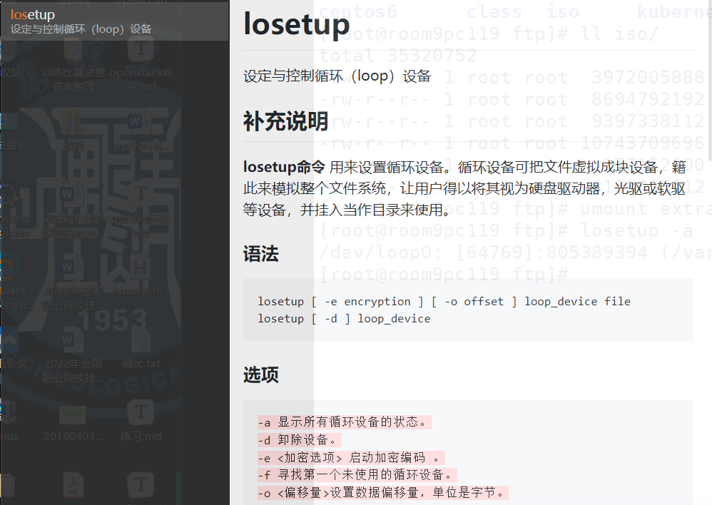
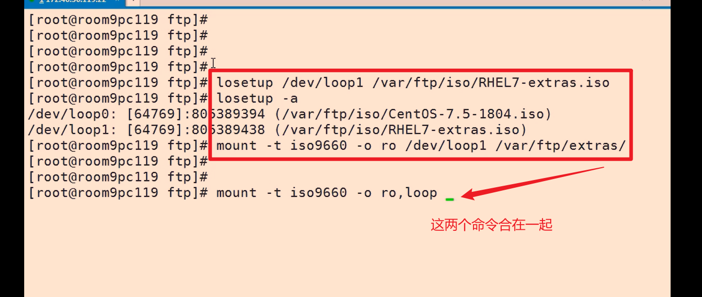

### Dockerfile知识点

空基础镜像

```
FROM scratch
```

command和args执行的命令会在logs中记录

```
apiVersion: v1
kind: Pod
metadata:
  name: configmap-pod
spec:
  containers:
    - name: configmap-pod
      image: busybox
      command: ["cat"]
      args: ["/etc/config/config.json"]
      volumeMounts:
        - name: config-vol
          mountPath: /etc/config
  volumes:
    - name: config-vol
      configMap:
        name: my-config3
        
root@master:~# kubectl logs configmap-pod
{
    "name": "痴者工良",
    "url": "k8s.whuanle.cn"
}
# cat /etc/config/config.json
```

节点选择器

```yaml
Pod节点选择器
spec:
  nodeSelector:
    nodeName: nginxnode
```

回滚

```
kubectl rollout history deployment nginx

kubectl rollout undo deployment nginx --to-revision=2
```

资源限制

```sh
kubectl set resources deployment nginx-app -c=nginx --limits=cpu=500m,memory=128Mi
# -c 指定容器
```

健康检查

```
命令形式的检查：
    livenessProbe:
      exec:
        command:
        - cat
        - /tmp/healthy
      initialDelaySeconds: 5
      periodSeconds: 5
      
HTTP 形式的检查：
  httpGet:
    httpHeaders:
      - name: Accept
        value: application/json

TCP：
      tcpSocket:
        port: 8080
```

网络

```
创建带端口的 Pod：
kubectl run nginx --image=nginx --restart=Never --port=80

为一个 Pod 暴露端口：
kubectl expose po nginx --port=80 --type=NodePort

映射成不同的端口：
kubectl expose po nginx --port=80 --target-port=8080 --type=NodePort
```

资源限制

```
    resources: 
      requests:
        memory: "100Mi"
        cpu: "0.5"
      limits:
        memory: "200Mi"
        cpu: "1"
```

Secret

```
创建已有的Secret
$ echo -n "admin" | base64
YWRtaW4=
$ echo -n "1f2d1e2e67df" | base64
MWYyZDFlMmU2N2Rm

vi secrets.yml
apiVersion: v1
kind: Secret
metadata:
  name: mysecret
type: Opaque
data:
  password: MWYyZDFlMmU2N2Rm
  username: YWRtaW4=

用tls
apiVersion: v1
kind: Secret
metadata:
  name: testsecret-tls
  namespace: default
data:
  tls.crt: base64 编码的 cert
  tls.key: base64 编码的 key
type: kubernetes.io/tls
```

Secret的类型

| 内置类型                              | 用法                                     |
| ------------------------------------- | ---------------------------------------- |
| `Opaque`                              | 用户定义的任意数据                       |
| `kubernetes.io/service-account-token` | 服务账号令牌                             |
| `kubernetes.io/dockercfg`             | `~/.dockercfg` 文件的序列化形式          |
| `kubernetes.io/dockerconfigjson`      | `~/.docker/config.json` 文件的序列化形式 |
| `kubernetes.io/basic-auth`            | 用于基本身份认证的凭据                   |
| `kubernetes.io/ssh-auth`              | 用于 SSH 身份认证的凭据                  |
| `kubernetes.io/tls`                   | 用于 TLS 客户端或者服务器端的数据        |
| `bootstrap.kubernetes.io/token`       | 启动引导令牌数据                         |

ServiceAccount（服务账户）

```
创建 ServiceAccount
kubectl create sa admin
在 Pod 中使用此 ServiceAccount
spec:
  serviceAccountName: admin
```

**SecurityContext**安全上下文（授予权限）

```yaml
设置运行用户和用户组
spec:
  securityContext: # add security context
    runAsUser: 1000
    runAsGroup: 2000

授权管理用户权限
spec:
  containers:
  - image: nginx
    securityContext:
      capabilities:
        add: ["SYS_TIME", "NET_ADMIN"]
```

volumes

```yaml
#引入docker卷
docker volume create {卷名称}
docker run   ...  -v /opt/test:/opt/test 

hostPath(依赖节点上的目录或文件，不同节点无法共享，适合单个pod部署，deployment多pod分布在不同节点)
spec:
  containers:
  - image: nginx:latest
    name: test-container
    volumeMounts:
    - mountPath: /test-pd
      name: test-volume
  volumes:
  - name: test-volume
    hostPath:
      # 宿主上目录位置
      path: /data
      # 此字段为可选
      type: Directory

emptyDir(空卷，不需要指定宿主机上对应目录，生命周期与pod绑定，容器崩溃不会影响，可在同一pod不同容器中访问)
apiVersion: v1
kind: Pod
metadata:
  name: test-pd
spec:
  containers:
  - image: nginx:latest
    name: test-container
    volumeMounts:
    - mountPath: /cache
      name: cache-volume
  volumes:
  - name: cache-volume
    emptyDir: {}
    
git卷(拉取git中的代码，还没有涉及此类的题)
volumns:
- name: erp
  gitRepo: 
    repository: https://github.com/whuanle/CZGL.AOP
    revision: main
    directory: .
    
ConfigMap(存储非机密性的数据到键值对，信息会被存储到etcd中，任何节点都可访问)
kubectl create configmap <map-name> <data-source>
以文件(--from-file)形式创建 ConfigMap,则为 key，文件内容为 value,也可以指定目录
对(--from-literal)形式创建 ConfigMap，可直接创建 key=value(常用)
1.ConfigMap在环境变量中使用，定义 Pod 
（1）只使用一部分（valueFrom）
    env:
     - name: letter
       valueFrom:
         configMapKeyRef:
           name: my-config2
           key: a.txt
（2）全部导入（envFrom）
    env:
    - name: myconfig_b
      envFrom:
      - configMapRef:
          name: my-config2
2.ConfigMag卷(向pod中注入数据，主要给Pod中容器传递配置)
apiVersion: v1
kind: Pod
metadata:
  name: configmap-pod
spec:
  containers:
    - name: configmap-pod
      image: busybox
      command: ["ls"]
      args: ["/etc/config"]
      volumeMounts:
        - name: config-vol
          mountPath: /etc/config
  volumes:
    - name: config-vol
      configMap:
        name: my-config
 注：ConfigMap 卷映射到容器，如果使用的是 mountPath 挂载到目录，则 ConfigMap 更新内容时，容器中的配置文件内容也会被更新，但需要使用一个新的目录挂载
多键值对
--from-file 等导入 ConfigMap，并不能同时导入多个值，要使用JSON、YAML文件
--from-env-file 将 a.txt 中的多行键值对拆分出来，只能出现一个
kubectl create configmap my-config3 --from-env-file=a.txt

Secret 卷（传递pod敏感信息）
1.通过证书创建 Secret(TLS)
kubectl create secret tls tls-secret --cert=1_k1.whuanle.cn_bundle.crt --key=2_k1.whuanle.cn.key
2.基本身份认证 Secret(basic-auth)存储账号密码，spec.data 中必须包含 username 和 password 两个字段
apiVersion: v1
kind: Secret
metadata:
  name: secret-basic-auth
type: kubernetes.io/basic-auth
stringData:
  username: admin
  password: t0p-Secret

root@master:~# kubectl get secret secret-basic-auth  -o yaml
apiVersion: v1
data:
  password: dDBwLVNlY3JldA==
  username: YWRtaW4=
kind: Secret
会被使用 base64 编码
3.SSH 身份认证 Secret（存储一段 ssh 密钥）
apiVersion: v1
kind: Secret
metadata:
  name: secret-ssh-auth
type: kubernetes.io/ssh-auth
data:
  ssh-privatekey: |
          MIIEpQIBAAKCAQEAulqb/Y ...
使用Secret（环境变量和文件两种形式）
1.文件
apiVersion: v1
kind: Pod
metadata:
  name: secret1
spec:
  containers:
  - name: secret1
    image: nginx
    volumeMounts:
    - name: foo
      mountPath: "/etc/foo"
      readOnly: true
  volumes:
  - name: foo
    secret:
      secretName: secret-basic-auth
2.环境变量
apiVersion: v1
kind: Pod
metadata:
  name: mysecret2
spec:
  containers:
  - name: mysecret
    image: nginx
    env:
      - name: SECRET_USERNAME
        valueFrom:
          secretKeyRef:
            name: secret-basic-auth
            key: username
      - name: SECRET_PASSWORD
        valueFrom:
          secretKeyRef:
            name: secret-basic-auth
            key: password
  restartPolicy: Never
 
同时使用ConfigMap、Secret
apiVersion: v1
kind: Pod
metadata:
  creationTimestamp: null
  labels:
    run: mydb
  name: mydb
spec:
  containers:
  - image: mysql:5.7
    name: mydb
    envFrom:
    - configMapRef:
        name: db-config
    - secretRef:
        name: db-secret
    resources: {}
  dnsPolicy: ClusterFirst
  restartPolicy: Always
status: {}

NFS卷（保证每个节点上访问到的文件内容、状态都是一致的、实时的）
echo "/nfs-share *(rw,no_root_squash,sync)" >> /etc/exports
exportfs -r   #生效
exportfs      #检查
systemctl enable --now rpcbind
systemctl enable --now nfs
showmount  -e hostname 
mount {部署了nfs服务器的ip}:/nfs-share /mnt
-------------------------------------------------------------------
挂载到pod
apiVersion: v1
kind: Pod
metadata:
  name: nginx
spec:
  containers:
    - name: nginx
      image: nginx:latest
      volumeMounts:
        - name: mynfs
          mountPath: /mnt/mynfs
  volumes:
    - name: mynfs
      nfs:
        server: 10.170.0.2
        path: /nfs-share
#查看
kubectl exec nginx -- ls /mnt/mynfs

---------------------------------------------------------
持久卷
创建远程存储空间（创建云硬盘）
#创建一个 /data/volumns 目录，这些目录存储空间用于创建卷
mkdir /data
mkdir /data/volumns
mkdir /data/volumns/1
mkdir /data/volumns/2
mkdir /data/volumns/3
mkdir /data/volumns/4
mkdir /data/volumns/5
echo "/data/volumns/1 *(rw,no_root_squash,sync)" >> /etc/exports
echo "/data/volumns/2 *(rw,no_root_squash,sync)" >> /etc/exports
echo "/data/volumns/3 *(rw,no_root_squash,sync)" >> /etc/exports
echo "/data/volumns/4 *(rw,no_root_squash,sync)" >> /etc/exports
echo "/data/volumns/5 *(rw,no_root_squash,sync)" >> /etc/exports
exportfs -r

创建卷（创建持久卷 PersistentVolume (PV)）
apiVersion: v1
kind: PersistentVolume
metadata:
  name: pv0001
spec:
  capacity:
    storage: 1Gi
  volumeMode: Filesystem
  accessModes:
    - ReadWriteOnce
  persistentVolumeReclaimPolicy: Recycle
  mountOptions:
    - hard
    - nfsvers=4.1
  nfs:
    path: /data/volumns/1
    server: 10.0.0.4
---
apiVersion: v1
kind: PersistentVolume
metadata:
  name: pv0002
spec:
  capacity:
    storage: 2Gi
  volumeMode: Filesystem
  accessModes:
    - ReadWriteOnce
  persistentVolumeReclaimPolicy: Recycle
  mountOptions:
    - hard
    - nfsvers=4.1
  nfs:
    path: /data/volumns/2
    server: 10.0.0.4
---
apiVersion: v1
kind: PersistentVolume
metadata:
  name: pv0003
spec:
  capacity:
    storage: 4Gi
  volumeMode: Filesystem
  accessModes:
    - ReadWriteOnce
  persistentVolumeReclaimPolicy: Recycle
  mountOptions:
    - hard
    - nfsvers=4.1
  nfs:
    path: /data/volumns/3
    server: 10.0.0.4
---
apiVersion: v1
kind: PersistentVolume
metadata:
  name: pv0004
spec:
  capacity:
    storage: 5Gi
  volumeMode: Filesystem
  accessModes:
    - ReadWriteOnce
  persistentVolumeReclaimPolicy: Recycle
  mountOptions:
    - hard
    - nfsvers=4.1
  nfs:
    path: /data/volumns/4
    server: 10.0.0.4
#这里暂时不创建 pv 5
kubectl get pv
```

每个 PV 可以设定三种 ACCESS MODES，即访问模式：

- `ReadWriteOnce`，RWO

  卷可以被一个节点以读写方式挂载，即只允许被一个节点挂载。

- `ReadOnlyMany`，ROX

  卷可以被多个节点以只读方式挂载。

- `ReadWriteMany`，RWX

  卷可以被多个节点以读写方式挂载。

- `ReadWriteOncePod`，RWOP

  卷可以被单个 Pod 以读写方式挂载。即只能有一个节点一个 Pod 挂载访问。

```yaml
创建PVC
apiVersion: v1
kind: PersistentVolumeClaim
metadata:
  name: pvc3
spec:
  accessModes:
    - ReadWriteOnce
  resources:
    requests:
      storage: 3Gi

root@master:~# kubectl get pvc
一旦找到符合要求的 PV，则 PVC 变成 Bound 状态，查找发现 PV 中没有刚好的容量，则会使用稍大的 PV 卷

Pod中使用卷
apiVersion: v1
kind: Pod
metadata:
  name: pvcpod
spec:
  containers:
    - name: pvctest
      image: nginx
      volumeMounts:
      - mountPath: "/usr/share/nginx/html"
        name: mypd
  volumes:
    - name: mypd
      persistentVolumeClaim:
        claimName: pvc3

其他类型PV
hostPath
  storageClassName: manual
  capacity:
    storage: 10Gi
  accessModes:
    - ReadWriteOnce
  hostPath:
    path: "/mnt/data"
```


exam.qcow2转换为docker镜像

```
把qcow2镜像的整个系统转成文件压缩包，再把文件压缩包导入到docker的镜像仓库
把qcow2镜像挂载到目录下，并复制到一个目录下，进行打包
tar -cvzf ~/com.tar.gz  -C  /mnt/com  ./

docker import  my_ubuntu_v3.tar runoob/ubuntu:v4  
```





#### 