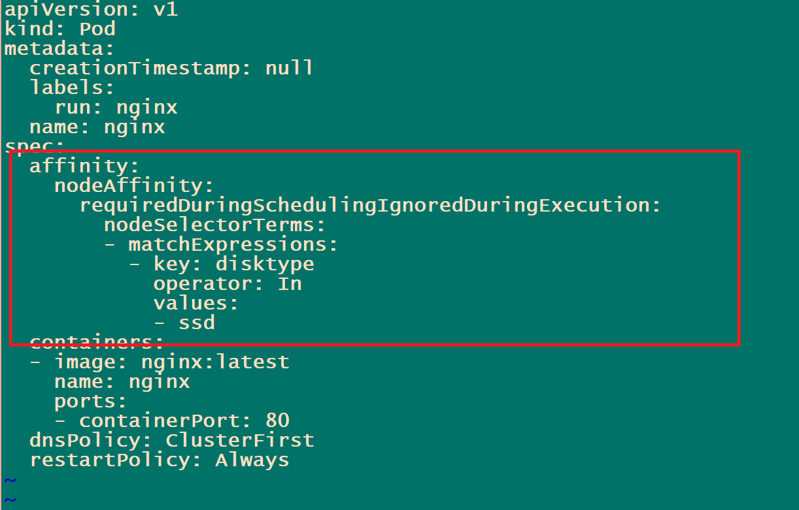
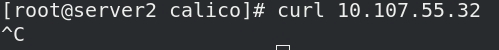
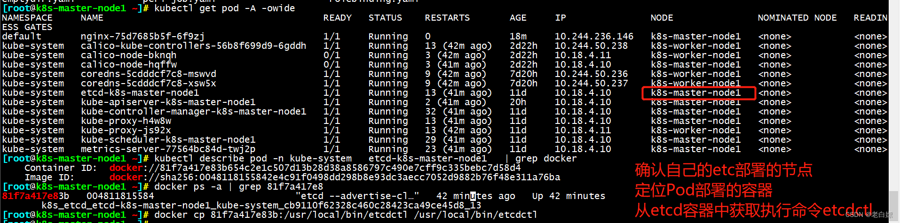
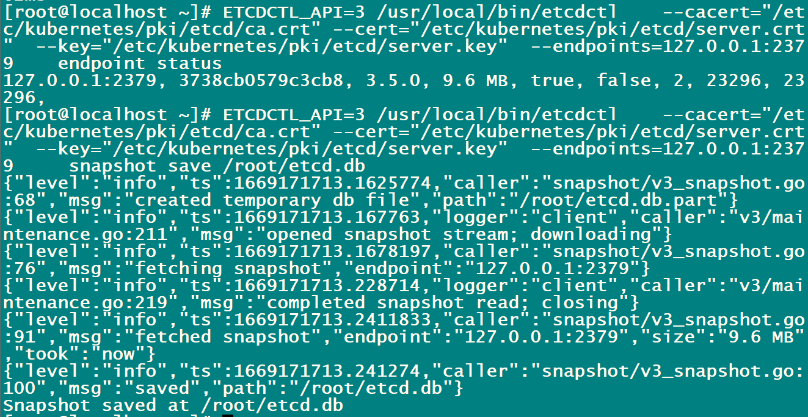
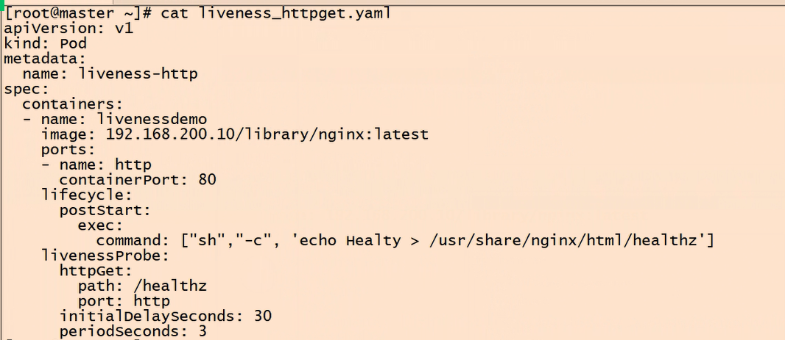
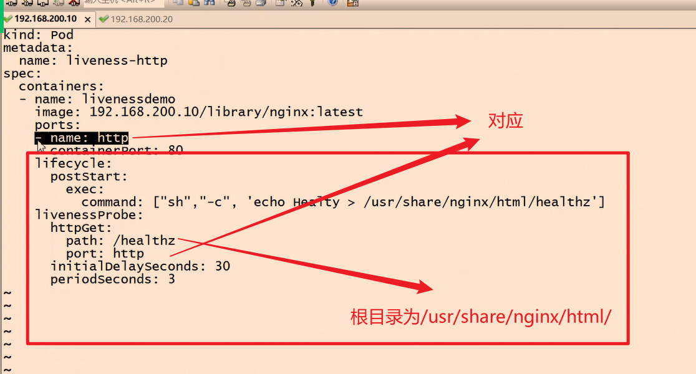
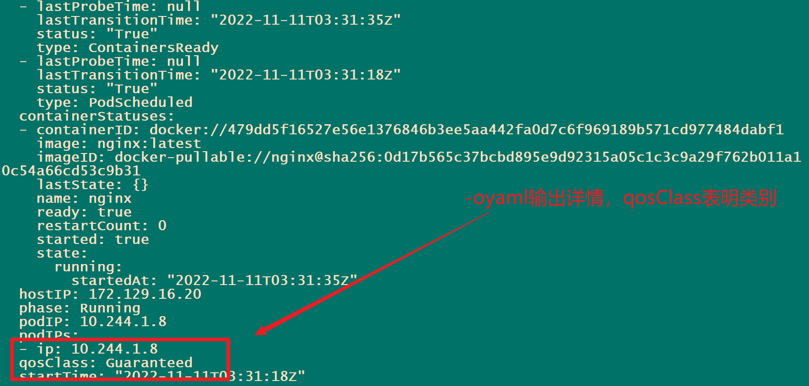
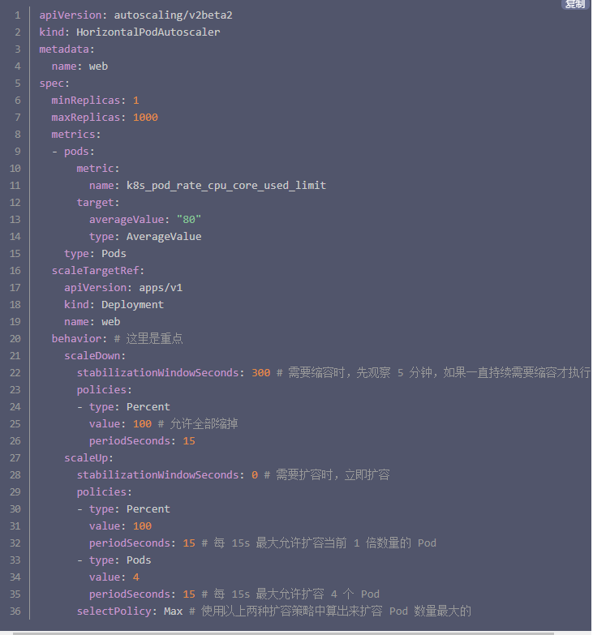

### Docker知识点

##### 更改 Docker 存储目录

既然 `Docker` 目录默认在 `/var/lib/docker` 目录下，且这个目录所挂载的磁盘容易被占满，所以我们修改 `Docker` 配置，将存储的数据单独存放到挂载其它大磁盘的目录中

```
1. 查看 Docker 状态，根据显示的信息定位 Docker 存储配置文件的位置
$ systemctl status -l docker
● docker.service - Docker Application Container Engine
   Loaded: loaded (/usr/lib/systemd/system/docker.service; enabled; vendor preset: disabled)
   Active: active (running) since 二 2021-06-15 10:40:07 CST; 3h 20min ago
     Docs: https://docs.docker.com
 Main PID: 1676 (dockerd)
......

可以看到配置文件所在目录是 /usr/lib/systemd/system/，配置文件是 docker.service
2. 设置 Docker 数据存储目录
打开 Docker 配置文件
$ vi /usr/lib/systemd/system/docker.service
找到 ExecStartExecStart=/usr/bin/docker 这行，在后面添加 --graph，例如这里目录为 /apps/data/docker 则可以按如下配置
...
ExecStart=/usr/bin/docker --graph /apps/data/docker
...


```


### Dockerfile知识点


空基础镜像

```
FROM scratch
```

### Docker-compoes知识点


```

```

### kubernetes知识点

##### 驱逐机制管理--配置节点压力驱逐[0.5 分] 

设置kubelet 数据存储在/apps/data/kubelet 目录下，并设置当 kubelet 的存储空间不足 5%， 或者当容器运行时文件系统可用存储空间不足 5%时开始驱逐 Pod。

```
更改 kubelet 存储目录与告警阈值
既然 Kubelet 目录默认在 /var/lib/kubelet 目录下，且这个目录所挂载的磁盘容易被占满，所以我们修改 Kubelet 配置，将存储的数据单独存放到挂载其它大磁盘的目录中。并且根据磁盘真实大小，调整 Kubelet 触发 DisPress 告警的比例
1.设置kubelet 数据存储在/apps/data/kubelet 目录下

  1. 查看 kubelet 状态，根据显示的信息定位 kubelet 存储配置文件的位置
$ systemctl status -l kubelet
● kubelet.service - kubelet: The Kubernetes Node Agent
   Loaded: loaded (/usr/lib/systemd/system/kubelet.service; enabled; vendor preset: disabled)
  Drop-In: /usr/lib/systemd/system/kubelet.service.d
           └─10-kubeadm.conf
   Active: active (running) since 二 2021-06-15 10:40:03 CST; 1h 57min ago
......

可以观察到配置文件目录所在位置是 /usr/lib/systemd/system/kubelet.service.d/，配置文件是 10-kubeadm.conf
  2.查看 EnvironmentFile 配置文件所在位置
打开 kubelet 配置，查看 kubelet 配置文件
  $ cat /usr/lib/systemd/system/kubelet.service.d/10-kubeadm.conf
[Service]
Environment="KUBELET_KUBECONFIG_ARGS=--bootstrap-kubeconfig=/etc/kubernetes/bootstrap-kubelet.conf --kubeconfig=/etc/kubernetes/kubelet.conf"
Environment="KUBELET_CONFIG_ARGS=--config=/var/lib/kubelet/config.yaml"
EnvironmentFile=-/var/lib/kubelet/kubeadm-flags.env
EnvironmentFile=-/etc/sysconfig/kubelet
ExecStart=
ExecStart=/usr/bin/kubelet $KUBELET_KUBECONFIG_ARGS $KUBELET_CONFIG_ARGS $KUBELET_KUBEADM_ARGS $KUBELET_EXTRA_ARGS

可以看到 EnvironmentFile=-/var/lib/kubelet/kubeadm-flags.env 和 EnvironmentFile=-/etc/sysconfig/kubelet 俩行配置，其中 /var/lib/kubelet/kubeadm-flags.env 是 “kubeadm init” 和 “kubeadm join” 在运行时生成的文件，我们不需要管理该文件。而 /etc/sysconfig/kubelet 文件则是供我们用户添加自定义参数的，所以我们需要在这个配置文件中添加我们自定义配置参数

$ vi /etc/sysconfig/kubelet
然后在 KUBELET_EXTRA_ARGS= 后面添加参数 -root-dir=<新的kubelet存储目录>:
KUBELET_EXTRA_ARGS=--root-dir=/apps/data/kubelet --eviction-hard=nodefs.available<5% --eviction-hard=imagefs.available<5% 
```

- –root-dir=/apps/data/kubelet: 设置 kubelet 数据存储在 /apps/data/kubelet 目录下。
- –eviction-hard=nodefs.available<5%: 设置当 kubelet 相关存储可用的存储不足 5% 时开始驱逐 Pod。
- –eviction-hard=imagefs.available<5%: 当容器运行时文件系统可用存储空间不足 5% 时开始驱逐 Pod。

> 上面的大小限制也可以改成具体的数值，例如 --eviction-hard=imagefs.available<10Gi，则表示容器运行时存储小于 10Gi 时进行驱逐。

```
重启 daemon-reload 和 kubelet
$ systemctl daemon-reload && systemctl restart kubelet

再次查看 kubelet 状态，观察上面配置是否生效
systemctl status -l kubelet
● kubelet.service - kubelet: The Kubernetes Node Agent
   Loaded: loaded (/usr/lib/systemd/system/kubelet.service; enabled; vendor preset: disabled)
  Drop-In: /usr/lib/systemd/system/kubelet.service.d
           └─10-kubeadm.conf
   Active: active (running) since 二 2021-06-15 13:55:29 CST; 1s ago
     Docs: https://kubernetes.io/docs/
 Main PID: 130986 (kubelet)
    Tasks: 14
   Memory: 26.1M
   CGroup: /system.slice/kubelet.service
           └─130986 /usr/bin/kubelet 
           --bootstrap-kubeconfig=/etc/kubernetes/bootstrap-kubelet.conf 
           --kubeconfig=/etc/kubernetes/kubelet.conf 
           --config=/var/lib/kubelet/config.yaml 
           --network-plugin=cni 
           --pod-infra-container-image=registry.aliyuncs.com/google_containers/pause:3.2 
           --root-dir=/apps/data/kubelet 
           --eviction-hard=nodefs.available<5% 
           --eviction-hard=imagefs.available<5%
           
可以观察到上面信息中已经加载了 root-dir、--eviction-hard 参数，说明配置已经生效
```

##### 网络策略管理--创建 Pod 网络策略[0.5 分] 

创建一个网络策略 network-exam，要求只有 internal 命名空间下的 Pod 可以通过 TCP 协议的 8080 端口访问到 mysql 命名空间下的 Pod。

```
apiVersion: networking.k8s.io/v1
kind: NetworkPolicy
metadata:
  name: network-exam
  namespace: internal
spec:
  policyTypes:
  - Egress
  egress:
  - to:
     - namespaceSelector:
        matchLabels:
         kubernetes.io/metadata.name: mysql
  - ports:
    - port: 8080
      protocol: TCP
```

##### 污点（node）与容忍（pod）

```
kubectl taint -h 里有提示

Node - taint > 排斥 Pod
Pod  - tolerations -> 我是真爱，我能容忍污点 -> Node
污点有强制和尽量两种，前者完全排斥，后者尽可能排斥，另外某些污点可以将已经在这台节点上部署的 Pod 逐出，这个过程称为 effect

添加污点格式：
kubectl taint node instance-2 key1=value1:NoSchedule

移除污点：
kubectl taint node instance-2 key1=value1:NoSchedule-

更新污点或覆盖：
kubectl taint node [node] key=value:[effect] --overwrite=true


容忍
kubectl explain pod.spec.tolerations


YAML 示例：

tolerations:
- key: "key1"
  operator: "Exists"
  effect: "NoSchedule"
此 Pod 能够容忍带有 key1 标签的污点，且无论是什么值
```

##### 节点亲和性管理

创建硬限制规则的 Pod

```
在  default  命 名 空 间 下 使 用  nginx  镜 像 运 行 一 个  Pod ， 名 称 为  nginx ， 要 求 使 用 requiredDuringSchedulingIgnoredDuringExecution 策略将 Pod 调度到具有“disktype=ssd”标 签的节点。

先给节点打标签
[root@master ~]# kubectl label node localhost.localdomain disktype=ssd
node/localhost.localdomain labeled


apiVersion: v1
kind: Pod
metadata:
  creationTimestamp: null
  labels:
    run: nginx
  name: nginx
spec:
  affinity:
    nodeAffinity:
      requiredDuringSchedulingIgnoredDuringExecution:
        nodeSelectorTerms:
        - matchExpressions:
          - key: disktype
            operator: In
            values:
            - ssd
  containers:
  - image: nginx:latest
    name: nginx
    ports:
    - containerPort: 80
  dnsPolicy: ClusterFirst
  restartPolicy: Always
```



##### 创建pod

```
使用 nginx 镜像在 default 命名空间下创建一个名为 exam 的 Pod，并为该 Pod 设置环境变量 exam，其值为 2022
kubectl run exam --env="exam=2022" --image=nginx:latest  --namespace=default  --image-pull-policy='IfNotPresent'
```

多容器的 Pod

```
apiVersion: v1
kind: Pod
metadata:
  name: qos-demo-4
  namespace: qos-example
spec:
  containers:
 
  - name: qos-demo-4-ctr-1
    image: nginx
    resources:
      requests:
        memory: "200Mi"
 
  - name: qos-demo-4-ctr-2
    image: redis
```

##### command和args

command和args执行的命令会在logs中记录

```
apiVersion: v1
kind: Pod
metadata:
  name: configmap-pod
spec:
  containers:
    - name: configmap-pod
      image: busybox
      command: ["cat"]
      args: ["/etc/config/config.json"]
      volumeMounts:
        - name: config-vol
          mountPath: /etc/config
  volumes:
    - name: config-vol
      configMap:
        name: my-config3
        
root@master:~# kubectl logs configmap-pod
{
    "name": "痴者工良",
    "url": "k8s.whuanle.cn"
}
# cat /etc/config/config.json
```

##### 节点选择器

```yaml
Pod节点选择器
spec:
  nodeSelector:
    nodeName: nginxnode
```

##### 回滚

1. `kubectl set image` 可以更新现有资源对象的容器镜像

   对象包括 `Pod`、`Deployment`、`DaemonSet`、`Job`、`ReplicaSet`

```
kubectl set image deployment {deployment名称} {镜像名称}:={镜像名称}:{版本}
```

2. 我们还可以通过 `kubectl edit yaml` 的方式方式更新 Pod

```
kubectl edit deployment nginx
```

> 为了记录版本更新信息，我们需要在 `kubectl create deployment`、`kubectl set image` 命令后面加上 `--record`

`kubectl scale` 命令也可以更改副本数量

通过 `kubectl rollout status` 命令，查看 Pod 的上线状态，即 Pod 副本集的更替状态：

```bash
kubectl rollout status deployment nginx
```

我们查看 Deployment 的上线历史记录：

```bash
kubectl rollout history deployment nginx
```

现在我们查看 版本2 的详细信息：

```
kubectl rollout history deployment nginx --revision=2
```

指定回滚到特点的版本。

```bash
kubectl rollout undo deployment nginx --to-revision=2
```

`kubectl rollout pause` 命令可以让我们在 Deployment 的 Pod 版本时，暂停滚动更新。

命令：

```bash
kubectl rollout history deployment nginx

kubectl rollout undo deployment nginx --to-revision=2
```

##### 资源限制

```sh
kubectl set resources deployment nginx-app -c=nginx --limits=cpu=500m,memory=128Mi
# -c 指定容器
```

##### 健康检查

```
命令形式的检查：
    livenessProbe:
      exec:
        command:
        - cat
        - /tmp/healthy
      initialDelaySeconds: 5
      periodSeconds: 5
      
HTTP 形式的检查：
  httpGet:
    httpHeaders:
      - name: Accept
        value: application/json

TCP：
      tcpSocket:
        port: 8080
```

##### 网络

```
创建带端口的 Pod：
kubectl run nginx --image=nginx --restart=Never --port=80

为一个 Pod 暴露端口：
kubectl expose po nginx --port=80 --type=NodePort

映射成不同的端口：
kubectl expose po nginx --port=80 --target-port=8080 --type=NodePort
```

##### 网络策略

```
创建网络策略
创建带有标签：app=nginx 的服务nginx-svc

kubectl apply -f /root/ingress/nginx-svc.yml
---
apiVersion: v1
kind: Service
metadata:
  name: nginx-svc
spec:
  selector:
    app: nginx
  ports:
  - protocol: TCP
    port: 80
    targetPort: 80
---
apiVersion: apps/v1
kind: Deployment
metadata:
  name: deployment
spec:
  replicas: 2
  selector:
    matchLabels:
      app: nginx
  template:
    metadata:
      labels:
        app: nginx
    spec:
      containers:
      - name: myapp
        image: myapp:v2
```

**拒绝访问指定服务**

```
设置带app=nginx标签的不能访问：
vim deny-nginx.yml
apiVersion: networking.k8s.io/v1
kind: NetworkPolicy
metadata:
  name: deny-nginx
spec:
  podSelector:
    matchLabels:
      app: nginx
```



**允许指定pod访问服务**

```
未创建策略前pod访问app：nginx的服务被拒绝
添加标签 app:demo：
kubectl label pod demo app=demo

vim acces-demo.yml
kind: NetworkPolicy
apiVersion: networking.k8s.io/v1
metadata:
  name: access-nginx
spec:
  podSelector:
    matchLabels:
      app: nginx
  ingress:
 - from:
      - podSelector:
          matchLabels:
            app: demo
            
kubectl apply -f acces-demo.yml
测试：访问成功
```

**禁止 namespace 中所有pod之间的相互访问**

```
创建命名空间demo
kubectl create namespace demo
创建两个pod并交互式（命名空间为demo）
kubectl run demo1 --image=radial/busyboxplus -it -n demo
kubectl run demo2 --image=radial/busyboxplus -it -n demo

创建策略:vim deny-pod.yml
apiVersion: networking.k8s.io/v1
kind: NetworkPolicy
metadata:
  name: default-deny
  namespace: demo
spec:
  podSelector: {}
  
kubectl apply -f deny-pod.yml
创建策略成功后：命名空间demo中的pod不能相互访问
```

**禁止其他 namespace 访问服务**

```bash
创建pod：可以访问
kubectl run nginx --image=myapp:v2

创建策略：vim deny-ns.yml
kind: NetworkPolicy
apiVersion: networking.k8s.io/v1
metadata:
  name: deny-namespace
spec:
  podSelector:
    matchLabels:
  ingress:
  - from:
    - podSelector: {}

```

**允许指定namespace访问服务**

```yaml
允许 role=prod并且ns 为 test的 pod 可以访问 run=nginx
创建namespace为test
kubectl create namespace test
为test添加标签role:prod
kubectl label ns test role=prod
创建test下的pod并交互式
kubectl run test1 --image=radial/busyboxplus -it -n test
测试发现不能访问（在4.1中设置带app=nginx标签的不能访问）
创建策略：vim acces-ns.yml
kind: NetworkPolicy
apiVersion: networking.k8s.io/v1
metadata:
  name: access-namespace
spec:
  podSelector:
    matchLabels:
      run: nginx
  ingress:
 - from:
    - namespaceSelector:
        matchLabels:
          role: prod

```

**允许外网访问服务**

```yaml
带标签 app=nginx 的pod可以从外网访问到
创建ingress：
vim nginx.yml
apiVersion: networking.k8s.io/v1beta1
kind: Ingress
metadata:
  name: ingress-demo
spec:
  rules:
 - host: www1.westos.org
    http:
      paths:
      - path: /
        backend:
          serviceName: nginx-svc
          servicePort: 80
```

- 外网测试访问失败（提前解析www1.westos.org）
  `curl www1.westos.org`
- 创建策略：
  kubectl apply -f acces-ex.yml

```yaml
kind: NetworkPolicy
apiVersion: networking.k8s.io/v1
metadata:
  name: web-allow-external
spec:
  podSelector:
    matchLabels:
      app: nginx
  ingress:
 - ports:
    - port: 80
    from: []
```

##### 资源限制

```
    resources: 
      requests:
        memory: "100Mi"
        cpu: "0.5"
      limits:
        memory: "200Mi"
        cpu: "1"
```

##### Secret

```
创建已有的Secret
$ echo -n "admin" | base64
YWRtaW4=
$ echo -n "1f2d1e2e67df" | base64
MWYyZDFlMmU2N2Rm

vi secrets.yml
apiVersion: v1
kind: Secret
metadata:
  name: mysecret
type: Opaque
data:
  password: MWYyZDFlMmU2N2Rm
  username: YWRtaW4=

用tls
apiVersion: v1
kind: Secret
metadata:
  name: testsecret-tls
  namespace: default
data:
  tls.crt: base64 编码的 cert
  tls.key: base64 编码的 key
type: kubernetes.io/tls
```

##### Secret的类型

| 内置类型                              | 用法                                     |
| ------------------------------------- | ---------------------------------------- |
| `Opaque`                              | 用户定义的任意数据                       |
| `kubernetes.io/service-account-token` | 服务账号令牌                             |
| `kubernetes.io/dockercfg`             | `~/.dockercfg` 文件的序列化形式          |
| `kubernetes.io/dockerconfigjson`      | `~/.docker/config.json` 文件的序列化形式 |
| `kubernetes.io/basic-auth`            | 用于基本身份认证的凭据                   |
| `kubernetes.io/ssh-auth`              | 用于 SSH 身份认证的凭据                  |
| `kubernetes.io/tls`                   | 用于 TLS 客户端或者服务器端的数据        |
| `bootstrap.kubernetes.io/token`       | 启动引导令牌数据                         |

##### ServiceAccount（服务账户）

```
创建 ServiceAccount
kubectl create sa admin
在 Pod 中使用此 ServiceAccount
spec:
  serviceAccountName: admin
```

##### **SecurityContext**安全上下文（授予权限）

```yaml
设置运行用户和用户组
spec:
  securityContext: # add security context
    runAsUser: 1000
    runAsGroup: 2000

授权管理用户权限
spec:
  containers:
  - image: nginx
    securityContext:
      capabilities:
        add: ["SYS_TIME", "NET_ADMIN"]
```

##### volumes

```yaml
#引入docker卷
docker volume create {卷名称}
docker run   ...  -v /opt/test:/opt/test 

hostPath(依赖节点上的目录或文件，不同节点无法共享，适合单个pod部署，deployment多pod分布在不同节点)
spec:
  containers:
  - image: nginx:latest
    name: test-container
    volumeMounts:
    - mountPath: /test-pd
      name: test-volume
  volumes:
  - name: test-volume
    hostPath:
      # 宿主上目录位置
      path: /data
      # 此字段为可选
      type: Directory

emptyDir(空卷，不需要指定宿主机上对应目录，生命周期与pod绑定，容器崩溃不会影响，可在同一pod不同容器中访问)
apiVersion: v1
kind: Pod
metadata:
  name: test-pd
spec:
  containers:
  - image: nginx:latest
    name: test-container
    volumeMounts:
    - mountPath: /cache
      name: cache-volume
  volumes:
  - name: cache-volume
    emptyDir: {}
    
git卷(拉取git中的代码，还没有涉及此类的题)
volumns:
- name: erp
  gitRepo: 
    repository: https://github.com/whuanle/CZGL.AOP
    revision: main
    directory: .
    
ConfigMap(存储非机密性的数据到键值对，信息会被存储到etcd中，任何节点都可访问)
kubectl create configmap <map-name> <data-source>
以文件(--from-file)形式创建 ConfigMap,则为 key，文件内容为 value,也可以指定目录
对(--from-literal)形式创建 ConfigMap，可直接创建 key=value(常用)
1.ConfigMap在环境变量中使用，定义 Pod 
（1）只使用一部分（valueFrom）
    env:
     - name: letter
       valueFrom:
         configMapKeyRef:
           name: my-config2
           key: a.txt
（2）全部导入（envFrom）
    env:
    - name: myconfig_b
      envFrom:
      - configMapRef:
          name: my-config2
2.ConfigMag卷(向pod中注入数据，主要给Pod中容器传递配置)
apiVersion: v1
kind: Pod
metadata:
  name: configmap-pod
spec:
  containers:
    - name: configmap-pod
      image: busybox
      command: ["ls"]
      args: ["/etc/config"]
      volumeMounts:
        - name: config-vol
          mountPath: /etc/config
  volumes:
    - name: config-vol
      configMap:
        name: my-config
 注：ConfigMap 卷映射到容器，如果使用的是 mountPath 挂载到目录，则 ConfigMap 更新内容时，容器中的配置文件内容也会被更新，但需要使用一个新的目录挂载
多键值对
--from-file 等导入 ConfigMap，并不能同时导入多个值，要使用JSON、YAML文件
--from-env-file 将 a.txt 中的多行键值对拆分出来，只能出现一个
kubectl create configmap my-config3 --from-env-file=a.txt

Secret 卷（传递pod敏感信息）
1.通过证书创建 Secret(TLS)
kubectl create secret tls tls-secret --cert=1_k1.whuanle.cn_bundle.crt --key=2_k1.whuanle.cn.key
2.基本身份认证 Secret(basic-auth)存储账号密码，spec.data 中必须包含 username 和 password 两个字段
apiVersion: v1
kind: Secret
metadata:
  name: secret-basic-auth
type: kubernetes.io/basic-auth
stringData:
  username: admin
  password: t0p-Secret

root@master:~# kubectl get secret secret-basic-auth  -o yaml
apiVersion: v1
data:
  password: dDBwLVNlY3JldA==
  username: YWRtaW4=
kind: Secret
会被使用 base64 编码
3.SSH 身份认证 Secret（存储一段 ssh 密钥）
apiVersion: v1
kind: Secret
metadata:
  name: secret-ssh-auth
type: kubernetes.io/ssh-auth
data:
  ssh-privatekey: |
          MIIEpQIBAAKCAQEAulqb/Y ...
使用Secret（环境变量和文件两种形式）
1.文件
apiVersion: v1
kind: Pod
metadata:
  name: secret1
spec:
  containers:
  - name: secret1
    image: nginx
    volumeMounts:
    - name: foo
      mountPath: "/etc/foo"
      readOnly: true
  volumes:
  - name: foo
    secret:
      secretName: secret-basic-auth
2.环境变量
apiVersion: v1
kind: Pod
metadata:
  name: mysecret2
spec:
  containers:
  - name: mysecret
    image: nginx
    env:
      - name: SECRET_USERNAME
        valueFrom:
          secretKeyRef:
            name: secret-basic-auth
            key: username
      - name: SECRET_PASSWORD
        valueFrom:
          secretKeyRef:
            name: secret-basic-auth
            key: password
  restartPolicy: Never
 
同时使用ConfigMap、Secret
apiVersion: v1
kind: Pod
metadata:
  creationTimestamp: null
  labels:
    run: mydb
  name: mydb
spec:
  containers:
  - image: mysql:5.7
    name: mydb
    envFrom:
    - configMapRef:
        name: db-config
    - secretRef:
        name: db-secret
    resources: {}
  dnsPolicy: ClusterFirst
  restartPolicy: Always
status: {}

NFS卷（保证每个节点上访问到的文件内容、状态都是一致的、实时的）
echo "/nfs-share *(rw,no_root_squash,sync)" >> /etc/exports
exportfs -r   #生效
exportfs      #检查
systemctl enable --now rpcbind
systemctl enable --now nfs
showmount  -e hostname 
mount {部署了nfs服务器的ip}:/nfs-share /mnt
-------------------------------------------------------------------
挂载到pod
apiVersion: v1
kind: Pod
metadata:
  name: nginx
spec:
  containers:
    - name: nginx
      image: nginx:latest
      volumeMounts:
        - name: mynfs
          mountPath: /mnt/mynfs
  volumes:
    - name: mynfs
      nfs:
        server: 10.170.0.2
        path: /nfs-share
#查看
kubectl exec nginx -- ls /mnt/mynfs

---------------------------------------------------------
持久卷
创建远程存储空间（创建云硬盘）
#创建一个 /data/volumns 目录，这些目录存储空间用于创建卷
mkdir /data
mkdir /data/volumns
mkdir /data/volumns/1
mkdir /data/volumns/2
mkdir /data/volumns/3
mkdir /data/volumns/4
mkdir /data/volumns/5
echo "/data/volumns/1 *(rw,no_root_squash,sync)" >> /etc/exports
echo "/data/volumns/2 *(rw,no_root_squash,sync)" >> /etc/exports
echo "/data/volumns/3 *(rw,no_root_squash,sync)" >> /etc/exports
echo "/data/volumns/4 *(rw,no_root_squash,sync)" >> /etc/exports
echo "/data/volumns/5 *(rw,no_root_squash,sync)" >> /etc/exports
exportfs -r

创建卷（创建持久卷 PersistentVolume (PV)）
apiVersion: v1
kind: PersistentVolume
metadata:
  name: pv0001
spec:
  capacity:
    storage: 1Gi
  volumeMode: Filesystem
  accessModes:
    - ReadWriteOnce
  persistentVolumeReclaimPolicy: Recycle
  mountOptions:
    - hard
    - nfsvers=4.1
  nfs:
    path: /data/volumns/1
    server: 10.0.0.4
---
apiVersion: v1
kind: PersistentVolume
metadata:
  name: pv0002
spec:
  capacity:
    storage: 2Gi
  volumeMode: Filesystem
  accessModes:
    - ReadWriteOnce
  persistentVolumeReclaimPolicy: Recycle
  mountOptions:
    - hard
    - nfsvers=4.1
  nfs:
    path: /data/volumns/2
    server: 10.0.0.4
---
apiVersion: v1
kind: PersistentVolume
metadata:
  name: pv0003
spec:
  capacity:
    storage: 4Gi
  volumeMode: Filesystem
  accessModes:
    - ReadWriteOnce
  persistentVolumeReclaimPolicy: Recycle
  mountOptions:
    - hard
    - nfsvers=4.1
  nfs:
    path: /data/volumns/3
    server: 10.0.0.4
---
apiVersion: v1
kind: PersistentVolume
metadata:
  name: pv0004
spec:
  capacity:
    storage: 5Gi
  volumeMode: Filesystem
  accessModes:
    - ReadWriteOnce
  persistentVolumeReclaimPolicy: Recycle
  mountOptions:
    - hard
    - nfsvers=4.1
  nfs:
    path: /data/volumns/4
    server: 10.0.0.4
#这里暂时不创建 pv 5
kubectl get pv
```

每个 PV 可以设定三种 ACCESS MODES，即访问模式：

- `ReadWriteOnce`，RWO

  卷可以被一个节点以读写方式挂载，即只允许被一个节点挂载。

- `ReadOnlyMany`，ROX

  卷可以被多个节点以只读方式挂载。

- `ReadWriteMany`，RWX

  卷可以被多个节点以读写方式挂载。

- `ReadWriteOncePod`，RWOP

  卷可以被单个 Pod 以读写方式挂载。即只能有一个节点一个 Pod 挂载访问。

```yaml
创建PVC
apiVersion: v1
kind: PersistentVolumeClaim
metadata:
  name: pvc3
spec:
  accessModes:
    - ReadWriteOnce
  resources:
    requests:
      storage: 3Gi

root@master:~# kubectl get pvc
一旦找到符合要求的 PV，则 PVC 变成 Bound 状态，查找发现 PV 中没有刚好的容量，则会使用稍大的 PV 卷

Pod中使用卷
apiVersion: v1
kind: Pod
metadata:
  name: pvcpod
spec:
  containers:
    - name: pvctest
      image: nginx
      volumeMounts:
      - mountPath: "/usr/share/nginx/html"
        name: mypd
  volumes:
    - name: mypd
      persistentVolumeClaim:
        claimName: pvc3

其他类型PV
hostPath
  storageClassName: manual
  capacity:
    storage: 10Gi
  accessModes:
    - ReadWriteOnce
  hostPath:
    path: "/mnt/data"
```

创建pv、pvc

```yaml
创建一个名称为 task-pv-volume 的 hostPath 类型的 PV 卷，其映射本地目录为 /mnt/data，卷空间大小为 10Gi，使用 ReadWriteOnce 访问模式，storageClassName: manual

storageClassName 是给卷进行分类，其字段值是自定义的。

apiVersion: v1
kind: PersistentVolume
metadata:
  name: task-pv-volume
  labels:
    type: local
spec:
  storageClassName: manual
  capacity:
    storage: 10Gi
  accessModes:
    - ReadWriteOnce
  hostPath:
    path: "/mnt/data"
```

声明 PVC，即代表要使用多大的卷：

```yaml
apiVersion: v1
kind: PersistentVolumeClaim
metadata:
  name: task-pv-claim
spec:
  storageClassName: manual
  accessModes:
    - ReadWriteOnce
  resources:
    requests:
      storage: 3Gi
```

挂载到 Pod 中：

```yaml
apiVersion: v1
kind: Pod
metadata:
  name: task-pv-pod
spec:
  volumes:
    - name: task-pv-storage
      persistentVolumeClaim:
        claimName: task-pv-claim
  containers:
    - name: task-pv-container
      image: nginx
      ports:
        - containerPort: 80
          name: "http-server"
      volumeMounts:
        - mountPath: "/usr/share/nginx/html"
          name: task-pv-storage
```

##### ETCD



```
 Kubernetes 使用 ETCD 来存储集群的实时运行数据，为防止服务器宕机导致 Kubernetes 集群数据丢失，请将 Kubernetes 集群数据备份到/root/etcd.db 中。
 ​ ​ ​ ​ ​ ​ ​ ​ ​ ​ ​ ​ ​ ​ ​ ​ ​ ​ ​ ​ ​ ​ ​ ​ ​ ​ ​ ​ ​ ​ ​ ​ ​ ​ ​ ​ ​ ​ ​ ​ ​ ​
找到etcd的pod查看详情，从etcd容器中获取etcdctl命令
 
 
 
 #查看etcd集群成员列表
ETCDCTL_API=3 /usr/local/bin/etcdctl \
 --cacert=/etc/kubernetes/pki/etcd/ca.crt \
 --cert=/etc/kubernetes/pki/etcd/server.crt \
 --key=/etc/kubernetes/pki/etcd/server.key \
 --endpoints="https://127.0.0.1:2379"  member list

#查看etcd端点状态
ETCDCTL_API=3 /usr/local/bin/etcdctl \
 --cacert=/etc/kubernetes/pki/etcd/ca.crt \
 --cert=/etc/kubernetes/pki/etcd/server.crt \
 --key=/etc/kubernetes/pki/etcd/server.key \
 --endpoints="https://127.0.0.1:2379"  endpoint status   

开始备份etcd数据：
#基础格式
ETCDCTL_API=3 etcdctl \
--cacert="${CACERT}" --cert="${CERT}" --key="${KEY}" \
--endpoints=${ENDPOINTS} \
snapshot save /root/etcd.db


ETCDCTL_API=3 /usr/local/bin/etcdctl \
 --cacert=/etc/kubernetes/pki/etcd/ca.crt \
 --cert=/etc/kubernetes/pki/etcd/server.crt \
 --key=/etc/kubernetes/pki/etcd/server.key \
 --endpoints="https://127.0.0.1:2379" snapshot save /root/etcd.db
```



##### 健康检查（存活探针）





```
在master节点/root目录下编写yaml文件liveness_httpget.yaml，具体要求如下：
（1）Pod名称：liveness-http；
（2）命名空间：default；
（3）镜像：nginx；端口：80；
（4）容器启动时运行命令“echo Healty > /usr/share/nginx/html/healthz”；
（5）httpGet请求的资源路径为/healthz，地址默认为Pod IP，端口使用容器中定义的端口名称HTTP；
（6）启动后延时30秒开始运行检测；
（7）每隔3秒执行一次liveness probe。
# cat liveness_httpget.yaml 

apiVersion: v1
kind: Pod
metadata:
  name: liveness-http
spec:
  containers:
  - name: livenessdemo
    image: nginx:latest
    ports:
    - name: http
      containerPort: 80
    lifecycle:
      postStart:
        exec:
          command:
          - /bin/sh
          - -c
          - 'echo Healty > /usr/share/nginx/html/healthz'
    livenessProbe:
      httpGet:
        path: /healthz
        scheme: HTTP
        port: http
      initialDelaySeconds: 30
      periodSeconds: 3
```

##### QoS资源限制

创建一个 QoS 类为 Guaranteed 的 Pod

```yaml
对于 QoS 类为 Guaranteed 的 Pod：

Pod 中的每个容器都必须指定内存限制和内存请求
对于 Pod 中的每个容器，内存限制必须等于内存请求
Pod 中的每个容器都必须指定 CPU 限制和 CPU 请求
对于 Pod 中的每个容器，CPU 限制必须等于 CPU 请求

apiVersion: v1
kind: Pod
metadata:
  creationTimestamp: null
  labels:
    run: nginx
  name: nginx
  namespace: qos-demo
spec:
  containers:
  - image: nginx:latest
    name: nginx
    ports:
    - containerPort: 80
    resources:
      limits:
        cpu: 100m
        memory: 256Mi
      requests:
        cpu: 100m
        memory: 256Mi
  dnsPolicy: ClusterFirst
  restartPolicy: Always
status: {}
```



创建一个 QoS 类为 Burstable 的 Pod

```
如果满足下面条件，将会指定 Pod 的 QoS 类为 Burstable：

Pod 不符合 Guaranteed QoS 类的标准。
Pod 中至少一个容器具有内存或 CPU 请求。
```

创建一个 QoS 类为 BestEffort 的 Pod

```
对于 QoS 类为 BestEffort 的 Pod，Pod 中的容器必须没有设置内存和 CPU 限制或请求
```

##### 安全管理**--**配置 **Pod** 安全上下文

```yaml
设置pod为特权模式即可
securityContext:
      privileged: true
      
      
 使用 busybox 镜像启动一个名为 context-demo 的 Pod，为该 Pod 配置安全上下文，要求 容器内以用户 1000 和用户组 3000 来运行所有进程，并在启动时执行“sleep 1h”命令。
# cat flask-demo.yaml 
apiVersion: apps/v1
kind: Deployment
metadata:
  labels:
    app: flask-demo
  name: flask-demo
spec:
  replicas: 1
  selector:
    matchLabels:
      app: flask-demo
  template:
    metadata:
      labels:
        app: flask-demo
    spec:
      securityContext:
        runAsUser: 1000    # 镜像里必须有这个用户UID
        runAsGroup: 3000      
      containers:
      - image: wangjinxiong/flask-demo:root
        name: flask-demo
        command:
        - sleep
        - 1h
        securityContext:
           allowPrivilegeEscalation: false # 不允许提权
        resources: {}
```

##### CRD

```yaml
apiVersion: apiextensions.k8s.io/v1
kind: CustomResourceDefinition
metadata:
  # name 必须匹配下面的spec字段：<plural>.<group>
  name: crontabs.stable.example.com
spec:
  # group 名用于 REST API 中的定义：/apis/<group>/<version>
  group: stable.example.com
  # 列出自定义资源的所有 API 版本
  versions:
  - name: v1beta1  # 版本名称，比如 v1、v2beta1 等等
    served: true  # 是否开启通过 REST APIs 访问 `/apis/<group>/<version>/...`
    storage: true # 必须将一个且只有一个版本标记为存储版本
    schema:  # 定义自定义对象的声明规范
      openAPIV3Schema:
        description: Define CronTab YAML Spec
        type: object
        properties:
          spec:
            type: object
            properties:
              cronSpec:
                type: string
              image:
                type: string
              replicas:
                type: integer
  # 定义作用范围：Namespaced（命名空间级别）或者 Cluster（整个集群）
  scope: Namespaced
  names:
    # kind 是 sigular 的一个驼峰形式定义，在资源清单中会使用
    kind: CronTab
    # plural 名字用于 REST API 中的定义：/apis/<group>/<version>/<plural>
    plural: crontabs
    # singular 名称用于 CLI 操作或显示的一个别名
    singular: crontab
    # shortNames 相当于缩写形式
    shortNames:
    - ct


创建自定义资源类型
在 Kubernetes 集群中自定义一种资源类型 Student，API 为 stable.example.com/v1，单数 形式为 student，复数形式为 students，简写为 stu，作用域为命名空间级，然后在 default 命 名空间下创建一个名为 exam 的 Student 对象。
apiVersion: apiextensions.k8s.io/v1
kind: CustomResourceDefinition
metadata:
  name: students.stable.example.com
spec:
  group: stable.example.com
  versions:
  - name: v1
    storage: true
    served: true
    schema:  
      openAPIV3Schema:
        type: object
  scope: Namespaced
  names:
    kind: Student
    plural: students
    singular: student
    shortNames:
    - stu
```

##### 解析管理--添加主机别名到 **Pod**

```yaml
使用 nginx 镜像在 default 命名空间下创建一个名为 nginx 的 Pod，并在 Pod 的/etc/hosts中添加 IP 地址 127.0.0.1 与 chinaskills 的解析。

apiVersion: v1
kind: Pod
metadata:
  creationTimestamp: null
  labels:
    run: nginx
  name: nginx
spec:
  hostAliases:
  - ip: "127.0.0.1"
    hostnames:
    - "chinaskill"
  containers:
  - image: nginx:latest
    name: nginx
    ports:
    - containerPort: 80
    resources: {}
  dnsPolicy: ClusterFirst
  restartPolicy: Always
status: {}


[root@master ~]# kubectl exec  nginx -- cat /etc/hosts
# Kubernetes-managed hosts file.
127.0.0.1       localhost
::1     localhost ip6-localhost ip6-loopback
fe00::0 ip6-localnet
fe00::0 ip6-mcastprefix
fe00::1 ip6-allnodes
fe00::2 ip6-allrouters
10.244.0.13     nginx

# Entries added by HostAliases.
127.0.0.1       chinaskill
```

##### HPA管理

参考：https://cloud.tencent.com/developer/article/2060687

```bash
默认情况下 HPA 是无法调整伸缩灵敏度的，但不同的业务场景对伸缩灵敏度的要求不一样。要求在 default 命名空间下使用 nginx 镜像创建一个名为 web 的 deployment，自定义 HPA 的伸缩灵敏度，为该 deployment 创建一个名为 web 的 HPA，扩容时立即新增当前 9 倍 数量的副本数，时间窗口为 5s，伸缩范围为 1--1000。例如一开始只有 1 个 Pod，当 CPU 使 用率超过 80%时，Pod 数量变化趋势为：1  → 10 →  100 → 1000。


修改yaml文件
kubectl edit deployments nginx

kubectl autoscale deployment nginx --min=1 --max=100 --cpu-percent=80

#腾讯参考https://cloud.tencent.com/developer/article/2060687
```

```yaml
apiVersion: autoscaling/v2beta2
kind: HorizontalPodAutoscaler
metadata:
  name: web
spec:
  minReplicas: 1
  maxReplicas: 1000
  metrics:
  - pods:
      metric:
        name: k8s_pod_rate_cpu_core_used_limit
      target:
        averageValue: "80"
        type: AverageValue
    type: Pods
  scaleTargetRef:
    apiVersion: apps/v1
    kind: Deployment
    name: web
  behavior: # 这里是重点
    scaleDown:
      stabilizationWindowSeconds: 300 # 需要缩容时，先观察 5 分钟，如果一直持续需要缩容才执行缩容
      policies:
      - type: Percent
        value: 100 # 允许全部缩掉
        periodSeconds: 15
    scaleUp:
      stabilizationWindowSeconds: 0 # 需要扩容时，立即扩容
      policies:
      - type: Percent
        value: 100
        periodSeconds: 15 # 每 15s 最大允许扩容当前 1 倍数量的 Pod
      - type: Pods
        value: 4
        periodSeconds: 15 # 每 15s 最大允许扩容 4 个 Pod
      selectPolicy: Max # 使用以上两种扩容策略中算出来扩容 Pod 数量最大的

以上 behavior 配置是默认的，即如果不配置，会默认加上。

scaleUp 和 scaleDown 都可以配置1个或多个策略，最终扩缩时用哪个策略，取决于 selectPolicy。

selectPolicy 默认是 Max，即扩缩时，评估多个策略算出来的结果，最终选取扩缩 Pod 数量最多的那个策略的结果。

stabilizationWindowSeconds 是稳定窗口时长，即需要指标高于或低于阈值，并持续这个窗口的时长才会真正执行扩缩，以防止抖动导致频繁扩缩容。扩容时，稳定窗口默认为0，即立即扩容；缩容时，稳定窗口默认为5分钟。

policies 中定义扩容或缩容策略，type 的值可以是 Pods 或 Percent，表示每 periodSeconds 时间范围内，允许扩缩容的最大副本数或比例。
```




【题目 12】wordpress 应用部署[1 分] ]（不会）

 根据提供的 chart 包 wordpress-13.0.23.tgz 部署 wordpress 服务，根据 chart 包中内容创建 wordpress 所需要的 pv，并修改其访问模式为 NodePort。使用修改后的 chart 包创建 wordpress 服务。完成后提交连接 kcloud 集群节点的用户名、密码和公网 IP 地址到答题框。

```
tar -xzvf wordpress-13.0.23.tgz
 vi values.yaml 
 type: LoadBalancer 修改为  NodePort
 
 helm install wordpress wordpress
 [root@kcloud-server ~]# kubectl get pvc
NAME                       STATUS    VOLUME   CAPACITY   ACCESS MODES   STORAGECLASS   AGE
data-wordpress-mariadb-0   Pending                                                     26s
wordpress                  Pending                                                     27s


vi pv1.yaml

apiVersion: v1
kind: PersistentVolume
metadata:
  name: pv1
spec:
  capacity:
    storage: 8Gi
  volumeMode: Filesystem
  accessModes:
  - ReadWriteOnce
  hostPath:
     path: "/tmp/data01"
     
vi pv2.yaml

apiVersion: v1
kind: PersistentVolume
metadata:
  name: pv2
spec:
  capacity:
    storage: 10Gi
  volumeMode: Filesystem
  accessModes:
  - ReadWriteOnce
  hostPath:
     path: "/tmp/wordpress"
     
[root@kcloud-server ~]# kubectl get pv
NAME   CAPACITY   ACCESS MODES   RECLAIM POLICY   STATUS      CLAIM                              STORAGECLASS   REASON   AGE
pv1    8Gi        RWO            Retain           Bound       default/data-wordpress-mariadb-0                           4m2s
pv2    10Gi       RWO            Retain           Available                                                              6s
[root@kcloud-server ~]# kubectl get pvc
NAME                       STATUS   VOLUME   CAPACITY   ACCESS MODES   STORAGECLASS   AGE
data-wordpress-mariadb-0   Bound    pv1      8Gi        RWO                           78m
wordpress                  Bound    pv2      10Gi       RWO                           78m
```


### Istio知识点

##### 服务网格--创建基于用户身份的路由[0.5 分] 

创建一个名为  reviews 路由，要求来自名为  Jason  的用户的所有流量将被路由到服务

```

```

##### 服务网格--**创建请求路由**[0.5分**]** 

在 default 命名空间下创建一个名为 reviews-route 的虚拟服务，默认情况下，所有的 HTTP流量都会被路由到标签为 version:v1 的reviews 服务的 Pod上。此外，路径以/wpcatalog/或/consumercatalog/开头的HTTP 请求将被重写为/newcatalog，并被发送到标签为 version:v2 的Pod 上。

```

```


### 杂点

exam.qcow2转换为docker镜像

```
把qcow2镜像的整个系统转成文件压缩包，再把文件压缩包导入到docker的镜像仓库
把qcow2镜像挂载到目录下，并复制到一个目录下，进行打包
tar -cvzf ~/com.tar.gz  -C  /mnt/com  ./

docker import  my_ubuntu_v3.tar runoob/ubuntu:v4  
```


