```
总结
90%会考的内容
私有云
jumpserver.tar.gz    #私有、公有都有可能


容器云
DjangoBlog.tar.gz
Pig.tar.gz
CICD-Runners.tar.gz


公有云
mariadb-repo.tar.gz
zabbix.tar.gz
```

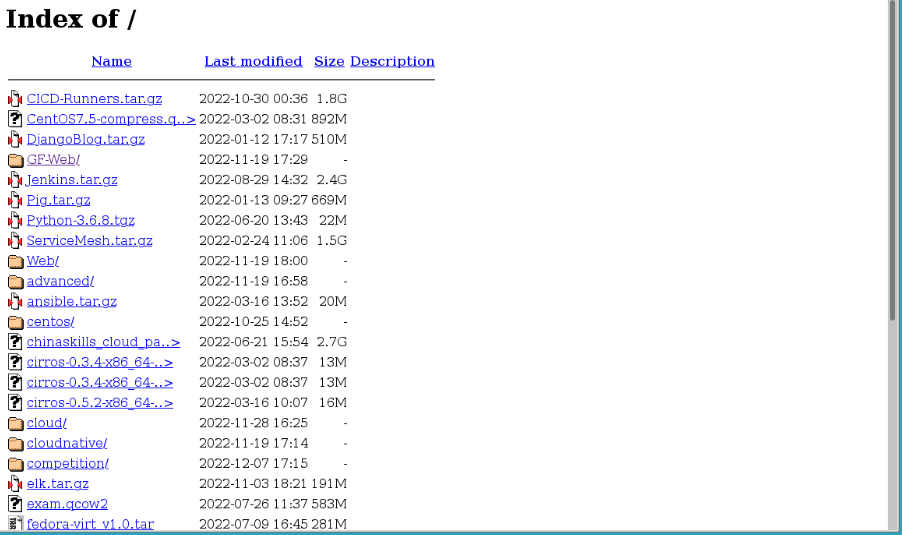

```bash
CICD-Runners.tar.gz     #下面列出内容
CentOS7.5-compress.     #镜像压缩
DjangoBlog.tar.gz       #
Pig.tar.zg              #
ServiceMesh.tar.gz      #ServiceMesh
elk.tar.gz              #ELK
exam.qcow2              #转换镜像
fedora-virt_v1.0.tar    #这是干啥的
```

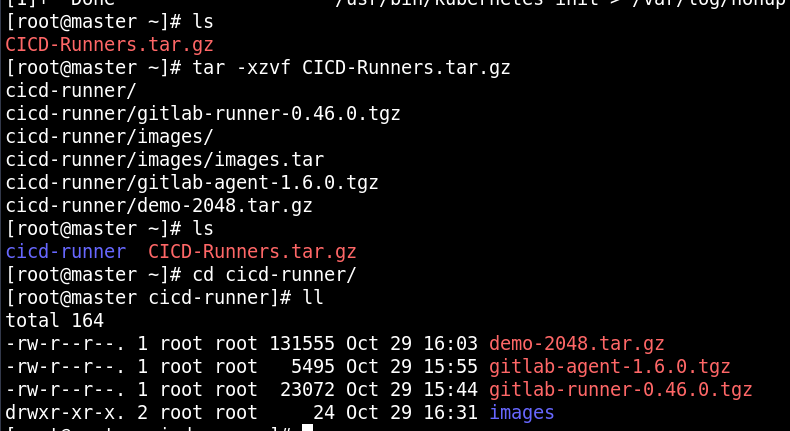

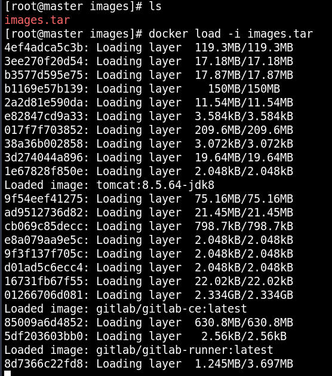

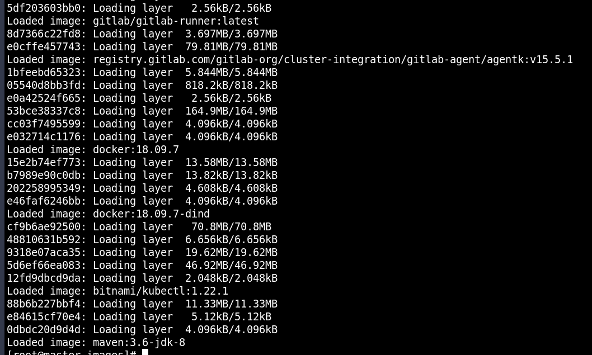

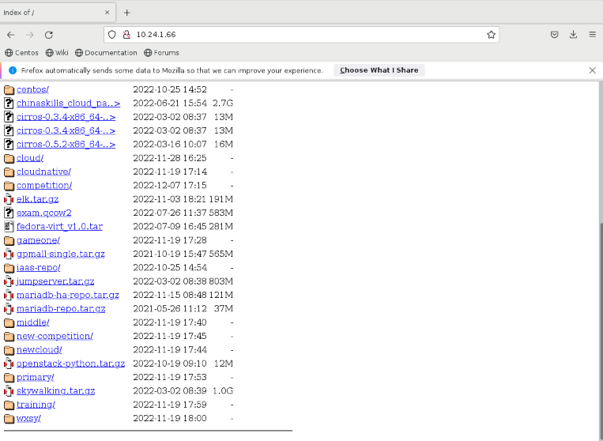

```bash
接fedora-virt_v1.0.tar    #这是干啥的

```

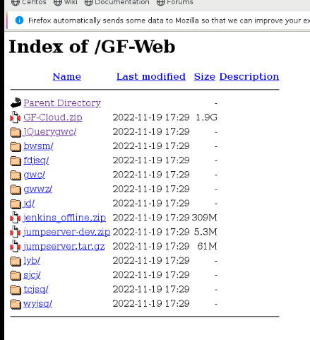

```
jumpserver
```

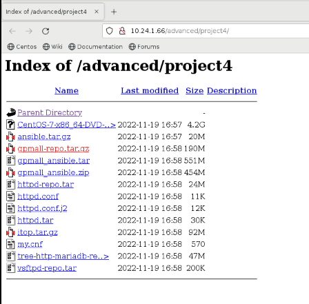

```
gpmall-ansible.tar
```


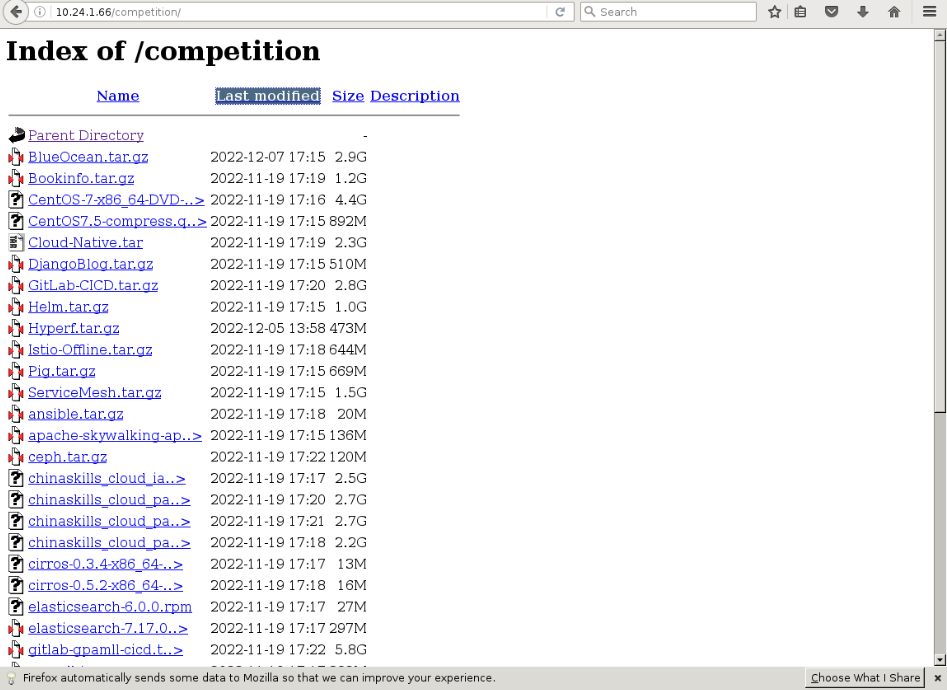

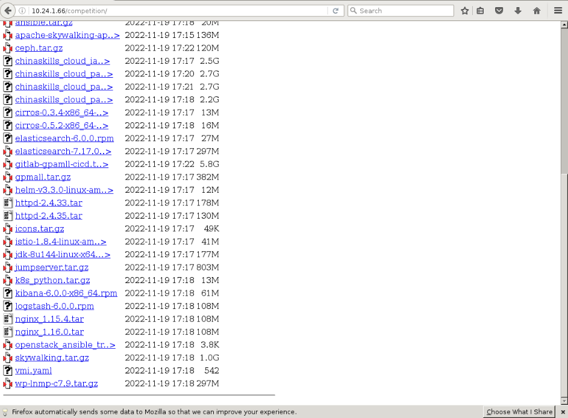

```

```

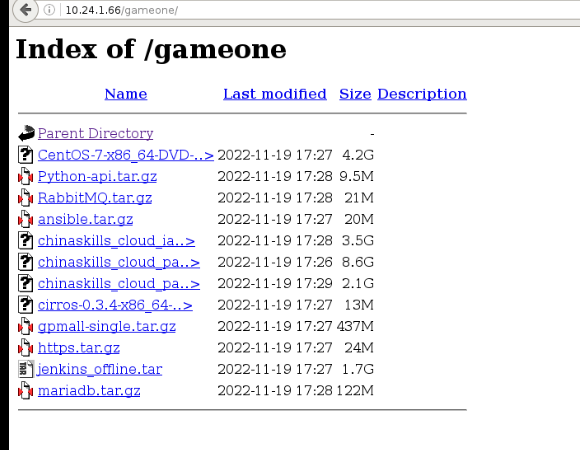

```
gpmall-single.tar.gz
```

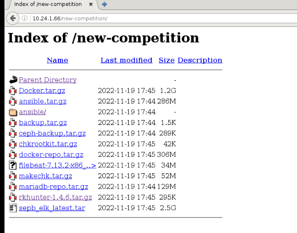

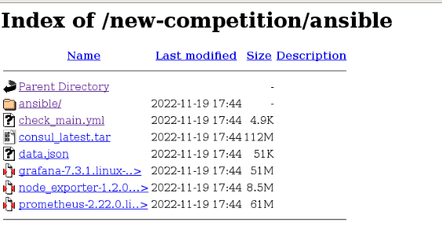

```

```

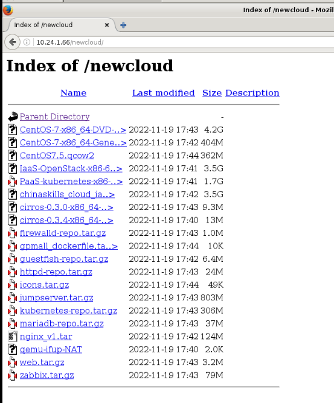

```

```

